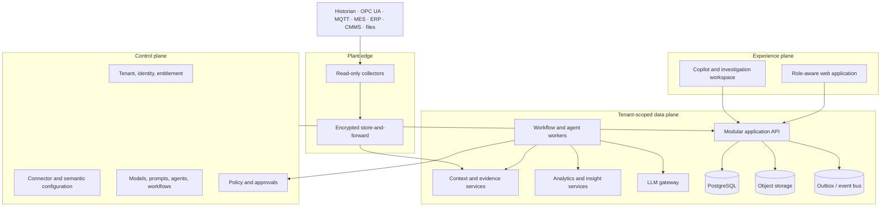
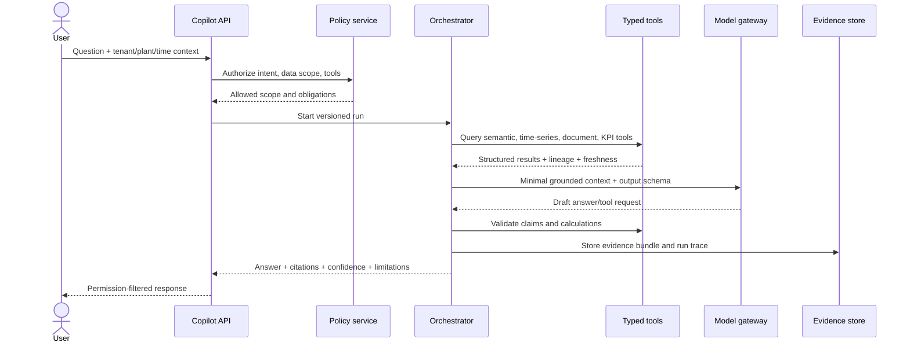
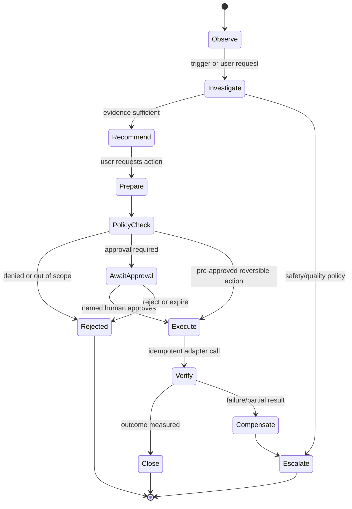
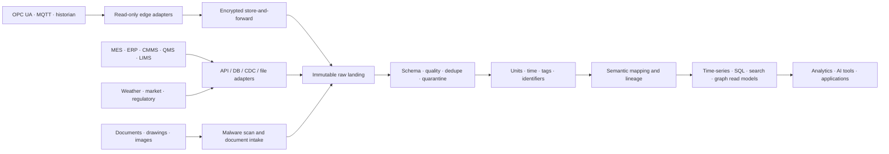
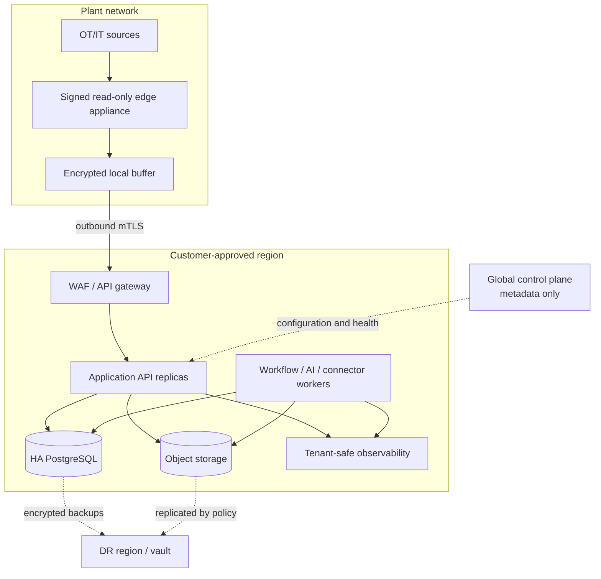
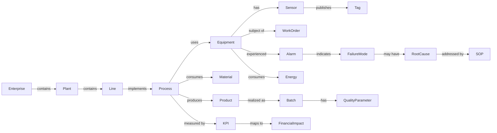

# PlantMind OS Founding Architecture Blueprint

**Status:** Founder review draft  
**Date:** 5 August 2026  
**Decision horizon:** demonstration prototype → deployable MVP pilot → enterprise target state  
**Safety boundary:** no direct control of PLCs, SIS, DCS, or other safety-critical systems in the prototype or MVP.

## Decision legend and truth labels

Every material capability carries one of these timing decisions:

- **Adopt now:** build or establish during Phase 0/1.
- **Prepare now, implement later:** preserve interfaces, identifiers, and boundaries now; add the capability in the MVP or enterprise phase.
- **Defer:** intentionally exclude until validated demand or scale.
- **Avoid:** contrary to product, safety, or engineering principles.

Every demonstration surface must also show one of these truth labels:

- **Production-capable:** implemented against an explicit reliability/security bar.
- **Demonstration:** functional but not certified for production operation.
- **Simulated:** generated/replayed data or mocked external write-back.
- **Future vision:** concept preview with no claim of current operation.

---

## 1. Executive assessment

PlantMind's opportunity is credible, but the stated vision contains several businesses: industrial data integration, semantic modeling, analytics, digital twins, copilots, agent automation, and a marketplace. Attempting all of them as platform primitives would bury the company in integration and infrastructure work before it proves value.

The recommended wedge is an **evidence-to-action operating layer for plant performance**. It consumes existing data, contextualizes only what a selected use case needs, detects or imports a material condition, explains it with traceable evidence, quantifies impact, proposes a governed action, and follows that action to measured outcome. This is more specific than “industrial AI” and more valuable than another dashboard.

The first demonstration should tell one coherent story: a degradation on a critical asset reduces throughput and increases energy intensity; PlantMind detects it, links signals to asset/process/work-order context, explains likely causes, calculates a bounded financial impact, proposes an inspection or CMMS work request, obtains human approval, and produces an executive report. All signals and integrations must be conspicuously marked as simulated or replayed.

### CTO recommendation in one page

| Area | Recommendation | Timing |
|---|---|---|
| Product boundary | Intelligence and governed action above systems of record; read-only OT initially | **Adopt now** |
| Architecture | TypeScript/Python modular monolith with explicit domain boundaries and an outbox | **Adopt now** |
| Frontend | React + TypeScript application shell; role-based compositions, not separate products | **Adopt now** |
| Core data | PostgreSQL for transactional, semantic, audit metadata; object storage for files/replay data | **Adopt now** |
| Time series | PostgreSQL/Timescale-compatible abstraction for prototype/MVP; dedicated analytical store only after measured need | **Adopt now** |
| Graph | Canonical semantic model in PostgreSQL first; Neo4j-compatible graph read model later | **Prepare now, implement later** |
| Vector search | PostgreSQL `pgvector` for pilot-scale document retrieval | **Adopt now** |
| Workflows | Durable workflow engine for approvals, retries, timers, and compensation | **Adopt now** for MVP; lightweight state machine in demo |
| Event backbone | Transactional outbox first; Kafka-compatible broker when independent consumers/throughput justify it | **Prepare now, implement later** |
| AI | Vendor-neutral LLM gateway; retrieval and deterministic tools; no model directly queries or writes systems | **Adopt now** |
| Authorization | Enterprise IdP + RBAC, plant/tenant attributes, deny-by-default tool policy | **Adopt now** |
| Deployment | Single-region multi-tenant SaaS control plane plus read-only edge collector first | **Adopt now** |
| Microservices | Extract only by scaling, isolation, ownership, or deployment need | **Defer** |
| Autonomous OT control | No direct control; Level 0–3 only through MVP | **Avoid** |
| Marketplace | Define signed extension contracts; do not build commerce or third-party runtime yet | **Defer** |

### Strategic benchmark

The relevant lessons are architectural, not cosmetic. Cognite positions contextualized industrial data and a knowledge graph as the bridge from heterogeneous sources to applications and agents; Palantir treats an ontology as both semantic objects and governed actions; Microsoft Fabric combines streaming, lakehouse, and analytics; AWS SiteWise demonstrates local collection/processing and bandwidth-aware edge-to-cloud flow. PlantMind should borrow the principles—context, policy-controlled actions, replayable data, edge resilience—but compete on faster time-to-value, executive language, evidence quality, and closed-loop value measurement. See the [official Cognite overview](https://docs.cognite.com/cdf), [Palantir ontology overview](https://www.palantir.com/docs/foundry/ontology/overview), [Microsoft Fabric overview](https://learn.microsoft.com/en-us/fabric/fundamentals/microsoft-fabric-overview), and [AWS SiteWise Edge guidance](https://docs.aws.amazon.com/iot-sitewise/latest/userguide/edge-processing.html).

## 2. Recommended product boundaries

### PlantMind is responsible for

1. Contextual references to source-system data, with lineage and freshness.
2. A minimal industrial semantic model for each use case.
3. Evidence-backed insights and investigation workspaces.
4. Deterministic KPI and business-impact calculations with versioned formulas.
5. Governed recommendations, approvals, write-back adapters, and outcome tracking.
6. Role-aware command experiences and audit-ready decision records.
7. AI orchestration where generative reasoning adds value, bounded by deterministic data/tool services.

### PlantMind is not responsible for

- Replacing SCADA, DCS, PLC, SIS, historian, MES, ERP, CMMS, QMS, or LIMS.
- Being the authoritative raw telemetry archive for every customer.
- Closed-loop process control or safety decisions.
- General-purpose enterprise BI, data science notebooks, or master data management.
- A universal digital-twin physics engine in the first three phases.
- Promising predictive maintenance without failure labels, operating context, and validation data.

### Initial beachhead

Target continuous or batch process plants with expensive rotating equipment and measurable production/energy losses—specialty chemicals, cement, food processing, pulp and paper, or metals—where historian data, maintenance records, and an accountable plant champion exist. Avoid nuclear, primary safety systems, and extremely validated pharmaceutical processes as the first deployment.

Initial use case: **critical-asset performance loss investigation and governed maintenance action**. It needs few integrations, has an understandable counterfactual, joins operational and financial data, and demonstrates the whole product loop.

## 3. Prototype, MVP, and target-state architecture

| Concern | Demonstration prototype | MVP pilot | Enterprise target |
|---|---|---|---|
| Users | Curated personas; demo authentication | One customer, multiple plants, enterprise SSO | Many enterprises, delegated administration, federation |
| Data | Seeded/replayed signals and documents | Read-only historian/CMMS/ERP connectors; store-and-forward | Fleet of governed connectors; regional data planes |
| Runtime | Single deployable web/API + worker | HA modular monolith, workflow workers, edge collector | Selectively extracted services, cell-based regional data planes |
| Storage | PostgreSQL + object storage | PostgreSQL HA + time-series extension + object storage | Lakehouse and dedicated time-series/search/graph only by measured workload |
| Events | In-process events + durable outbox | Outbox + queue; schema registry discipline | Kafka-compatible regional backbone and replay |
| AI | One or two hosted models behind gateway; curated tools | Multi-model routing, RAG, evaluations, policy checks | Customer/private models, regional routing, advanced agents |
| Autonomy | Levels 0–2; approval UI is functional but write-back mocked | Levels 0–3; approved CMMS draft/create where customer permits | Level 4 only for bounded, reversible, non-safety actions; Level 5 remains exceptional |
| Tenancy | Tenant IDs and scoped fixtures | Shared app/database with RLS; optional dedicated deployment | Cell-based SaaS plus dedicated/VPC/on-prem variants |
| Availability | Best effort | Defined SLOs, backups, restore tests | Multi-AZ; regional DR; customer-tier RTO/RPO |
| Truth | Explicit demo/simulation badges | Connector certification and freshness states | Contractual data quality, SLOs, audit export |

Accepted prototype debt: synthetic identity provider, a single process, hand-authored semantic mappings, replayed streams, limited browser support, and non-HA deployment. Unacceptable debt: missing tenant scope, unlabeled simulated data, mutable audit records, unrestricted agent tools, or financial calculations performed by an LLM.

## 4. Overall system architecture



### Logical style

- **Modular monolith — Adopt now.** One deployable backend with modules for identity/tenancy, industrial context, observations, insights, workflows, agents, reports, and integrations. Enforce module APIs and database ownership in code and CI.
- **API-first — Adopt now.** OpenAPI 3.1 for commands/queries, AsyncAPI/CloudEvents-style envelopes for events. Generated clients prevent frontend/backend drift.
- **Event-driven seams — Adopt now.** Domain events plus transactional outbox; asynchronous work is idempotent. Do not introduce a broker merely for architecture aesthetics.
- **Microservices — Defer.** Extract connector ingestion, high-volume analytics, AI execution, or report rendering only when independent scaling, fault isolation, ownership, or customer deployment warrants it.
- **Control/data plane split — Prepare now.** Central control plane owns tenant configuration, deployment metadata, entitlements, policy bundles, and extension registry. Customer/regional data planes own operational data and execution. Never route restricted raw OT data through a global control plane.
- **Cell architecture — Prepare now, implement later.** A cell is a bounded set of tenants with independent compute/storage/blast radius. Dedicated customers receive a single-tenant cell.

### Multi-tenancy and isolation

All resources carry immutable `tenant_id`; plant-scoped resources also carry `plant_id`. Authorization is evaluated in the API and enforced again in storage. PostgreSQL row-level security, tenant-qualified cache keys, tenant-specific object prefixes/keys, and trace attributes provide defense in depth. High-regulation tiers use separate database, encryption keys, network, and possibly cloud account/subscription. No cross-tenant AI memory, retrieval index, cache, analytics result, or observability payload is permitted.

### Scalability, HA, and DR

- Stateless API and workers scale horizontally; connector and workflow partition keys are `{tenant_id, plant_id}`.
- Backpressure, bounded queues, rate limits, and load shedding protect interactive use.
- MVP: multi-AZ database, point-in-time recovery, object versioning, rolling deploys, tested restore. Target RPO ≤15 minutes and RTO ≤4 hours, validated with pilot customer.
- Enterprise: cell-specific active/passive regional DR by default; active/active only for truly required read workloads. Target tiers might offer RPO ≤5 minutes/RTO ≤1 hour, but only after recovery exercises.
- Observability uses OpenTelemetry traces, metrics, and logs with tenant-safe cardinality, plus product telemetry for data freshness, workflow state, policy decisions, model/tool calls, token/cost, and evidence coverage. OpenTelemetry conventions provide cross-language naming but GenAI conventions may evolve, so wrap them behind a PlantMind schema ([official conventions](https://opentelemetry.io/docs/specs/semconv/)).

### Extension model

Use signed, versioned manifests declaring extension type, schemas, permissions, supported platform versions, data residency, and resource limits. MVP extensions run as reviewed configuration or isolated connector/worker containers; third-party arbitrary code never executes inside the core API. Marketplace billing, public submission, and open runtime are **deferred**.

## 5. Frontend architecture

### Stack and rendering

Use React + TypeScript with a mature full-stack framework (Next.js) for routing, server rendering of fast initial shells, static marketing/help content, and client-rendered high-interaction workspaces. Keep domain APIs independent of framework server functions. This yields good enterprise UX without coupling business logic to the frontend.

Micro-frontends are **deferred**. A single application shell and package-level domain boundaries give consistent navigation, permissions, theming, and performance. Adopt micro-frontends only when independently shipping teams and deployment ownership exist.

### Application shell

The shell owns tenant/plant/time context, navigation, identity, command palette, notifications, global search, Copilot drawer, freshness/connection indicators, and help. Pages compose role-specific modules; personas do not receive forked applications. Executives default to exceptions and impact. Engineers default to signals, evidence, and detailed diagnostics.

### Principal experiences

- **Enterprise Command Centre:** outcome scorecard, plant comparison, risk/opportunity queue, intervention value ledger.
- **Plant Command Centre:** current state, constraints, prioritized exceptions, shift context, action status.
- **Asset Intelligence:** hierarchy, state timeline, related alarms/work orders, contributing signals, model health.
- **Copilot:** answer first; then confidence, as-of time, scope, evidence, assumptions, calculation, and available action. Never show chain-of-thought; show concise decision rationale and provenance.
- **Digital Twin:** start with a 2D/2.5D topology and state overlay; load 3D only where it helps spatial understanding. It is a context navigator, not a decorative model.
- **Knowledge Graph:** task-oriented neighborhood views, path explanations, filters, and “why related?”; avoid an unreadable global hairball.
- **Agent Control Centre:** mandate, level, runs, inputs, tool use, policy decisions, pending approvals, cost, outcomes, and kill switch.

### State management

Use TanStack Query (or framework-equivalent) for server state; URL/search params for shareable filters; local component state for transient UI; a small store such as Zustand only for cross-cutting client state. WebSocket or Server-Sent Events update query caches via typed events. Persist Copilot/workflow state server-side. Do not put server entities in a global client store.

### Visualization and performance

Use Apache ECharts for dense operational charts, lightweight SVG/Canvas topology, Cytoscape.js for graph exploration, and MapLibre only if geography matters. Consider three.js only for validated 3D use cases. Downsample time-series on the server, virtualize large tables, lazy-load graph/3D bundles, cancel stale queries, and enforce bundle/LCP/interaction budgets.

Accessibility target is WCAG 2.2 AA: keyboard-complete workflows, visible focus, semantic tables, textual status, reduced motion, screen-reader summaries for charts, and non-color alarm cues. Error states distinguish permission, stale data, partial data, unavailable source, and system failure. Every panel shows last refresh and scope.

For degraded connectivity, the web app becomes read-only with cached last-known views clearly timestamped; drafts may queue locally only if encrypted and permitted. The edge collector continues buffering independently. Never imply current state while offline.

## 6. Backend architecture

### Framework and modules

Use TypeScript with NestJS or a thin Fastify-based architecture for the main API; use Python/FastAPI workers for numerical, ML, document, and AI workloads. The backend is one modular application at first, with separate worker processes.

| Domain module | Responsibilities | Data ownership |
|---|---|---|
| Identity & tenancy | users, service principals, roles, plants, membership | identity references and tenant scope |
| Entitlements | plans, features, limits, extension licenses | entitlement records |
| Industrial context | entities, relationships, mappings, units, source references | semantic model |
| Observations | normalized signal references, aggregates, freshness, quality | time-series metadata/derived windows |
| Insights | anomalies, evidence bundles, impact, status, feedback | insight records |
| Workflow & actions | cases, tasks, approvals, execution, compensation | workflow/action ledger |
| AI governance | models, prompts, agents, tools, policies, evaluations | versioned AI assets/runs |
| Integrations | connector definitions, credentials references, sync state | connector metadata |
| Reports & notifications | templates, render jobs, subscriptions, delivery | report and notification metadata |
| Audit | append-only security and decision events | audit ledger/export |

### Interface choices

- REST for stable commands/resources and external integration.
- GraphQL **defer** unless the graph/command-centre composition creates demonstrable over-fetching or client proliferation; it is not the graph database API.
- WebSocket for high-frequency interactive updates; SSE for simpler one-way streams such as agent progress.
- Asynchronous events for integration, workflow progression, projections, and notifications—not for request/response masquerading.
- API gateway at ingress handles TLS, token validation, WAF, quotas, request IDs, and routing; domain authorization remains in the application.

### Jobs, workflows, rules, and notifications

Prototype background work can use a PostgreSQL-backed queue and explicit state machines. The MVP should adopt Temporal for long-running investigations, approvals, deadlines, retries, and compensation; workflows must call idempotent activities and store business state in PlantMind, not hide it solely in the engine. A deterministic JSON decision-table/rules service handles thresholds, routing, and approval matrices. OPA is introduced when policies span services/deployments; its strength is separating policy decision from enforcement ([official OPA overview](https://www.openpolicyagent.org/docs)).

Notifications are event consumers with user preference, sensitivity classification, deduplication, quiet hours, templates, and delivery logs. Reports render asynchronously from immutable snapshot data so a historical report remains reproducible.

### Platform capabilities

Use external enterprise IdPs through OIDC/SAML; tenant context is derived from authenticated membership, never trusted from a naked header. Configuration is versioned, schema-validated, promotable between environments, and audited. Feature flags support release control, not permanent customer entitlements. Entitlements are server-enforced and separate from authorization. All writes accept idempotency keys where client/network retries are plausible.

## 7. AI and agent architecture

### Workload taxonomy

| Work type | Correct mechanism | Examples |
|---|---|---|
| Deterministic analytics | SQL, stream/window code, tested formulas | OEE, energy intensity, EBITDA bridge, thresholds |
| Rules automation | versioned rules/policy engine | severity, routing, approval requirements |
| Statistical methods | robust statistics/change detection | baselines, control limits, anomaly candidates |
| ML models | governed model service | failure probability, forecasting, classification |
| Generative AI | grounded synthesis and interaction | explanation, report drafting, query planning |
| Agentic AI | bounded orchestration around tools/workflows | investigate, gather evidence, prepare action |

An LLM must never invent a measurement, calculate a financial KPI without a deterministic tool, decide authorization, alter audit history, or directly issue an OT control command.

### AI request flow



### Core components

1. **LLM gateway — Adopt now.** Normalizes providers, model capabilities, structured output, retries, budgets, regional routing, redaction, caching rules, and telemetry. It does not reduce all models to the lowest common denominator; capability profiles expose differences.
2. **Orchestrator — Adopt now.** A small explicit state graph with maximum steps, deadlines, token/tool budgets, cancellation, and terminal states. Avoid an opaque swarm framework.
3. **Typed tool registry — Adopt now.** Each tool declares JSON schema, owner, sensitivity, side effects, required permission, timeout, idempotency, and audit fields. Read and write tools are separate.
4. **Retrieval — Adopt now.** Hybrid lexical/vector retrieval over approved document chunks plus metadata filters; structured queries use pre-approved semantic query plans; time-series and graph retrieval use dedicated tools.
5. **Evidence bundle — Adopt now.** Every consequential claim points to source IDs, query/version, time range, units, freshness, transformations, and excerpts/measurements.
6. **Prompt/model registry — Adopt now.** Immutable versions, review status, intended tasks, evaluation results, and rollout/rollback metadata.
7. **Agent identity — Adopt now.** Each role-based executive has a service identity, mandate, scopes, permitted tools, budget, memory policy, autonomy ceiling, and escalation conditions.

### Role executives

Executives are policy profiles over shared platform capabilities, not separately branded prompts. For example, the Maintenance Head can inspect asset condition/work orders and prepare a maintenance request; it cannot alter production targets. The Production Head can analyze constraints and prepare a plan change; it cannot suppress a safety escalation. Cross-agent collaboration is message passing through a case/workflow with attributable outputs, not shared hidden memory.

### Memory and privacy

Use short-lived run state, server-side conversation history, approved durable facts, and retrieval indexes. Separate tenant-shared knowledge, plant knowledge, team cases, and private user notes. A model cannot promote a conversation assertion to durable organizational memory; a user or deterministic ingestion workflow must approve and source it. Apply retention, legal hold, export, and deletion policies.

### Confidence and explainability

Do not show a fabricated universal confidence percentage. Compute a calibrated **evidence quality profile** from source coverage, freshness, agreement, retrieval relevance, model uncertainty where measured, data quality, and analytical/model validation. Display high/medium/low only when thresholds are validated, plus the component reasons. ML predictions also show model version, validation cohort, drift, and operating threshold. GenAI answers show sources, assumptions, unresolved contradictions, and what would change the answer.

### Hallucination and injection controls

- Treat documents, retrieved text, tool responses, and web content as untrusted data—not instructions.
- Separate system policy from content; allowlist tools; validate arguments and outputs; enforce tenant scope inside each tool.
- Require evidence for material factual claims; refuse or qualify when evidence is insufficient.
- Scan/normalize documents, isolate parsers, block embedded active content, and label external instructions.
- Keep secrets and broad credentials out of prompts; DLP-filter input/output; restrict model retention settings.
- Evaluate indirect prompt injection, cross-tenant leakage, tool escalation, misleading citations, and data poisoning.

### Agent execution and approval



Prototype and MVP stop at Level 3 except narrowly scoped non-production notification/report actions. Level 4 requires customer policy, reversible action, least-privilege credential, precondition check, rate limit, two-person approval where appropriate, and verified outcome. Level 5 is **deferred** and never assumed safe merely because a model is accurate.

## 8. Industrial data architecture

### Ingestion and contextualization



### Protocol and connector policy

- OPC UA and MQTT are first-class edge inputs. Use vendor-supported client libraries and certificate lifecycle management.
- Modbus is integrated only through a hardened gateway translating to a safer upstream protocol; PlantMind does not poll arbitrary controllers from the cloud.
- REST/SOAP, JDBC/ODBC read replicas, CDC, SFTP, and watched file drops cover enterprise systems. Prefer official APIs and read-only accounts.
- Connectors expose capability, cursor/checkpoint, schema, quality, rate limit, and write-back classification. A “certified” connector has contract tests, failure/recovery tests, supported versions, and operational runbooks.

### Data contract

Every observation includes tenant, plant, source, source entity/tag, event/measurement time, ingestion time, value, unit, quality code, sequence/idempotency key, schema version, and lineage reference. Event time and ingestion time remain distinct. The pipeline supports deduplication, watermarks, late updates, quarantine, replay, and correction events; it never silently overwrites source truth.

Unit normalization uses a controlled unit catalog and retains raw value/unit. Tag mapping is versioned, effective-dated, confidence-scored, and human-approved when automated matching is uncertain. Schema evolution is backward-compatible by default, with contract compatibility checks. Data-quality dimensions include completeness, validity, timeliness, uniqueness, consistency, and mapping coverage.

### Retention and edge behavior

Retention is policy-driven by data class, source agreement, resolution, tenant, and region. Keep immutable raw/replay data only when contractually permitted; retain high-resolution operational data for the use case, downsample older data, and preserve derived/audit artifacts according to regulation. Edge collectors use encrypted disks, bounded queues, signed configuration, outbound-only connectivity where possible, health telemetry, monotonic checkpoints, and graceful backfill. Cloud acknowledgements occur only after durable receipt.

## 9. Database strategy

Avoid polyglot persistence until observed workloads justify it.

| Technology | Purpose and data | Timing | Complexity / alternatives |
|---|---|---|---|
| PostgreSQL | tenants, semantic entities/edges, insights, workflows, configs, audit indexes; JSONB where variability is real | **Adopt now** | Strong transactions/RLS/ecosystem. Scale vertically/replicas first. Alternatives: managed PostgreSQL vendors |
| PostgreSQL time-series extension or partitioned tables | prototype/pilot observations and aggregates | **Adopt now** | Lowest operational count; abstraction required. Move hot analytics to ClickHouse/Timescale service when benchmark demands |
| `pgvector` + full-text search | pilot document chunks/embeddings and metadata-filtered hybrid retrieval | **Adopt now** | Adequate at pilot scale. OpenSearch later for large corpus, faceting, or operational search |
| S3-compatible object storage | raw landing, documents, report artifacts, model/evaluation assets, replay fixtures | **Adopt now** | Lifecycle/versioning essential; MinIO-compatible on-prem option |
| Redis-compatible cache | sessions only if IdP flow needs it, short-lived cache, rate counters | **Prepare now, implement later** | Avoid caching authorization/evidence without safe invalidation; in-process/Postgres first |
| Neo4j or graph engine | deep traversals, graph algorithms, interactive graph read model | **Prepare now, implement later** | PostgreSQL edges first. Neo4j adds licensing/ops; enterprise clustering/access features differ by edition ([official manual](https://www.neo4j.com/docs/operations-manual/current/introduction/)) |
| ClickHouse | high-volume time-series/analytical queries, event analytics | **Prepare now, implement later** | Add after workload benchmarks; alternatives: Timescale, cloud-native time-series stores |
| Kafka-compatible broker | durable multi-consumer event backbone and replay | **Prepare now, implement later** | Outbox/queue first. Alternatives: Redpanda, managed cloud buses, NATS for lighter needs |
| Lakehouse with Delta/Iceberg | long-term cross-domain analytics, ML features, open tables | **Defer** | Valuable at enterprise data volume; avoid duplicating a customer's existing lakehouse |
| Separate event-sourcing database | full aggregate history | **Avoid** by default | Append-only audit/action records and outbox meet needs without event-sourcing all domains |

PostgreSQL supports declarative partitioning and pruning, which makes it a rational first store while data volume is bounded ([official PostgreSQL documentation](https://www.postgresql.org/docs/current/ddl-partitioning.html)). Define repository interfaces and exportable open formats so later stores are projections, not rewrites of business semantics.

## 10. Security architecture

### Identity and authorization

- Enterprise workforce identity through OIDC; SAML via the identity broker where required. OAuth 2.0 authorization code + PKCE for users; workload identity/mTLS or private-key JWT for services. No password database unless a break-glass deployment explicitly requires it.
- RBAC supplies understandable base roles; ABAC adds tenant, plant, asset group, data class, shift, purpose, and action context. ReBAC may govern case/team sharing later.
- Authorization is deny-by-default and checked at navigation, API, domain service, tool, and database layers. UI hiding is never authorization.
- Agents and connectors are service principals with narrower scopes than their human sponsor. Delegation records the principal, agent, policy, purpose, expiry, and approved resources.

### Data and platform security

- TLS 1.2+ in transit; managed encryption at rest; customer-managed keys for higher tiers; envelope encryption for connector secrets; rotation and access logs.
- Regional/cell placement enforces residency; backups, logs, model endpoints, support tooling, and telemetry follow the same boundary.
- Immutable or WORM-capable audit export records authentication, authorization, data access where required, configuration, model/prompt/tool versions, approvals, write-backs, and administrative actions. Hash chaining is optional defense, not a substitute for protected storage.
- Privileged access is just-in-time, MFA-protected, approved, time-bound, recorded, and separately audited. Customer support access is off by default.
- Zero-trust network design: authenticated/encrypted service calls, workload identity, least privilege, egress control, private endpoints, and no implicit trust based on network location.

### OT segmentation

Place collectors in an industrial DMZ or approved edge zone. Prefer outbound-only TLS to the PlantMind data plane. Separate OT-facing adapter processes from cloud-facing synchronization, block inbound cloud sessions, and use allowlisted endpoints/protocols. PlantMind is read-only until a separately reviewed enterprise write-back path is approved; it never crosses into SIS/control networks for direct manipulation.

### Secure lifecycle

Threat modeling is required for connectors, agent tools, multi-tenancy, document ingestion, and deployment variants. CI gates include secret scanning, SAST, dependency/container/IaC scanning, SBOM generation, signature/provenance, license policy, and critical-CVE blocking with an exception process. Runtime includes WAF/API quotas, EDR where customer-controlled, vulnerability SLAs, patch policy, penetration tests, incident response, tenant notification procedures, and disaster exercises.

Prompt-injection and exfiltration controls are part of the threat model, not only AI QA. Sensitive prompt/tool payloads are minimized and redacted from logs. DLP policy and output filters prevent secrets or cross-scope data leaving approved endpoints.

## 11. Deployment architecture



### Deployment order and trade-offs

1. **Public-cloud SaaS — Adopt first.** Fastest iteration and lowest operations cost. Provide a regional choice and private connectivity. It is insufficient for every regulated customer.
2. **Dedicated enterprise cloud — MVP option.** Same artifacts in an isolated cell/account and database. Higher cost, easier security/procurement boundary.
3. **Customer VPC/VNet — Prepare during MVP.** GitOps-managed deployment with limited outbound control-plane connection. Shared responsibility and upgrade complexity rise.
4. **Hybrid cloud + edge — Adopt read-only edge early.** Edge handles protocol locality, buffering, and optional reduction; cloud handles intelligence and collaboration.
5. **On-prem/restricted connectivity — Defer until a paid design partner.** Requires offline artifacts, private registries/model endpoints, license process, local observability, backup, upgrade, and support model. Maintain Kubernetes/container portability and S3/PostgreSQL-compatible dependencies now.

Do not promise identical feature cadence across SaaS and disconnected deployments. Publish a deployment capability matrix and support lifecycle.

## 12. Repository and folder structure

A monorepo is recommended through the MVP: atomic contract changes, shared tooling, one dependency/security policy, and easier refactoring. Polyrepo becomes appropriate only when independently governed products or sensitive customer-delivery repositories demand it.

```text
plantmind-os/
├─ apps/
│  ├─ web/                       # application shell and role experiences
│  ├─ api/                       # modular TypeScript backend
│  ├─ worker-ai/                 # Python AI/analytics workers
│  ├─ worker-workflows/          # durable workflow workers
│  └─ edge-collector/            # isolated read-only collection runtime
├─ packages/
│  ├─ contracts/                 # OpenAPI, AsyncAPI, JSON Schema
│  ├─ domain/                    # shared domain types; no infrastructure
│  ├─ design-system/             # tokens, components, charts, patterns
│  ├─ authz/                     # policy inputs and enforcement adapters
│  ├─ observability/             # safe telemetry conventions
│  ├─ testing/                   # fixtures, test builders, harnesses
│  └─ config/                    # lint, format, build presets
├─ modules/                      # backend domain modules and ownership rules
├─ connectors/
│  ├─ sdk/                       # connector contract and conformance kit
│  ├─ opcua/                     # introduced by approved use case
│  └─ mock-demo/                 # conspicuously simulated fixtures
├─ ai/
│  ├─ gateway/                   # provider adapters and routing
│  ├─ agents/                    # mandates, policies, evaluation suites
│  ├─ prompts/                   # versioned templates and schemas
│  ├─ tools/                     # typed, permission-scoped tools
│  └─ evaluations/               # golden sets, adversarial tests, scorecards
├─ workflows/                    # versioned definitions and simulations
├─ solutions/                    # industry/use-case packs; no core forks
├─ data/
│  ├─ ontology/                  # canonical semantic schemas/mappings
│  ├─ units/                     # unit catalog and conversions
│  └─ demo/                      # provenance and licenses for fixtures
├─ infrastructure/
│  ├─ terraform/                 # modules and environment composition
│  ├─ kubernetes/                # later deployment manifests/charts
│  ├─ edge/                      # appliance packaging
│  └─ policies/                  # deployment/security policy as code
├─ docs/
│  ├─ architecture/decisions/    # ADRs
│  ├─ product/                   # boundaries, personas, metrics
│  ├─ security/                  # threat models and controls
│  ├─ operations/                # SLOs, runbooks, recovery
│  └─ data/                      # contracts, lineage, governance
├─ tests/
│  ├─ contract/ integration/ e2e/ performance/ security/
│  └─ workflow-simulation/
└─ tooling/                      # repository automation; no business logic
```

Rules: an app may depend on packages/modules, not another app; modules communicate through public interfaces/events; connector dependencies stay out of the core; solution packs configure/extend contracts rather than fork them; ownership and dependency direction are CI-enforced.

## 13. Component hierarchy

```text
ApplicationShell
├─ GlobalContextBar (tenant, plant, time, freshness)
├─ GlobalNavigation
│  ├─ EnterpriseCommandCentre
│  ├─ PlantCommandCentre
│  ├─ AssetIntelligence
│  ├─ InsightsCentre
│  ├─ AIExecutiveTeam
│  ├─ AgentControlCentre
│  ├─ WorkflowCentre
│  ├─ KnowledgeGraph
│  ├─ DigitalTwin
│  ├─ Reports
│  └─ Marketplace (future-vision flag until implemented)
├─ ContextualCopilot
├─ NotificationAndApprovalInbox
└─ Administration
   ├─ TenantAndPlantManagement
   ├─ IntegrationManagement
   ├─ SemanticMapping
   ├─ SecurityAndGovernance
   ├─ ModelsAgentsAndPolicies
   └─ AuditAndUsage
```

Shared detail primitives are `EntityHeader`, `StateTimeline`, `KPIWithDefinition`, `EvidencePanel`, `ExplanationPanel`, `ImpactBridge`, `RecommendationCard`, `ApprovalPanel`, `AuditHistory`, and `DataFreshnessBanner`. They encode trust behavior once across all experiences.

## 14. State-management strategy

| State | System of record | Frontend treatment |
|---|---|---|
| Server entities/analytics | Backend/database | Query cache keyed by tenant/plant/time; invalidate by typed event |
| Authentication | IdP + secure server session | HttpOnly secure cookie; no tokens in local storage |
| Tenant/plant/time context | URL + authorized session defaults | Shareable route; selection validated server-side |
| UI state | Component/local small store | Never persisted unless useful preference |
| Copilot conversations | Server-side conversation service | Optimistic message shell; streamed response; resumable by ID |
| Real-time events | Event gateway | Update/invalidate cached queries; sequence and gap detection |
| Workflow state | Workflow/domain service | Read model; client never advances authoritative state |
| Digital twin | Context service + current observation projection | Viewport/local selections local; entity state server-derived |
| Preferences | User profile | Versioned, tenant-aware, safe defaults |

Include authorization scope and data version in query keys. Switching tenant/plant cancels in-flight requests and clears unauthorized cache. Reconnection performs a cursor-based catch-up; gaps trigger refetch rather than guessing.

### Knowledge graph relationship model

The canonical model is deliberately small at first. It stores business identity and effective-dated relationships; source systems remain authoritative. Solution packs extend vocabulary through reviewed schemas rather than changing core meaning.



Relationships carry source, validity interval, mapping status, evidence/confidence, tenant, plant, and schema version. Automated resolution may propose links; uncertain or material mappings require human review.

## 15. Routing strategy

Routes express tenant and plant scope explicitly so bookmarks, evidence links, and audit references are stable. Slugs are aliases; immutable IDs are used in APIs and audit events.

| Route class | Illustrative pattern | Policy |
|---|---|---|
| Public | `/`, `/security`, `/trust`, `/docs/public` | No operational data |
| Authentication | `/auth/sign-in`, `/auth/callback`, `/auth/error` | IdP flow, PKCE, return-URL allowlist |
| Tenant | `/t/{tenant}/home` | Membership and entitlement required |
| Enterprise | `/t/{tenant}/enterprise/{view}` | Enterprise permission; plant exclusions honored |
| Plant | `/t/{tenant}/plants/{plant}/{view}` | Plant ABAC and data-class checks |
| Asset/deep link | `/t/{tenant}/plants/{plant}/assets/{asset}?at={timestamp}` | Revalidate scope, time, evidence server-side |
| Investigation | `/t/{tenant}/investigations/{id}` | Case membership plus evidence permission |
| Workflows/agents | `/t/{tenant}/workflows/{id}`, `/agents/{id}/runs/{run}` | Action and audit permissions are distinct |
| Administration | `/t/{tenant}/admin/{area}` | Step-up authentication |
| Marketplace | `/t/{tenant}/marketplace/{extension}` | **Future vision** until controls exist |

Guards are layered: authentication, tenant membership, entitlement, role/attribute policy, resource authorization, then field/evidence filtering. Denial returns `403` with a request-access path rather than `404` unless existence is sensitive. Use `404` for absent resources, `410` for retired links, `409` for version conflicts, and correlation IDs for `5xx`. A tenant/plant switch clears scoped caches. **Adopt now.**

Role navigation is configuration over one route graph, not security or separate apps. Customer route extensions and micro-frontend ownership are **deferred**.

## 16. Design system

### Experience model by persona

| Persona group | Default question | Primary experience | Action posture |
|---|---|---|---|
| CEO / CFO / COO | Where is value at risk or created? | Enterprise command centre, value ledger, reports | Review and approve material actions |
| Plant / operations / production heads | What constrains this shift? | Plant command centre, loss tree, action queue | Prioritize operational work |
| Maintenance / reliability | Which assets need attention and why? | Asset intelligence, evidence, work preparation | Investigate and prepare CMMS action |
| Quality / safety / energy heads | Which governed state is deteriorating? | Domain scorecards, deviations, workflows | Escalate under domain policy |
| Process / maintenance engineers | What supports the diagnosis? | Trends, graph paths, calculations, documents | Deep investigation |
| Data scientist | Is the result valid and monitored? | Model/evaluation workspace, lineage | Evaluate; never bypass policy |
| IT administrator / integrator | Are access, connectivity, and quality healthy? | Administration, integration health, audit | Configure with separation of duties |

Use three token layers: primitives, semantic tokens (`surface-raised`, `status-critical`, `confidence-limited`), and component tokens. Distribute versioned CSS variables plus neutral JSON. Components consume semantics, never raw colors.

- Typography: legible variable sans, tabular numerals, monospace only for IDs; comfortable and compact densities.
- Layout: 4 px base spacing, responsive grids, bounded reading widths, density tokens.
- Core: shell, command palette, cards, tables, filters, timelines, charts, trees, graph viewport, empty/error/stale states.
- Trust: `EvidencePanel`, `ExplanationPanel`, `AssumptionList`, `ConfidenceProfile`, `FreshnessStamp`, `AIContentBadge`, `ApprovalControl`, `PolicyDecision`, `AuditHistory`.
- Industrial: asset state, alarm/severity, quality code, maintenance timeline, constraint indicator, unit-aware value.
- Charts define units, time zone, missing data, downsampling disclosure, uncertainty, alarms, and export.
- WCAG 2.2 AA is the release target; keyboard and screen-reader behavior belongs to each contract. W3C recommends the latest WCAG 2 version ([official overview](https://www.w3.org/WAI/standards-guidelines/wcag/)).

Build in Storybook with interaction, accessibility, visual-regression, and token tests. Figma may mirror tokens; code owns shipped semantics. **Adopt now.** Unrestricted tenant CSS and white-label forks are **avoid**.

## 17. Theme system

Ship light and dark themes from the same semantics. Light is default for office/report use; dark supports command centres. High contrast is separately tested, not a filter.

| Semantic family | Governance |
|---|---|
| Neutral text/surfaces | Meet contrast in every density/theme |
| Info/success/warning/critical | Pair color with icon, label, and shape |
| Alarm severity | Customer labels may vary; critical color remains reserved |
| Asset state | Running, idle, planned/unplanned stop, maintenance, unknown, stale use text/pattern/icon |
| Confidence/evidence | Separate palette from alarm severity |
| Charts | Color-vision-safe series and direct labels/patterns |
| AI content | Persistent provenance marker and generation time |

Tenant branding is limited to logo, approved accent, report/login cover, and vetted fonts. Alarm, evidence, focus, and approval semantics cannot be recolored. Themes preserve chart identity and are snapshot-tested. **Adopt now.** Arbitrary themes are **deferred**.

## 18. Animation framework

Use CSS/Web Animations for basic state and Motion for React only for complex shared-layout transitions. Visualization libraries own chart/graph transitions. Do not add 3D to the base bundle.

Approved purposes are orientation, observable system state, relationship highlighting, and change indication. Use tokenized short durations, concurrency budgets, and reduced-motion behavior. AI progress shows observable stages: retrieving, calculating, policy check, and composing; it does not expose hidden chain-of-thought. Data-flow animation must not imply live telemetry when data is replayed. **Adopt now.** Decorative parallax, endless glow, and motion that impairs alarm reading are **avoid**.

## 19. Technology decision matrix

Pin versions only when implementation begins; review support windows quarterly. Managed services sit behind open contracts.

| Capability | Preferred | Why / trade-off | Alternatives | Timing | Lock-in |
|---|---|---|---|---|---|
| Web | React, TypeScript, Next.js App Router | Mature layouts/hybrid rendering; caching needs discipline | Vite SPA, Remix, Angular | **Adopt now** | Low-M; API stays independent |
| UI and visuals | CSS variables, Storybook, ECharts, Cytoscape | Testable semantics and dense visuals; custom accessibility work | MUI, Plotly, Sigma | **Adopt now** | Low-M; wrap chart specs |
| Digital twin | SVG/Canvas topology | Fast and comprehensible | three.js, Babylon | **Adopt now**; 3D **defer** | Low |
| Backend | TypeScript + NestJS/Fastify | Strong modules/contracts; framework weight | Plain Fastify, .NET, Spring | **Adopt now** | Low-M |
| AI/analytics | Python + FastAPI/Pydantic | ML/numerical ecosystem; second language | TypeScript-only | **Adopt now** | Low |
| APIs/streaming | OpenAPI 3.1, JSON Schema, SSE then WebSocket | Interoperable and simple; multiple interaction styles | GraphQL-first, gRPC | **Adopt now** | Low |
| Workflow | Temporal | Durable timers/retries/signals; operating learning | Camunda, Conductor | Demo state machine; MVP **adopt** | Medium |
| Rules/policy | Decision tables; OPA later | Deterministic/auditable | Drools, Cedar | Simple **now**, OPA **later** | Low |
| Jobs/events | PostgreSQL queue/outbox; Kafka-compatible later | Minimal MVP operations | RabbitMQ, SQS, NATS, Redpanda | Outbox **now**, broker **later** | Low-M |
| Relational/time series | PostgreSQL partitions/Timescale-compatible layer | One-store MVP; benchmark limits | ClickHouse, InfluxDB | **Adopt now** | Low-M |
| Vector/search | pgvector + PostgreSQL FTS | Metadata-safe hybrid retrieval | OpenSearch, Qdrant | **Adopt now** | Low |
| Knowledge graph | PostgreSQL nodes/edges first | One canonical store; weaker deep traversal | Neo4j, Neptune | Model **now**, engine **later** | Low |
| Object/cache/lake | S3-compatible object store; cache later; federate customer lake | Avoid persistence sprawl | Redis, Fabric, Databricks | Object **now**; others **defer** | Low-M |
| Identity/gateway | OIDC/SAML broker + cloud WAF/ingress | Enterprise federation and fast protection | Keycloak, Entra, Auth0, Kong | **Adopt now** | Medium; standards/export |
| Feature flags | OpenFeature API + provider | Vendor-neutral evaluation ([official spec](https://openfeature.dev/docs/reference/intro/)) | Unleash, LaunchDarkly direct | **Adopt now** | Low |
| AI gateway/agents | PlantMind adapter + explicit workflow/typed tools | Policy, audit, replay | LangGraph, provider agents | **Adopt now** | Low-M |
| Observability | OpenTelemetry + managed backend | Portable instrumentation; pricing/cardinality | Grafana stack, Datadog | **Adopt now** | Low-M |
| Platform | Terraform-compatible IaC + Docker; Kubernetes later | Portable; Kubernetes too heavy for demo | Pulumi, CDK, Nomad | Container/IaC **now** | Low-M |
| Delivery/test | CI provider + Vitest, Playwright, Pytest, contracts, k6 | Broad gates; maintenance cost | GitLab/Azure, Jest/Cypress | **Adopt now** | Low |
| Security/docs | Layered scanners, SBOM/signing; Markdown/Mermaid/API docs | Supply-chain assurance and versioned knowledge | Vendor suites, Backstage | **Adopt now** | Low-M |

Next.js supports layouts plus server/client composition; production guidance calls out caching, error handling, CSP, accessibility, type safety, and bundle measurement ([App Router](https://nextjs.org/docs/app), [production guidance](https://nextjs.org/docs/app/guides/production-checklist)). Temporal is for durable workflows, not PlantMind domain records ([official documentation](https://docs.temporal.io/)).

## 20. Development standards

### Architecture and contracts

- Record consequential decisions as ADRs with context, options, consequences, owner, and reversal trigger. **Adopt now.**
- Use domain-driven design lightly: common language, bounded modules, invariants, and events; avoid elaborate patterns where CRUD suffices.
- OpenAPI and event schemas are versioned artifacts. Additive change is default; breaking change needs a major contract, migration window, telemetry, and deprecation notice.
- Errors use RFC 9457-style problem details with stable code, safe text, retryability, and correlation ID. Never leak stacks, credentials, prompts, or cross-tenant identifiers.
- Events use a CloudEvents-like envelope: ID, type, schema, tenant/plant, subject, occurrence/publish time, trace, producer, causation/correlation.
- Producers own contracts; consumers run compatibility tests. Schema-registry discipline begins before a broker.

### Reliability and operations

- External commands require idempotency keys; consumers deduplicate. Retry only transient failures with bounded exponential backoff and jitter.
- Set dependency timeouts, concurrency/rate limits, circuit breakers, and a total retry budget across layers.
- Logs, metrics, and traces share correlation fields and redact classified data. SLOs cover availability, latency, freshness, workflow completion, evidence availability, and connector lag.
- Configuration is typed and startup-validated; secrets use a manager/workload identity and never enter source or logs.
- Database changes follow expand/migrate/contract with tested roll-forward/rollback.
- Flags have owner, purpose, default, expiry, eligibility, audit, and failure behavior. Entitlements are not casual flags.

### Delivery governance

Use trunk-based development with short-lived branches, protected main, code owners, small PRs, and semantic versioning for public contracts. Releases are immutable, signed, SBOM-attached artifacts promoted between environments. Backward compatibility includes connectors, events, workflow versions, reports, saved links, prompts/tools, and extension manifests.

Security review is mandatory for new data classes, integrations, agent tools, auth changes, parsers, and write-backs. Establish budgets for LCP/INP, JS, API p95, large queries, graph size, and reports. Accessibility and internationalization are acceptance criteria: store UTC plus source zone, display it explicitly, use Unicode/locale-aware formatting, translatable strings, and configurable units. Documentation-as-code includes runbooks, lineage, model cards, agent mandates, workflow diagrams, incident reviews, and truth labels.

## 21. Coding standards

| Area | Required practice |
|---|---|
| TypeScript | Strict mode; no unchecked `any`; discriminated unions; runtime boundary validation; enforced dependency direction; exhaustive states |
| Python | Supported CPython; annotations and strict checking on core paths; Pydantic; reproducible environments; never deserialize untrusted pickle |
| SQL | Explicit columns; parameterized queries; RLS/tenant tests; reviewed migrations; UTC; deliberate numeric precision; plans for material queries |
| Infrastructure | Immutable modules, least privilege, policy-as-code, encrypted state, pinned providers/images, no secrets in plans |
| APIs | Stable names, explicit nullability/units/time zones, bounded pagination, idempotency/concurrency semantics |
| Events | Past-tense facts, immutable payload, global ID, scope, schema/causation, compatible evolution |
| Prompts | Versioned owner/purpose, allowed inputs/tools, output schema, refusal/uncertainty, threats, evaluation, model compatibility |
| Agent tools | Narrow typed contract, independent authorization, validation, read/write class, rate/cost limit, idempotency, timeout, audit, dry run |
| Workflows | Versioned definitions; deterministic orchestration; idempotent activities; explicit timers, approvals, and compensation |

Names follow domain language, not vendors. Modules expose cohesive capabilities, not generic utility dumping grounds. Comments explain intent, unit, safety constraint, or trade-off. Formatting/linting, static analysis, secret detection, dependency policy, dead-code and schema checks run in CI.

Secure coding requires output encoding, parameterization, SSRF-safe egress, parser limits, safe files, tenant-safe caching, vetted cryptography, and permission-negative tests. AI text and tool arguments remain untrusted until validated. OWASP lists prompt injection, sensitive disclosure, insecure tool design, excessive agency, and overreliance among core LLM risks ([OWASP GenAI Security Project](https://owasp.org/www-project-top-10-for-large-language-model-applications/)). **Adopt now.**

## 22. Testing and quality strategy

| Layer | Scope | Minimum before MVP pilot |
|---|---|---|
| Unit | Formulas, units, policies, parsers, state transitions | High coverage on critical logic; property/mutation tests where useful |
| Integration | PostgreSQL/RLS, object store, identity, workflow, model gateway | Real ephemeral dependencies; negative tenant tests |
| Contract | APIs, events, connectors, model/tool schemas | Producer/consumer compatibility and connector-version matrix |
| End-to-end | Golden journey, approve/reject, report, permissions | Chrome/Edge and executive/engineering roles |
| Visual/accessibility | Components, layouts, themes, reduced motion | Snapshots, automated checks, keyboard/screen-reader manual gates |
| Performance/load | Ingestion, time-series queries, concurrency, AI/report queues | Pilot budget, p95/p99, graceful degradation |
| Security | SAST/DAST/dependencies/IaC/containers, authz fuzzing, isolation | No unresolved criticals; independent pen test before production |
| Data/time series | Quality, units, ordering, lateness, backfill, downsampling | Deterministic corrections, quarantine, replay, visible staleness |
| Connectors | Checkpoints, rate/credential failure, store-forward/recovery | Conformance suite and runbook per certified connector |
| AI | Grounding, citation, completeness, refusal, cost/latency | Persona/use-case golden sets; severe failures not hidden by averages |
| Adversarial AI | Injection, poisoning, exfiltration, misleading evidence | Tool scope holds; unsafe action blocked; regression corpus |
| Agent permissions | Role/agent/action/data class, expiry/revocation | Deny matrix and confused-deputy tests |
| Workflow | Approve/reject/expire/cancel/retry/partial/compensate | Deterministic replay and approval evidence |
| Recovery/chaos | Dependency outage, backlog, edge disconnect, restore | No silent loss; phase-appropriate RPO/RTO demonstrated |

NIST's AI RMF frames continuous AI risk work as govern, map, measure, and manage; use it for model/agent risk registers and release evidence ([NIST AI RMF](https://www.nist.gov/itl/ai-risk-management-framework)).

### Merge and release gates

Every merge requires format/lint/type/schema checks, relevant tests, dependency/secret/SAST checks, code-owner review, migration compatibility, and updated docs/evaluations. Changed journeys require accessibility/visual evidence; changed prompts/tools/policies require AI and permission regressions.

A release is signed/reproducible with SBOM and migration/rollback plan; staging smoke/E2E passes; dashboards/alerts and runbooks exist; backups/restore evidence are current; truth labels match behavior; isolation tests pass; limitations are documented. MVP production additionally requires threat review, incident/on-call readiness, penetration test, disaster-restore exercise, DPA/residency confirmation, connector certification, and named human approval for external writes.

## 23. Sprint and delivery plan

Assume two-week sprints, a compact founding team, one design-partner use case, and no live safety-critical write path. Estimates are confidence ranges, not sales commitments.

### Phase 0 - Foundation and architecture (Sprints 0-1; 4 weeks)

| Item | Definition |
|---|---|
| Objective | Freeze the wedge, truth boundaries, architecture runway, and demo acceptance test |
| Deliverables | Founder decisions; scenario/data provenance; UX map/tokens; entity/evidence/insight/action model; threat model; autonomy matrix; ADRs; deterministic impact formula |
| Dependencies | Founder sponsor, industrial SME, legally usable data, buyer interviews |
| Acceptance | One storyboard links source -> context -> insight -> action -> outcome; every capability has a truth label; P0 decisions resolved |
| Accepted debt | Hand-authored ontology slice and one industry vocabulary |
| Risks | Scope drift, weak demo data, unvalidated buyer language |
| Exit | Signed boundary/backlog, data provenance, security/design review |

### Phase 1 - Demonstration prototype (Sprints 2-6; 10 weeks)

| Sprint | Demonstrable increment |
|---|---|
| 2 | Premium shell, role switching, enterprise/plant shells, replay harness, truth/freshness labels |
| 3 | Plant/asset views, time-series evidence, deterministic anomaly, business-impact calculation |
| 4 | Context graph and topology twin, source-linked investigation, AI Plant Head and AI Maintenance Head mandates |
| 5 | Copilot with structured tools, RCA evidence chain, evidence-quality panel, evaluation/adversarial harness |
| 6 | Approval workflow, mocked CMMS write-back, agent/audit centre, executive report, rehearsal |

Acceptance: the golden journey completes in under eight minutes; no unlabeled simulation; deterministic values reproduce; citations open exact evidence; denial/approval work; model/network failure produces an honest fallback; target users can explain the value unaided.

Accepted debt: one deployment, curated users, PostgreSQL only, manual mappings, narrow corpus, scripted anomaly timing, non-HA runtime, mock writes. Risks are a brittle happy path, spectacle over trust, and Copilot variability. Exit requires 5-8 buyer sessions, quantified desirability evidence, a pilot hypothesis, demo runbook, evaluation baseline, and founder go/no-go.

### Demonstration truth table

| Capability | Phase 1 truth | Phase 2 target |
|---|---|---|
| Telemetry/anomaly | **Simulated/replayed**; deterministic detector | Production-capable read-only historian/OPC UA ingestion |
| CMMS action | **Demonstration** UI; write-back mocked | Approved draft/create through certified adapter |
| Copilot/RCA | Functional **demonstration** on curated evidence | Evaluated, permission-aware pilot capability |
| Digital twin | **Demonstration** topology/state overlay | Context navigator; no physics claim |
| Knowledge graph | Functional narrow ontology | Governed mappings and lineage |
| AI executives | Two role mandates demonstrated | Real scopes, KPIs, evaluations, and run logs |
| Autonomy | Level 0-2; Level 3 simulated | Level 0-3; human-approved external action |
| Financial impact | Deterministic, assumptions shown | Customer-approved formula and lineage |

### Phase 2 - MVP platform (about 4-6 months after Phase 1)

Objective: deploy a secure pilot for one enterprise/multiple plants and prove measurable value. Deliverables: enterprise SSO/SCIM path; tenant/plant RLS; HA database/backups; certified historian or OPC UA connector; required CMMS/ERP adapter; encrypted edge buffering; mapping UI; durable workflows; audit export; AI registry/evaluations; SLOs; entitlements; support/runbooks; one approved write-back if contractually authorized.

Dependencies: paid partner, source owners, security review, data/residency agreement, baseline, plant champion, approved impact formula. Acceptance: 30+ days stable ingestion; quality/freshness SLO; isolation, pen and restore tests pass; evidence reproducible; agent cannot exceed scope; action is idempotent/audited; outcomes measured. Accepted debt: one primary cloud/region, narrow connectors, mapping assistance, modular monolith, no specialist graph/lake/broker, Level 0-3 only. Exit: renewal/expansion intent, verified value, repeatable 8-12 week deployment, viable unit economics, no critical security/safety issue.

### Phase 3 - Enterprise platform (12-30 months, demand-led)

Objective: global enterprises with regional isolation, extensibility, governed advanced agents, and predictable operations. Demand-triggered deliverables: cell-based regions; dedicated/VPC/on-prem variants; regional DR; connector fleet; specialist analytical/graph projections; lakehouse federation; policy federation; customer/private models; drift/evaluation; signed extension SDK/registry; enterprise audit/eDiscovery; licensing/localization.

Dependencies: repeatable customers, SLO tiers, security/SRE ownership, extension demand, observed scale. Acceptance: cell isolation and DR exercises; contractual SLOs; compatible upgrades; extension sandbox/conformance; any Level 4 action is reversible and non-safety; margin/reliability targets. Exit: repeatable regional deployments and revenue/workload evidence justify extraction and specialist stores.

## 24. Risk register

Scale: likelihood (L), impact (I), and residual are Low/Medium/High.

| Risk | L | I | Mitigation | Residual | Owner |
|---|---|---|---|---|---|
| Scope becomes several platforms | H | H | One wedge, boundary review, outcome roadmap | M | CEO / CPO |
| Premature architecture complexity | H | H | Modular monolith, store/service gates, ADRs | L-M | CTO |
| Industrial integrations run late | H | H | Paid discovery, version inventory, read-only first, conformance kit | M | Integration Lead |
| Poor data quality/context | H | H | Profile before promise, contracts, quarantine, mapping/freshness UI | M | Data Lead + customer |
| Insufficient labels/model accuracy | H | H | Prefer deterministic use case, baseline, abstention, drift/model cards | M | Analytics Lead |
| Hallucination/false attribution | H | H | Tool retrieval, claim-evidence check, refusal, evaluations | M | AI Lead |
| Persuasive but wrong explanation | M | H | Separate causation/correlation, SME review, counter-evidence | M | Industrial AI Lead |
| Cyberattack/tenant leakage | M | H | RLS tests, least privilege, DLP/egress, pen test, incident plan | M | Security Lead |
| Advice affects safety | M | H | Safety boundary, escalation, no direct control, customer procedure prevails | L-M | Safety Owner + CTO |
| Customer distrusts simulation/AI | M | H | Truth labels, audit, reproducibility, stated limitations | L | Product Lead |
| Agent exceeds autonomy | M | H | Service identity, allowlisted tools, policy/approval, kill switch | L-M | AI Governance |
| Enterprise procurement delay | H | M-H | Security pack, DPA/SBOM, paid discovery, sponsor | M | CRO / Architect |
| Too many deployment variants | M | H | SaaS first, paid trigger for VPC/on-prem, capability matrix | M | Platform Lead |
| Legacy systems lack APIs | H | M-H | File/DB/edge patterns, version certification, customer gateway | M | Integration Lead |
| Vendor/model/cloud dependence | M | H | Open contracts/formats, gateway, portability test, exit clauses | M | CTO / Procurement |
| Cloud/AI/egress cost grows | M | M-H | Tenant budgets, smaller models, batching, sampling, attribution | L-M | FinOps |
| Residency conflicts | M | H | Regional cells; include logs, backups, and model endpoints | M | Security / Legal |
| Scale assumptions fail | M | H | Workload models, benchmarks, partition/cell seams | L-M | Platform Lead |
| Users see another dashboard | H | H | Embed daily action loop, role research, notification discipline | M | Product / UX |
| Delivery remains services-heavy | H | H | Narrow packs, mapping tools, deployment metrics, time-box custom work | M | Delivery Lead |
| Business value unprovable | M-H | H | Pre-intervention baseline, deterministic formula, finance sign-off | M | Value Lead |
| Prototype debt leaks to pilot | M | H | Formal exit and production-readiness workstream | L-M | Engineering Lead |
| Marketplace is premature | M | M-H | Manifest only; demand gate for commerce/runtime | L | CEO / Product |
| Change/role conflict blocks action | M | M | Named owner, RACI, approval SLA, training | L-M | Customer Success |
| IP/license contamination | L-M | H | Provenance, SBOM, license/model/data review | L | Legal / Engineering |
| Edge becomes attack surface | M | H | Signed builds/config, outbound-only, hardening, patch inventory | M | Security / Edge |

Review this register at every phase gate. High residual risks require explicit founder/customer acceptance. AI accuracy is not one aggregate risk because severity depends on task and action.

## 25. Vision improvement recommendations

### Candid assessment

The strongest differentiation is not an AI executive, graph, or twin alone. It is a trusted chain from operational evidence to business impact to governed action to verified outcome. This is legible to executives, useful to engineers, and defensible through mappings, evaluations, deployment knowledge, and outcome data.

The universal twin, ten AI executives, general agent platform, enterprise-wide graph, and marketplace are too broad. **Defer** physics simulation, arbitrary third-party agents, Level 5 autonomy, video-first analytics, broad supply-chain optimization, and marketplace commerce. Avoid calling every deterministic job or approval an agent.

### Missing or under-specified capabilities

- Value-realization ledger: baseline, intervention, counterfactual, realized/avoided value, finance sign-off, and attribution uncertainty. **Adopt now.**
- Semantic mapping/data-quality workbench and deployment health. **Adopt for MVP.**
- Model/insight lifecycle: owner, validity, drift, feedback, retirement, affected decisions. **Adopt for MVP.**
- Shift/operating-mode context and incident chronology. **Adopt now.**
- Action ownership, SLA, escalation, notification fatigue, and closure evidence. **Adopt now.**
- Customer trust package: truth boundaries, data flow, AI limitations, security, subprocessor/model policy, audit. **Prepare now.**
- Data/ontology export, deletion, and portability. **Prepare now.**

### Beachhead and use cases

Prioritize plants where losses are frequent, measurable, non-safety-critical, and owned by one leader. Candidate industries: cement, specialty chemicals, food/beverage, pulp and paper, metals/minerals. Validate data access, cycle, expertise, and loss magnitude before declaring a vertical.

First use cases: (1) rotating-asset performance degradation with throughput/energy impact; (2) production loss and shift action tracking; (3) energy-intensity deviation by operating mode; (4) quality deviation only when genealogy/lab data exists. Predictive failure, prescriptive optimization, safety automation, and supply-chain agents wait for evidence.

### Defensible IP and data moat

Durable assets are versioned semantic mappings; causal/evidence templates; connector conformance/deployment automation; calibrated evaluation data; deterministic value models; intervention outcomes; and governed agent/tool policies. The moat must use customer-authorized, privacy-preserving reusable patterns rather than claim ownership of customer telemetry.

### Packaging and commercial model

- Land with a paid 6-10 week value-discovery/demo tied to one loss mechanism.
- Convert to annual plant intelligence priced by plant/use-case tier or managed scope, not tokens.
- Add enterprise control plane, dedicated deployment, security, retention, audit, and private models as higher tiers.
- Sell solution packs/certified connectors; charge separately for unusual integration.
- Use outcome fees only with jointly auditable attribution.
- Defer marketplace revenue share until partners already demand distribution.

PlantMind will be services-assisted early. Turn repeated mappings, connectors, workflows, evaluations, and playbooks into products. Track time to first trusted insight, implementation hours, reuse, action conversion, verified value, and renewal expansion.

## 26. Architecture Decision Records to create

| ADR | Decision | Timing / review trigger |
|---|---|---|
| ADR-001 | Product boundary and no-direct-control safety policy | **Adopt now**; board/customer safety review to change |
| ADR-002 | Modular monolith and extraction criteria | **Adopt now**; revisit on team/scale/deployment evidence |
| ADR-003 | Monorepo dependency/ownership rules | **Adopt now** |
| ADR-004 | Tenant/plant identity, isolation tiers, RLS defense | **Adopt before schema/code** |
| ADR-005 | Canonical entity/relationship/evidence model | **Adopt now**; versioned solution-pack governance |
| ADR-006 | PostgreSQL-first persistence and specialist-store gates | **Adopt now**; record benchmark triggers |
| ADR-007 | Outbox, event envelope, and broker introduction | **Adopt now / prepare later** |
| ADR-008 | API styles and contract/version policy | **Adopt now** |
| ADR-009 | Edge trust boundary and store-and-forward | Before first connector |
| ADR-010 | AI workload taxonomy and LLM-last rule | **Adopt now** |
| ADR-011 | LLM gateway, provider portability, model residency | **Adopt now** |
| ADR-012 | Evidence bundle, citations, confidence semantics | **Adopt now** |
| ADR-013 | Agent identity, memory, tools, autonomy, approval | **Adopt now** |
| ADR-014 | Workflow engine and versioning | Demo state machine; decide before MVP |
| ADR-015 | RBAC/ABAC and policy enforcement points | **Adopt now** |
| ADR-016 | Audit/decision ledger and retention/export | **Adopt now** |
| ADR-017 | SaaS first, cells, dedicated/VPC/on-prem triggers | **Adopt now** |
| ADR-018 | Design system, accessibility, density, theme | **Adopt now** |
| ADR-019 | Observability schema, SLOs, sensitive telemetry | **Adopt now** |
| ADR-020 | Feature flags versus entitlement/licensing | **Adopt now** |
| ADR-021 | Connector SDK, certification, write classification | Before real connector |
| ADR-022 | Extension manifest, sandbox, signature, marketplace gate | **Prepare now, implement later** |
| ADR-023 | Business-impact governance and value ledger | **Adopt now** |
| ADR-024 | AI evaluation, promotion, incident, rollback | **Adopt now** |
| ADR-025 | Retention, residency, deletion, customer export | Before MVP data agreement |

Every ADR states the evidence that would reverse it. Vendor selections are replaceable implementation decisions; safety, tenancy, audit, and evidence semantics are foundational.

## 27. Questions and assumptions requiring founder validation

### P0 - resolve before prototype implementation

1. Which beachhead industry, named buyer, plant persona, and loss mechanism anchor the demo?
2. Is rotating-asset degradation causing throughput and energy loss the golden scenario, or is another backed by better evidence?
3. What demo data is legally available, and must it be synthetic, anonymized, or replayed? Who attests provenance?
4. Which two AI executives are Phase 1? Recommendation: AI Plant Head and AI Maintenance Head.
5. Which impact assumptions, currency, and approving owner may be shown?
6. Is Phase 1 internal/investor only, or will external users receive credentials?
7. Which cloud region/model providers are permitted? May data leave India or a customer-selected region?
8. Confirm no prototype/MVP PLC/DCS/SIS control and mocked external write-back until separately approved.
9. What budget, team capacity, and immovable demo date constrain the plan?

### P1 - resolve before paid MVP pilot

10. Which historian/OPC UA and CMMS/ERP product/version are first, and who owns access?
11. Shared SaaS, dedicated cloud, or customer VPC? Required RTO/RPO and residency?
12. Which IdP, SSO, SCIM, MFA, and privileged-access processes?
13. Which roles may see financial, maintenance, quality, safety, and employee data?
14. What is an approved action: draft request, creation, assignment, notification, or plan change?
15. Who bears accountability, and where are two-person/step-up approvals required?
16. How is intervention value baselined and signed by operations/finance?
17. What retention, legal hold, export/deletion, audit, subprocessor, and model-training terms?
18. Which success threshold triggers renewal: time saved, downtime, energy, action closure, or verified value?

### P2 - resolve before enterprise commitments

19. Which deployment variants have contracted revenue rather than prospect interest?
20. Which certifications/regulatory regimes are actually required and when?
21. Is cross-customer learning allowed, and under what consent/privacy controls?
22. What evidence justifies graph, lakehouse, broker, 3D, or microservice specialization?
23. What partner demand justifies a marketplace, and who owns security/support liability?
24. Is Level 4 autonomy required; for which reversible, non-safety actions and failure limits?

Current assumptions: SaaS-first; customer-approved region; one use case/two executives; replayed demo data; modular monolith; PostgreSQL/object storage; Level 0-2 demo and Level 0-3 MVP; human approval for material actions; paid partner before on-prem or broad connectors. A changed assumption updates its ADR, risk, budget, and phase gate.

## 28. Final CTO recommendation

Approve PlantMind OS as a focused **evidence-to-action platform for industrial performance**, with a platform architecture behind it, not as a promise to deliver the entire industrial AI category at once.

The next investment should produce one exceptional, honest golden journey. It begins with replayed/read-only evidence, makes context and uncertainty visible, uses deterministic analytics for anomaly and impact, uses generative AI only for synthesis/investigation, requires policy and named-human approval, and closes with measured outcome. This is both the fastest investor demonstration and the correct enterprise nucleus.

**Build now:** shared shell and trust components; TypeScript/Python modular monolith; PostgreSQL/object storage; tenant/plant identity; minimal semantic model; evidence bundle; deterministic value formula; LLM gateway with typed read-only tools; evaluation/audit; replay harness; two role executives; functional approval with mocked write-back.

**Prepare now, implement when justified:** durable workflows, edge store-and-forward, certified connectors, dedicated cells, distributed policy, specialist time-series/search/graph projections, private-model routing, and signed extension contracts.

**Defer:** microservices, micro-frontends, lakehouse ownership, universal 3D/physics twins, ten executive agents, broad Level 4 autonomy, disconnected on-prem parity, and marketplace commerce.

**Avoid:** direct autonomous PLC/DCS/SIS control or any design where an LLM can independently authorize itself, query unrestricted data, calculate financial truth, or write to an industrial system.

Board-level go/no-go sequence:

1. Approve P0 decisions and one quantified scenario.
2. Fund Phase 0-1 with truth labels and buyer-test acceptance.
3. Start Phase 2 only with a paid partner, real source access, and named value/safety owners.
4. Invest in enterprise specialization only after repeatability, workload, deployment, and revenue evidence crosses ADR triggers.

This balance preserves speed without a disposable prototype and enterprise credibility without premature infrastructure. PlantMind's defensible promise becomes concrete: **every important insight is traceable to evidence, expressed in operational and financial terms, and connected to a governed action whose outcome can be measured.**

