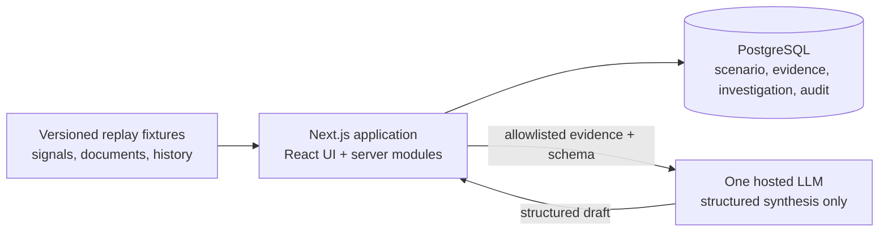
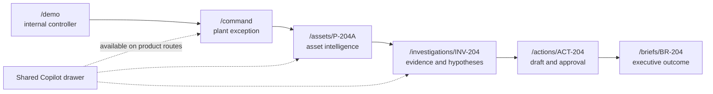

# PlantMind OS Prototype — Critical CTO Review and Simplified Recommendation

**Status:** founder approval draft  
**Date:** 5 August 2026  
**Scope:** demonstration prototype only  
**Implementation boundary:** no application code may be generated or modified until explicit founder approval.

## Executive verdict

The Founding Architecture Blueprint is directionally strong for an eventual enterprise platform, especially its evidence-to-action positioning, read-only OT boundary, deterministic-before-generative principle, and rejection of premature microservices. It is not yet sufficiently ruthless about the demonstration prototype.

The blueprint still asks a small prototype team to think about too many deployables, data technologies, platform registries, executive agents, workflows, routes, and enterprise controls. Several are sensible MVP preparations but unnecessary runtime machinery for proving the product. If implemented literally, the prototype could become an infrastructure exercise and fail to produce a polished, convincing story quickly.

The approved prototype should be one deployable full-stack application, one PostgreSQL database, one replayed industrial scenario, one deterministic anomaly and business-impact model, one shared Copilot, two genuinely distinct executive role views, and one simulated approval-to-work-order flow. Knowledge graph and digital twin concepts should appear as focused visual components inside that journey, not as separate platforms.

The prototype's job is to prove one claim:

> PlantMind turns fragmented operational evidence into a credible, financially quantified, governed action faster than existing dashboards and manual investigation.

It is not required to prove live industrial connectivity, enterprise-scale tenancy, autonomous monitoring, predictive maintenance, marketplace extensibility, multi-model routing, or production deployment.

---

## 1. Critical review of the original recommendation

### 1.1 Unnecessary technical complexity

| Original recommendation | CTO critique | Revised decision |
|---|---|---|
| TypeScript application plus NestJS API plus Python AI/analytics workers | Three runtime shapes and two languages are unnecessary for a curated deterministic scenario. They add contracts, process management, deployment, debugging, and skills overhead. | One Next.js/TypeScript application. Add Python only in MVP when real numerical/ML workloads justify it. |
| PostgreSQL plus object storage plus pgvector/full-text retrieval | Curated prototype documents and replay fixtures do not require separate object storage or semantic indexing. | PostgreSQL plus versioned fixture files bundled with the demo. Use direct evidence IDs and deterministic retrieval. |
| LLM gateway with provider normalization, budgets, routing, registry, and caching | A thin boundary is useful, but a generalized gateway is a platform project. | One model provider behind one small interface. Record request, model, prompt version, result, latency, and evidence IDs. |
| Explicit agent orchestrator and typed tool registry | The governance intent is correct, but a general orchestrator/registry is larger than the scenario. | One fixed investigation sequence and four allowlisted read-only operations, implemented as application functions later. No free-form agent loop. |
| Event-driven seams, transactional outbox, background queue | There is no demonstrated asynchronous scale or reliability need. | Synchronous request flow and database transaction. A simple persisted status transition is enough. |
| Separate design-system program with Storybook | A premium visual system is required, but a standalone component program can slow the demo. | Define tokens and a compact component gallery inside the app/repository. Storybook moves to MVP unless already familiar and zero-friction. |
| Broad enterprise routing, administration, integration, marketplace, agent and workflow centres | Empty or shallow pages make the product feel less credible, not more complete. | Six primary product routes plus one internal demo controller. Embed graph, twin, agent trace, and approval in the core journey. |

The original blueprint sometimes uses “adopt now” to mean “establish the enterprise seam,” but a prototype team may interpret it as “implement the subsystem.” The revised rule is stricter: prepare a clean data shape or interface only when it takes little effort and is exercised by the demo. Do not create an unused abstraction to signal future readiness.

### 1.2 Premature services and infrastructure

The blueprint correctly defers microservices, Kafka, Redis, ClickHouse, Neo4j, Kubernetes, and lakehouse infrastructure. However, the following still amount to premature service decomposition for the prototype:

- A separate NestJS backend deployment.
- A separate Python worker deployment.
- A workflow worker.
- A connector/edge runtime, even if read-only.
- A standalone LLM gateway service.
- An API gateway beyond the hosting platform's standard ingress.
- A multi-tenant control-plane/data-plane split.

For the demonstration, these should be logical modules inside one application or design notes only. The prototype should have exactly one deployable application and one managed database. A hosted model API is the only external runtime dependency.

### 1.3 Technologies not required for the demonstration

The following are not approved for prototype implementation:

- NestJS, Fastify as a separate API, FastAPI, and Python workers.
- Temporal, Camunda, OPA, Kafka/Redpanda, RabbitMQ, NATS, Redis.
- TimescaleDB-specific features, ClickHouse, Neo4j, OpenSearch, pgvector.
- S3-compatible object storage for demo assets.
- Kubernetes, Terraform, GitOps, service mesh, multi-region infrastructure.
- Auth0/Okta/Keycloak/enterprise SAML or SCIM integration.
- OpenFeature and a remote feature-flag platform.
- GraphQL, AsyncAPI, CloudEvents, WebSocket infrastructure.
- Multi-model routing, model marketplace, long-term agent memory.
- Three.js/Babylon.js or a general digital-twin engine.
- Marketplace manifests, signing, sandboxing, licensing, and entitlement engines.
- A standalone report-rendering service.

Some of these are valid MVP choices. None makes the investor demonstration more persuasive than an additional week spent on narrative coherence, data credibility, interaction quality, evidence UX, or rehearsal.

### 1.4 Contradictions with the product vision

1. **Intelligence before visualization vs. many first-class visual destinations.** Separate command centre, graph, twin, agents, workflows, insights, and reports risk becoming a dashboard suite. The prototype must make the investigation/action loop primary and treat visuals as supporting evidence.
2. **Context before prediction vs. “predictive maintenance” language.** A scripted anomaly and curated hypotheses do not prove prediction. Call it performance-degradation detection and evidence-backed investigation.
3. **Explainability before autonomy vs. agent control-centre spectacle.** Showing autonomous-looking runs before explanation quality is proven undermines trust. The user initiates the investigation; the AI never silently monitors or acts.
4. **Premium simplicity vs. platform breadth.** A dozen thin pages and multiple executive chat surfaces would feel less premium than six complete pages.
5. **Configuration before customization vs. hard-coded demo.** The demo will be curated, but the scenario data, formulas, thresholds, labels, and copy should be configuration—not scattered UI constants. Do not build a generic configuration product.
6. **Business impact alongside operations vs. unvalidated avoided-loss claims.** The impact must be a transparent scenario estimate with visible assumptions, not a claimed realized saving.

### 1.5 AI Executive Team risk: renamed chatbots

The original blueprint says executives are policy profiles with mandates, scopes, tools, and memory. That is correct for the target state, but the prototype could still reduce them to two chat panels sharing the same prompt and retrieval.

For the prototype, the AI Executive Team must not be represented as multiple conversational bots. Use one shared Copilot and two role-specific decision briefs:

| Role view | Distinct mandate | Inputs | Required output | Allowed action |
|---|---|---|---|---|
| AI Plant Head | Protect plant throughput and operating economics | Constraint, production loss, energy intensity, action status | Prioritized plant brief with impact, urgency, and decision requested | Approve investigation priority; send to maintenance review |
| AI Maintenance Head | Determine the safest maintenance response | Asset signals, alarms, work history, SOP excerpts, hypotheses | Ranked causes, inspection plan, evidence gaps, work-order draft | Prepare draft only; cannot approve or execute |

Both views use the same evidence service and Copilot engine, but their mandate, input scope, output schema, language, and permitted next step differ. There is no simulated agent-to-agent banter, shared hidden memory, or separately branded generic chat. If these distinctions cannot be demonstrated, show only the Maintenance Head and label the Plant Head as a future role.

### 1.6 Explainability, evidence, confidence, and audit gaps

The original blueprint describes these well but does not make the prototype contract concrete enough. The prototype must enforce the following visible rules:

- Every material factual claim has one or more clickable evidence references.
- Evidence opens at the relevant signal range, alarm, work order, or exact document excerpt.
- Every answer shows “as of” time, plant/asset scope, and whether data is replayed.
- Deterministic calculations show formula, inputs, units, assumptions, and rounding.
- Hypotheses distinguish observed fact, calculated result, retrieved reference, and AI inference.
- Conflicting or missing evidence is displayed; it is never silently reconciled.
- “Confidence” is not an LLM self-rating. Show an evidence-quality profile with four components: coverage, freshness, data quality, and analytical support.
- Each AI run records model, prompt version, user, input evidence IDs, output, latency, and disposition.
- Each approval record contains approver, time, decision, comment, exact proposal version, and truth label.
- The prototype audit timeline is append-only by application behavior, but must not be described as WORM or regulatory-grade.

### 1.7 Unsafe or insufficiently governed agent capabilities

Level 3 “prepare action” is still unsafe if a model can invent action parameters, ignore contradictory evidence, or present a generated work request as approved. The demonstration therefore has no autonomous agent and no real external write tool.

Approved behavior:

- A deterministic rule creates the initial anomaly event from replay data.
- A user explicitly starts an investigation.
- The AI can read only the current scenario's allowlisted evidence.
- The AI can rank curated hypotheses and identify missing evidence.
- A deterministic function calculates impact.
- The AI may populate a draft from an approved template, with generated fields visibly marked.
- A named user approves or rejects the draft inside PlantMind.
- “Send to CMMS” produces a simulated success event only, clearly labeled; no external call exists.

Prohibited behavior:

- Background LLM monitoring.
- Unbounded planning loops or tool selection.
- Cross-scenario, cross-plant, or internet retrieval.
- Persistent conversational memory beyond the scenario session.
- Model-determined authorization, severity, financial value, or approval.
- Any PLC, DCS, SIS, historian, ERP, MES, or CMMS write.

### 1.8 Product areas too broad for the first prototype

Defer standalone versions of enterprise command centre, marketplace, workflow centre, agent control centre, knowledge-graph explorer, 3D digital twin, integration manager, security/governance console, multi-plant comparison, model management, AI executive roster, and broad report library.

The prototype should demonstrate one plant and one critical asset. A small enterprise summary may show the selected plant's relevance, but multi-plant data is not necessary. The graph and twin are embedded evidence views. The “agent activity” experience is an investigation/audit timeline, not a platform control centre.

### 1.9 Missing elements for a compelling enterprise and investor demonstration

- A rehearsed six-to-eight-minute narrative with named presenter transitions.
- A visible demo mode, scenario clock, replay status, and one-click reset.
- A clear “before PlantMind / with PlantMind” comparison of investigation effort and decision latency.
- A decisive opening screen with the value-at-risk exception—not a generic KPI wall.
- An evidence drawer that opens exact sources without navigation loss.
- A transparent financial-impact bridge and scenario disclaimer.
- A credible “what PlantMind knows / does not know” panel.
- A model-offline fallback that preserves the demo and is labeled as a pre-reviewed simulated response.
- A closing executive brief showing decision, action owner, expected value, uncertainty, and next checkpoint.
- A compact trust panel covering data provenance, AI boundaries, permissions, audit, and no-control policy.
- Presenter notes, reset checklist, seeded failure-free state, and recorded fallback video/screens.
- Consistent realistic industrial naming, units, timestamps, alarm codes, work-order history, and SOP content reviewed by an industrial SME.

### 1.10 Risks to rapid completion

| Delivery risk | How it slows the prototype | Immediate control |
|---|---|---|
| Trying to establish target architecture while building the demo | Weeks lost on unused boundaries and infrastructure | One deployable; architectural notes for later only |
| Building several AI executives | Prompt/evaluation/UI duplication | Two structured role briefs, one shared Copilot |
| Live connectors or real customer data | Access, security, quality, and legal delays | Versioned synthetic/replayed dataset with provenance |
| General RAG pipeline | Chunking, embeddings, retrieval evaluation | Curated evidence catalog and direct evidence lookup |
| 3D twin and global graph | Asset/model preparation and interaction complexity | One 2D process schematic and one focused relationship view |
| Open-ended Copilot | Variability, hallucination, demo failure | Suggested questions, bounded tools, structured response schema |
| Unvalidated business value | Credibility damage late in rehearsal | Approve formula and assumptions in Phase 0 |
| Excessive page count | Shallow pages and inconsistent polish | Six product routes; embed secondary views |
| Identity/tenant complexity | Login and permission plumbing with no demo payoff | Three fixed demo personas and local session switching |
| Dependence on live model/network | Demo can fail in the room | Cached reviewed fallback with conspicuous simulation label |
| No single product owner for story | Features accumulate without narrative coherence | One founder owns scope and demo acceptance |

---

## 2. Revised and simplified prototype recommendation

## 2.1 Approved prototype architecture



Physical shape:

- One repository.
- One Next.js/TypeScript deployable.
- One managed PostgreSQL database.
- Versioned replay fixtures and document excerpts stored with the demo assets; database rows reference them.
- One hosted LLM provider through a thin internal adapter.
- One hosting environment and one demo URL.
- No separate worker, API, gateway, queue, edge runtime, object store, or observability stack.

The application is organized into logical modules—scenario, plant context, investigation, evidence, impact, AI synthesis, approval, report, and audit—but these are not services. Include stable IDs and source metadata that make later extraction possible. Do not create unused enterprise abstractions.

## 2.2 Components to build now

1. Premium application shell with dark/light command-centre theme, persona switcher, scenario clock, demo truth badge, and reset control.
2. Plant exception command page centered on one value-at-risk event.
3. Critical asset page with replayed trends, current state, alarms, work history, and 2D process context.
4. Investigation workspace with hypotheses, evidence drawer, focused relationship graph, assumptions, and evidence-quality profile.
5. Shared Copilot drawer with four to six suggested questions and bounded structured answers.
6. AI Plant Head decision brief and AI Maintenance Head diagnostic brief, each with distinct schema and action boundary.
7. Deterministic anomaly, impact, and recommendation-support calculations.
8. Approval page for a versioned maintenance work-order draft.
9. Investigation and decision audit timeline.
10. Executive report/brief page suitable for screen and print.
11. Model-offline reviewed fallback, visibly labeled simulated.
12. Internal scenario controller for reset, time jump, model mode, and presentation state.

## 2.3 Components to simulate

| Capability | Simulation rule |
|---|---|
| Sensor/historian feed | Replayed time-series fixture with visible scenario clock |
| Anomaly detection | Deterministic threshold/trend rule over fixture data |
| ERP/production/energy context | Seeded records with source labels and timestamps |
| Maintenance history and SOP | Realistic synthetic records reviewed for plausibility |
| CMMS work-order creation | Local state transition and audit event; no network call |
| AI monitoring | Predefined event trigger; never claim an LLM continuously monitored the plant |
| Intervention outcome | Optional time jump to a clearly labeled simulated post-action state |
| Model outage fallback | Pre-reviewed cached answer labeled “simulated fallback” |

## 2.4 Prepare for but do not implement

- Stable tenant, plant, asset, source, evidence, investigation, action, and audit IDs.
- Logical module boundaries and server-side authorization hooks.
- Provider-neutral model adapter with one implemented provider.
- Tool-like read functions with typed inputs/outputs, without a general registry.
- Data-source metadata compatible with future connectors.
- Append-only audit-event shape and proposal versioning.
- Configuration files for scenario thresholds, formulas, routes, role mandates, and suggested questions.
- Deployment and security ADRs for MVP.
- Interface points for enterprise IdP, object storage, workflow engine, connector runtime, and specialist stores.

“Prepare” means document the seam and keep the data model clean. It does not mean install, deploy, scaffold, or operate the future technology.

## 2.5 Defer

- Live OPC UA, MQTT, historian, MES, ERP, or CMMS connectors.
- Edge collector and store-and-forward.
- Multi-tenant SaaS isolation, enterprise SSO, SAML, SCIM, and ABAC engine.
- Temporal/workflow platform, OPA, event broker, outbox, background workers.
- Python analytics/ML services and predictive models.
- Vector database/RAG ingestion pipeline.
- Dedicated graph, time-series, search, cache, object-store, and lakehouse systems.
- Multi-model routing, private models, long-term memory, agent collaboration.
- Level 3 real action preparation outside the local demo; all Level 4/5 autonomy.
- Standalone graph, twin, agent, workflow, marketplace, integration, security, and administration products.
- Microservices, micro-frontends, Kubernetes, multi-region, on-prem, and disaster recovery.
- General extension SDK, marketplace commerce, entitlements, and licensing.

## 2.6 Approved technologies

### Prototype

| Area | Approved choice | Boundary |
|---|---|---|
| Language | TypeScript only | No Python runtime |
| Application | Next.js + React | UI, server routes/actions, and logical domain modules in one deployable |
| Styling | CSS variables/tokens plus a small accessible component foundation | No separate design-system release train required |
| Charts | Apache ECharts or one equivalent already familiar to the team | Time series and impact bridge only |
| Relationship/process visual | React Flow or a simple SVG implementation | One curated graph and one 2D process schematic; reuse where possible |
| Database | Managed PostgreSQL | All mutable demo state, evidence metadata, and audit events |
| Validation | TypeScript runtime schemas | Validate AI and boundary inputs/outputs |
| AI | One hosted model with structured output | Synthesis only; no autonomous loop or external writes |
| Authentication | Fixed demo personas/local demo session | Clearly not enterprise SSO |
| Hosting | One managed web deployment plus managed PostgreSQL | One region; best-effort demo availability |
| Testing | Unit tests for formulas/state; browser E2E for golden path; visual smoke checks | Optimize for demo reliability |
| Telemetry | Structured application log and AI-run/audit tables | No full observability platform |

### Deferred until MVP evidence exists

Python/FastAPI, NestJS extraction, Temporal, OPA, Redis, Kafka-compatible streaming, Timescale-specific features, ClickHouse, Neo4j, OpenSearch, pgvector, S3 object storage, enterprise identity provider, OpenFeature provider, OpenTelemetry backend, Terraform, containers/Kubernetes, edge runtime, connector SDK, report service, and multi-model gateway.

This is not a permanent rejection. Each technology returns only when a real pilot requirement, measured workload, reliability need, or deployment constraint supplies an acceptance test.

---

## 3. Single end-to-end demonstration scenario

### Scenario: Cooling-water pump degradation threatens production and energy performance

**Plant:** Meridian Specialty Chemicals, Pune Plant  
**Process:** Reactor Line 2 cooling-water loop  
**Critical asset:** Pump P-204A  
**Scenario time:** 14:20 IST, 5 August 2026  
**Truth:** all data is synthetic and replayed.

Narrative:

1. The Plant Command page opens on one prioritized exception: P-204A vibration and motor current are trending upward while cooling-water flow falls below its operating-mode baseline.
2. PlantMind's deterministic rule marks a performance-degradation event. It does not claim a predicted failure.
3. The AI Plant Head brief explains that Reactor Line 2 has an estimated 6–10% throughput exposure during the next production window and elevated energy intensity. It requests a maintenance investigation before the next batch.
4. The user opens the asset. Trends show vibration, current, flow, discharge pressure, and energy intensity against the same time window. Alarm and maintenance history appear beside the 2D process schematic.
5. The investigation workspace assembles exact evidence: signal segments, a recent seal inspection note, a prior bearing work order, pump curve context, and an SOP excerpt.
6. The AI Maintenance Head ranks three hypotheses: bearing degradation, suction restriction, and instrument error. It states why each is supported or weakened and identifies missing evidence.
7. A deterministic impact panel calculates the exposure range from planned output, contribution margin, expected duration, and energy penalty. All values and assumptions are editable only through scenario configuration and displayed to the user.
8. The Maintenance Head prepares an inspection work-order draft: verify suction strainer differential pressure, perform vibration spectrum inspection, inspect bearing temperature and lubrication, and define safe isolation prerequisites. Generated fields are marked.
9. A named Plant Head persona approves the draft. “Send to CMMS” records a simulated submission; no external system is called.
10. The final executive brief summarizes evidence, uncertainty, decision, owner, expected impact, next checkpoint, and complete audit trail. An optional time jump shows a clearly simulated post-inspection outcome.

The demo begins with an executive exception and ends with a governed decision. Copilot, graph, twin, workflow, AI executives, business impact, and auditability all support this one narrative rather than competing for attention.

---

## 4. Prototype page and route map



| Route | Purpose | Required content |
|---|---|---|
| `/demo` | Presenter-only scenario control | Reset, time, persona, model live/fallback, truth state, jump points |
| `/command` | Opening plant command experience | One exception, value-at-risk, production/energy context, AI Plant Head brief, action status |
| `/assets/P-204A` | Asset evidence and process context | Trends, state, alarms, work history, 2D schematic, freshness/source indicators |
| `/investigations/INV-204` | Core intelligence workspace | Hypotheses, evidence drawer, relationship view, Copilot, confidence profile, impact bridge |
| `/actions/ACT-204` | Governed decision | Versioned draft, generated fields, approval/rejection, simulated submission, audit |
| `/briefs/BR-204` | Closing executive artifact | Decision, evidence, impact range, owner, uncertainty, checkpoint, printable summary |

There are no standalone prototype routes for enterprise comparison, marketplace, knowledge graph, digital twin, agents, workflows, integrations, administration, or security. Relevant concepts are embedded where they improve the story.

---

## 5. Prototype data model

This is a conceptual model, not an implementation schema.

| Entity | Essential fields | Purpose |
|---|---|---|
| DemoScenario | id, name, truth_label, clock_start, current_time, state, version | Reproducible scenario/reset |
| Persona | id, role, display_name, permissions, mandate | Fixed demo identity and role view |
| Plant | id, name, timezone, location, production_context | Plant context |
| ProcessArea | id, plant_id, name, operating_mode, planned_output | Reactor/cooling-loop context |
| Asset | id, process_area_id, name, type, criticality, state | Pump identity and status |
| Signal | id, asset_id, name, unit, source_id, quality_rule | Signal definition |
| ObservationSeries | signal_id, points, start_time, end_time, quality, replayed | Replayed measurements |
| OperationalEvent | id, asset_id, type, severity, occurred_at, rule_id, status | Deterministic anomaly/alarm |
| SourceRecord | id, type, system_label, timestamp, excerpt_or_reference, truth_label | Work order, alarm, SOP, production or energy record |
| Relationship | id, from_id, type, to_id, evidence_id | Focused knowledge relationships |
| Investigation | id, event_id, status, initiated_by, as_of, scope, evidence_quality | Investigation container |
| EvidenceItem | id, investigation_id, kind, source_id, time_range, observed_value, unit, quality, citation_label | Atomic source-linked evidence |
| Hypothesis | id, investigation_id, title, rank, supporting_ids, contradicting_ids, gaps, inference_label | Explainable RCA option |
| ImpactAssessment | id, investigation_id, formula_version, inputs, range_low, range_high, currency, assumptions | Deterministic business impact |
| ExecutiveBrief | id, investigation_id, role, schema_version, content, evidence_ids, generated_at | Distinct Plant/Maintenance outputs |
| Recommendation | id, investigation_id, action_type, rationale, evidence_ids, safety_notes | Proposed next step |
| ActionDraft | id, recommendation_id, version, fields, generated_fields, status | Versioned work-order draft |
| Approval | id, action_draft_id, decision, approver_id, decided_at, comment | Human governance |
| AIRun | id, user_id, model, prompt_version, evidence_ids, structured_output, latency, fallback, timestamp | AI traceability |
| AuditEvent | id, actor_id, event_type, entity_type, entity_id, version, timestamp, details | Append-only demo decision history |

Every time-bearing record uses an explicit timezone/UTC instant. Every measurement has a unit and quality state. Every evidence item has a source and truth label. AI output references entity/evidence IDs rather than copying untraceable prose.

---

## 6. Prototype component map

```text
PrototypeApp
├─ DemoController
├─ ApplicationShell
│  ├─ ScenarioClockAndTruthBadge
│  ├─ PersonaSwitcher
│  ├─ GlobalContext
│  └─ CopilotDrawer
├─ PlantCommandPage
│  ├─ PriorityExceptionHero
│  ├─ ProductionAndEnergyContext
│  ├─ ValueAtRiskCard
│  ├─ PlantHeadBrief
│  └─ ActionStatusTimeline
├─ AssetPage
│  ├─ AssetStateHeader
│  ├─ MultiSignalTrend
│  ├─ ProcessSchematic2D
│  ├─ AlarmAndWorkHistory
│  └─ SourceFreshnessPanel
├─ InvestigationPage
│  ├─ InvestigationHeader
│  ├─ HypothesisRanking
│  ├─ EvidenceDrawer
│  ├─ RelationshipView
│  ├─ EvidenceQualityProfile
│  ├─ ImpactBridge
│  └─ MaintenanceHeadBrief
├─ ActionPage
│  ├─ RecommendationSummary
│  ├─ WorkOrderDraft
│  ├─ GeneratedFieldMarkers
│  ├─ ApprovalControl
│  └─ AuditTimeline
└─ ExecutiveBriefPage
   ├─ DecisionSummary
   ├─ EvidenceAndUncertainty
   ├─ FinancialImpactRange
   ├─ OwnerAndCheckpoint
   └─ PrintView
```

Reusable trust primitives are more important than a large generic component library: `TruthBadge`, `SourceCitation`, `AsOfStamp`, `FreshnessState`, `EvidenceQuality`, `InferenceLabel`, `FormulaDisclosure`, `GeneratedContentMarker`, `ApprovalRecord`, and `AuditEntry`.

---

## 7. Phased implementation sequence

Target: five to six weeks for a focused team after founder decisions and content readiness. This is an execution sequence, not authorization to generate code.

### Phase A — Story and evidence lock (2–4 working days)

- Approve scenario, personas, asset, event, outcome, and demo truth labels.
- Freeze the six-to-eight-minute storyboard and route sequence.
- Produce/review replay signals, source records, SOP excerpt, work history, and formulas.
- Define evidence-quality rules and exact AI output schemas.

**Exit:** founder and industrial SME sign off the scenario pack; no unresolved data or financial assumption.

### Phase B — Premium shell and deterministic foundation (1 week)

- Establish tokens, typography, density, themes, shell, routes, demo controller, and reset.
- Load fixtures and render command/asset baseline states.
- Implement deterministic event and impact behavior.

**Exit:** the demo runs without AI from opening exception through transparent impact calculation.

### Phase C — Evidence and investigation (1 week)

- Complete time-series evidence, source drawer, relationship view, process schematic, hypotheses, and confidence profile.
- Verify every claim-to-source link and timestamp/unit.

**Exit:** an industrial reviewer can reproduce the investigation from displayed evidence.

### Phase D — Bounded AI and executive differentiation (1 week)

- Add one model adapter, suggested questions, structured answers, model trace, and fallback.
- Complete distinct Plant Head and Maintenance Head briefs.
- Run groundedness, citation, refusal, and scope tests.

**Exit:** AI adds synthesis without becoming the source of facts, calculations, permissions, or actions.

### Phase E — Governed action and closing brief (1 week)

- Complete draft, generated markers, approval/rejection, simulated submission, audit timeline, and executive brief.
- Add print/presentation states and trust panel.

**Exit:** the full evidence-to-action loop is complete and truthfully labeled.

### Phase F — Hardening and rehearsal (3–5 working days)

- Golden-path E2E, formula tests, AI regression set, visual/accessibility smoke pass.
- Test cold start, reset, persona transitions, model outage, network degradation, and projector/laptop layouts.
- Create presenter script, fallback recording/screens, and reset checklist.

**Exit:** three consecutive unrehearsed runs complete within the target time without intervention.

---

## 8. Prototype acceptance criteria

### Product coherence

- One scenario completes from exception to governed action and closing brief in 6–8 minutes.
- Every route advances the same narrative; no placeholder or dead-end product page is shown.
- A target executive can explain the product's value proposition after one run without technical prompting.
- The experience clearly distinguishes PlantMind from SCADA, historian, CMMS, and generic BI.

### Truth and credibility

- Every screen permanently indicates that operational data is synthetic/replayed.
- No copy claims a live integration, predicted failure, realized saving, regulatory certification, or autonomous action.
- “Send to CMMS” is visibly simulated before and after activation.
- The scenario resets to the exact initial state in under 15 seconds.

### Evidence and explainability

- 100% of material factual claims and hypotheses have clickable evidence or are labeled inference/assumption.
- Evidence opens at the exact signal range, record, or document excerpt.
- Every measurement displays unit, time range, source label, and quality/freshness state.
- Every impact value is reproducible from a visible versioned formula and inputs.
- Contradictory and missing evidence is visible.
- Evidence quality shows component reasons; no unsupported universal AI confidence percentage appears.

### AI and executive roles

- AI cannot access evidence outside the active scenario or invoke a write action.
- AI responses conform to the approved structured schema or fail safely.
- The model-offline path completes the demo and is labeled as simulated fallback.
- Plant Head and Maintenance Head outputs differ in mandate, inputs, output structure, and allowed next step—not only tone or title.
- The AI never determines financial inputs, authorization, approval, or asset severity.

### Governance and audit

- Every AI run, proposal version, approval/rejection, simulated submission, persona switch, and scenario time jump is recorded.
- Approval binds the named user to an exact immutable proposal version.
- Rejection and revision paths are demonstrable.
- No real industrial or enterprise system credentials, endpoints, or writes exist in the prototype.

### Experience quality

- The primary 1440×900 presentation layout has no clipping, overflow, or unreadable chart labels; a standard laptop layout remains usable.
- Light and dark themes preserve semantic states and contrast; critical meaning never relies on color alone.
- Core journey is keyboard operable, focus is visible, and reduced-motion mode works.
- Loading, empty, model-unavailable, and partial-evidence states are designed rather than exposed as raw errors.
- Visual design is consistent across all six routes and the printable brief.

### Reliability

- Three consecutive full runs succeed from a clean reset.
- Golden-path browser test, deterministic formula tests, and AI citation/scope regression pass before each demonstration build.
- The live model has a strict timeout and cannot block navigation, evidence, impact, approval, or report views.
- No step depends on an untested external service other than the optional live AI response.

---

## 9. Final simplified CTO recommendation

Approve a five-to-six-week demonstration prototype only if the founder accepts the single-scenario boundary and the explicit simulation policy.

Build the smallest complete expression of PlantMind's differentiation: one premium command experience that connects a replayed asset-performance exception to exact operational evidence, a bounded AI-assisted investigation, transparent business impact, a human-approved maintenance draft, and an auditable executive outcome.

Do not build a platform-shaped prototype. Preserve enterprise readiness through disciplined identifiers, provenance, versioning, module boundaries, audit records, and truth labels—not by deploying enterprise infrastructure early.

Founder approval is required on these five items before implementation:

1. The cooling-water pump scenario and all synthetic data assumptions.
2. The one-deployable/one-database technology boundary.
3. The two executive-role definitions and decision rights.
4. The deterministic impact formula and financial disclaimer.
5. The five-to-six-week scope, acceptance criteria, and explicit defer list.

Until those decisions are approved, no application code should be generated or modified.
