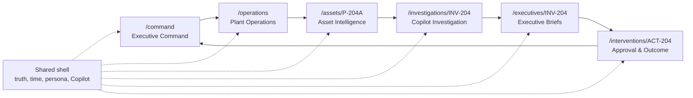
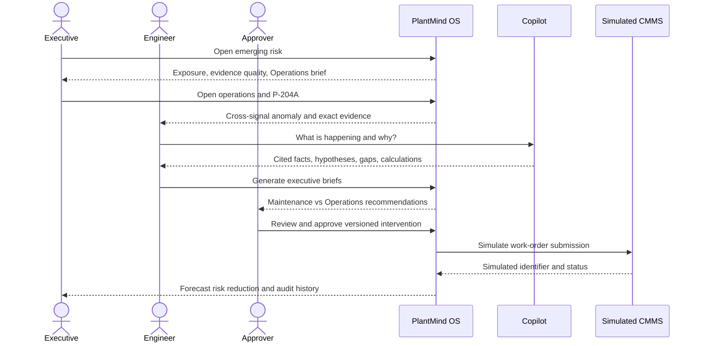
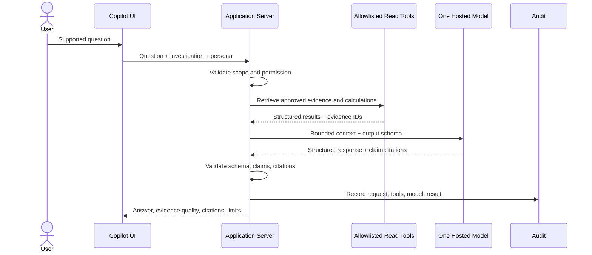
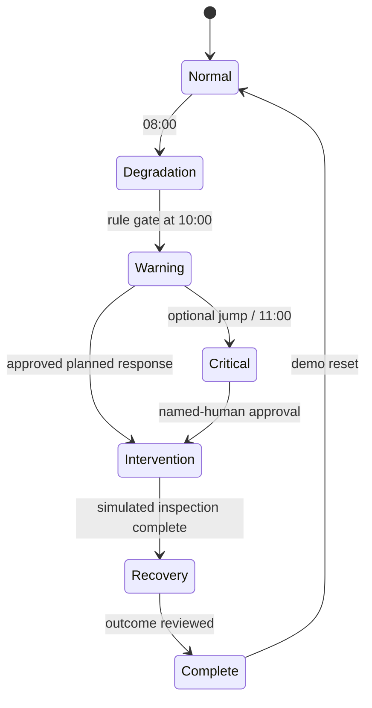
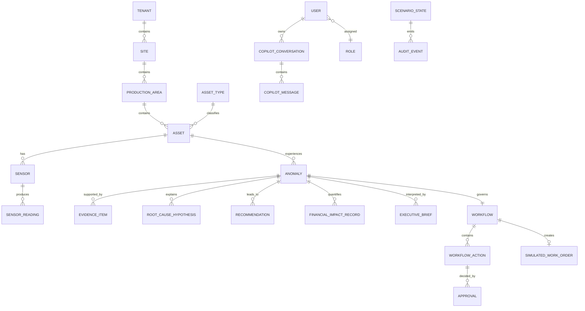
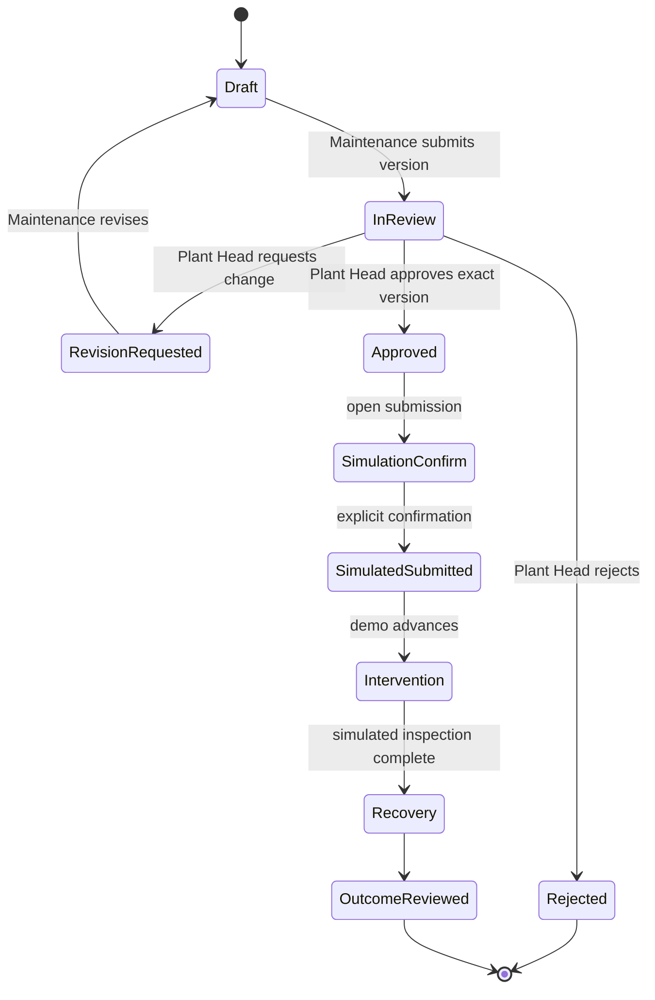

# PlantMind OS Prototype Product and Engineering Blueprint

**Status:** implementation-planning draft for founder approval  
**Date:** 5 August 2026  
**Architecture authority:** Founder Architecture Approval and Simplified CTO Recommendation  
**Code boundary:** this document defines implementation; it does not authorize application-code generation.

## Document decisions

This blueprint fixes the prototype scope so implementation can proceed as vertical slices after founder approval. The words **working**, **deterministic**, **AI-generated**, **replayed**, **simulated**, **static**, and **future** are truth classifications, not marketing language.

The prototype proves one product loop:

> detect a progressive pump abnormality from replayed data, explain it with evidence and operational context, quantify exposure deterministically, present distinct maintenance and operations decisions, obtain human approval, simulate a CMMS submission, and show the expected outcome and audit history.

---

## 1. Approved scope

### Product boundary

- One premium, coherent demonstration for one synthetic enterprise, one site, one production area, and one pump.
- One Next.js and TypeScript deployable application.
- One PostgreSQL database.
- One eight-hour replayed scenario with controllable time.
- Exactly six primary product routes.
- One bounded Copilot using one model provider and allowlisted application tools.
- Exactly two AI executive experiences: AI Maintenance Head and AI Operations Head.
- Deterministic anomaly, severity, root-cause support, operational-impact, financial-impact, avoided-loss, and evidence-quality calculations.
- Human approval of a versioned intervention proposal.
- Simulated CMMS work-order submission with explicit labeling.
- Outcome tracking through a simulated recovery stage.
- Fixed demo personas: Executive Viewer, Reliability Engineer, Operations Head, and Plant Head Approver.

### Success definition

The prototype is successful when a founder can demonstrate the complete evidence-to-action journey in 6–8 minutes; an industrial leader understands the decision value without believing the integrations are live; and an engineer can inspect the sources, formulas, assumptions, uncertainty, approval, and audit trail.

## 2. Explicit exclusions

The prototype will not implement Python workers, NestJS, microservices, vector or graph databases, Timescale-specific infrastructure, object storage, Temporal, OPA, Kafka, Redis, Kubernetes, enterprise SSO, multi-model routing, edge collectors, marketplace capabilities, live connectors, background agent loops, long-term agent memory, physics simulation, predictive-failure claims, real CMMS submission, or any control of PLC, DCS, SIS, SCADA, MES, ERP, historian, or other industrial systems.

It will also not contain standalone marketplace, agent-control, workflow-control, graph-explorer, digital-twin, integrations, security, or administration routes. Those concepts appear only where they support the six-route story.

## 3. Final demonstration scenario

### Scenario identity

| Field | Approved value |
|---|---|
| Enterprise | Meridian Specialty Chemicals (synthetic) |
| Site | Pune Specialty Materials Plant (synthetic) |
| Production area | Reactor Line 2 cooling-water loop |
| Asset | Cooling-water Pump P-204A |
| Asset type | Horizontal centrifugal pump, duty/standby pair |
| Scenario date | 5 August 2026, IST |
| Dataset | Fully simulated and replayed |
| Scenario window | 06:00–14:00 IST |
| Demonstration start | 10:15 IST, Warning stage |
| Operational horizon | Next 10 production hours |
| Business context | Batch production threatened by declining cooling-water performance |

### Story

Pump P-204A develops rising vibration, motor current, bearing temperature, and suction-strainer differential pressure while flow and discharge pressure decline. A deterministic rule identifies a persistent cross-signal abnormal condition. PlantMind connects the event to asset history, a recent seal inspection, a prior bearing work order, operating mode, the current production schedule, and approved cost assumptions.

The Copilot explains facts and calculations from bounded evidence. The AI Maintenance Head ranks failure hypotheses and proposes an inspection scope. The AI Operations Head explains output, schedule, energy, and downtime trade-offs. A human Plant Head reviews a versioned intervention, approves it, and simulates CMMS submission. The scenario advances to a simulated intervention and recovery; the command centre shows forecast risk reduction, never claimed realized savings.

### Narrative truth

- Detection is **functionally working and deterministically calculated** over replayed readings.
- Source records and telemetry are **replayed from simulated data**.
- Copilot explanations and executive prose are **AI-generated from bounded context**, with a labeled reviewed fallback.
- CMMS submission and post-intervention recovery are **simulated**.
- Graph and process views are **working visualizations of curated relationships**, not general graph or twin platforms.

---

## 4. Six-route page map

There are exactly six primary routes. The scenario controller is a header drawer available only in demo mode, not a seventh route. The root URL redirects to `/command` and is not a product destination.

### Route 1 — `/command`: Executive Command Centre

| Concern | Specification |
|---|---|
| Purpose | Open with the most important emerging risk, quantified exposure, current decision status, and executive interpretation. |
| Primary persona | Executive Viewer; Operations Head. |
| Main information | Plant health summary, one priority exception, scenario truth/time, production-at-risk range, energy penalty, evidence quality, AI Operations Head brief, intervention status. |
| Major components | `CommandHero`, `ExecutiveKPIGrid`, `PriorityRiskCard`, `ImpactRangeCard`, `OperationsHeadBriefCard`, `ActionStatusTimeline`, `TrustStrip`. |
| User actions | Open site context; inspect P-204A; open evidence; compare executive brief; resume action; change persona; pause replay. |
| Data dependencies | Scenario state, site/area/asset summary, active anomaly, impact record, operations brief, workflow state, latest audit events. |
| Empty state | “No active operational risk at this scenario stage,” with jump-to-warning control in demo mode. |
| Loading state | Stable shell, labeled KPI skeletons, frozen scenario clock until consistent snapshot loads. |
| Error state | Preserve last consistent snapshot; identify unavailable panel; show correlation ID and retry; never convert missing data to zero. |
| Permissions | Executive sees impact and brief; Reliability Engineer can inspect but cannot approve; fixed demo permissions are visible. |
| Responsive behavior | Desktop: risk and brief side-by-side. Laptop: brief below risk. Mobile: read-only narrative stack; approval redirects to supported layout warning. |
| Demo talking points | “PlantMind starts with the decision and value at risk, not a wall of tags.” “All data is visibly replayed.” |
| Acceptance criteria | Priority risk understandable in 20 seconds; every KPI has unit/as-of/source state; asset drill-down is one action; simulated/replayed label always visible. |

### Route 2 — `/operations`: Plant Operations Overview

| Concern | Specification |
|---|---|
| Purpose | Explain where the pump sits in the production context and why its degradation matters now. |
| Primary persona | Operations Head; Plant Head. |
| Main information | Reactor Line 2 status, cooling-water constraint, current batch/operating mode, planned output, affected process path, energy intensity, risk timeline, related asset state. |
| Major components | `OperationsHeader`, `AreaStatusRibbon`, `ProcessSchematic`, `ConstraintSummary`, `ProductionPlanCard`, `EnergyIntensityCard`, `OperationalTimeline`, `AffectedAssetCard`. |
| User actions | Inspect affected asset; change time window; open formula disclosure; compare normal vs current operation; ask suggested Copilot question. |
| Data dependencies | Site, production area, operating mode, operational metrics, scenario stage, P-204A state, anomaly, production/cost assumptions. |
| Empty state | Normal-operation view with no active constraint and a clear scenario-stage explanation. |
| Loading state | Process schematic structure renders first; values remain marked unavailable until snapshot is complete. |
| Error state | Partial-data banner specifies unavailable source; process topology remains; impact calculations are withheld if required inputs fail. |
| Permissions | Financial detail hidden for Reliability Engineer if persona configuration excludes it; site data remains read-only. |
| Responsive behavior | Schematic becomes horizontally scrollable at narrow widths; cards stack in decision order; dense timeline uses summary mode. |
| Demo talking points | “The anomaly is connected to production schedule, operating mode, and business exposure.” |
| Acceptance criteria | User can explain why P-204A matters, identify current operating mode, and reach the asset in one click. |

### Route 3 — `/assets/P-204A`: Asset Intelligence

| Concern | Specification |
|---|---|
| Purpose | Show the asset condition, cross-signal anomaly, timeline, history, and exact evidence. |
| Primary persona | Reliability Engineer; AI Maintenance Head consumer. |
| Main information | Asset identity/state, health/severity, vibration/current/temperature/flow/pressure/energy trends, thresholds, anomaly window, alarms, work-order history, source freshness, 2D process context. |
| Major components | `AssetHeader`, `AssetHealthCard`, `MultiSignalTrend`, `ThresholdLegend`, `AnomalyTimeline`, `AlarmHistory`, `MaintenanceHistory`, `ProcessContextMiniMap`, `EvidenceDrawer`. |
| User actions | Brush time range; toggle signals; open evidence; inspect threshold/formula; start or resume investigation; ask Copilot. |
| Data dependencies | Asset/type/sensors/readings, anomaly, operational metrics, alarm/source records, work-order history, scenario clock. |
| Empty state | Asset metadata plus “No readings in selected interval”; offers reset interval, never fabricates a line. |
| Loading state | Chart axes/legend fixed; progressive series loading; quality status remains unknown until loaded. |
| Error state | Failed signal shown individually; related calculations marked unavailable; other signals remain inspectable. |
| Permissions | All personas read; only authorized personas can initiate investigation or progress workflow. |
| Responsive behavior | Desktop multi-signal synchronized charts; narrow screens use one selected signal plus compact anomaly summary. |
| Demo talking points | “PlantMind preserves engineering depth: exact units, thresholds, timestamps, missing data, and source records.” |
| Acceptance criteria | Warning onset and cross-signal deterioration are visually unambiguous; exact evidence opens without leaving context; no more than six series appear simultaneously. |

### Route 4 — `/investigations/INV-204`: Copilot Investigation

| Concern | Specification |
|---|---|
| Purpose | Provide the core evidence-backed analysis, bounded Copilot, hypotheses, deterministic impact, and uncertainty. |
| Primary persona | Reliability Engineer. |
| Main information | Investigation scope/status, Copilot conversation, observed facts, hypothesis ranking, supporting/contradicting evidence, gaps, evidence quality, operational/financial impact, formula disclosures. |
| Major components | `InvestigationHeader`, `CopilotPanel`, `SuggestedPromptBar`, `FindingStack`, `RootCausePanel`, `EvidenceDrawer`, `EvidenceQualityProfile`, `ImpactBridge`, `RelationshipView`. |
| User actions | Ask supported question; open citation; compare periods; inspect hypothesis; mark evidence reviewed; generate executive briefs; navigate to action. |
| Data dependencies | Investigation, evidence, hypotheses, deterministic analysis, readings/records, impact record, Copilot conversation/messages, AI run/audit. |
| Empty state | New investigation with supported suggested questions and explicit scope. |
| Loading state | User message appears immediately; progress exposes “collecting evidence / retrieving calculations / composing”; citations render only after validation. |
| Error state | Model error preserves deterministic findings and offers reviewed simulated fallback; invalid citations prevent answer display. |
| Permissions | Read access to cited evidence required; questions outside active site/asset are refused; brief generation requires Engineer or Operations role. |
| Responsive behavior | Desktop two-pane analysis/Copilot; laptop collapsible Copilot drawer; mobile sequential cards with sticky citation access. |
| Demo talking points | “The model explains approved facts; it does not invent measurements, formulas, authorization, or action.” |
| Acceptance criteria | Every material answer claim is cited or labeled inference; unsupported question fails safely; calculations match deterministic records; model outage does not block the journey. |

### Route 5 — `/executives/INV-204`: AI Executive Briefs

| Concern | Specification |
|---|---|
| Purpose | Compare two structurally distinct decision views derived from the same governed investigation. |
| Primary persona | Plant Head; Executive Viewer. |
| Main information | Maintenance Head diagnostic brief, Operations Head continuity brief, shared evidence set, disagreements/trade-offs, recommended timing, decision requested. |
| Major components | `ExecutiveBriefHeader`, `ExecutiveSelector`, `MaintenanceBrief`, `OperationsBrief`, `ExecutiveComparison`, `SharedEvidenceStrip`, `DecisionRequestCard`. |
| User actions | Switch/compare views; inspect evidence; acknowledge trade-off; open proposed intervention. No free-form executive chat. |
| Data dependencies | Two versioned briefs, investigation/evidence, impact record, recommendation, persona authority. |
| Empty state | Brief not generated; describes required evidence and routes back to investigation. |
| Loading state | Separate brief skeletons; never show one role's text under the other role. |
| Error state | One brief may remain available if the other fails; comparison disabled and reason shown. |
| Permissions | Financial impact visible to Operations/Plant/Executive personas; approval rights remain separate. |
| Responsive behavior | Side-by-side at wide desktop; tabbed at laptop/mobile with persistent comparison summary. |
| Demo talking points | “These are different decision mandates, not renamed chatbots.” |
| Acceptance criteria | A reviewer can name at least three substantive differences between briefs; evidence is shared but output schemas/actions differ; no third executive appears. |

### Route 6 — `/interventions/ACT-204`: Intervention Approval and Outcome

| Concern | Specification |
|---|---|
| Purpose | Convert recommendation into a governed, versioned human decision, simulated CMMS submission, and expected outcome. |
| Primary persona | Plant Head Approver; Maintenance/Operations reviewers. |
| Main information | Recommendation, work scope, operational window, safety prerequisites, cost/exposure range, evidence, proposal version, approvals, simulated work order, audit timeline, expected/simulated outcome. |
| Major components | `InterventionHeader`, `RecommendationCard`, `WorkOrderDraft`, `GeneratedFieldMarker`, `ApprovalPanel`, `SimulatedCMMSStatus`, `OutcomeProjection`, `AuditTimeline`. |
| User actions | Review evidence; approve/reject/request revision; confirm simulation; submit simulated work order; jump to intervention/recovery; return to command. |
| Data dependencies | Recommendation, action draft/version, workflow/actions, approvals, simulated work order, impact/avoided-loss record, scenario state, audit. |
| Empty state | No approved recommendation; route back to investigation and explain prerequisite. |
| Loading state | Version and decision controls disabled until full proposal/evidence snapshot loads. |
| Error state | Approval transaction either commits fully or not at all; simulated submission can retry without duplicate work order. |
| Permissions | Only Plant Head Approver may approve/reject; Maintenance may revise before approval; no persona can trigger a real integration. |
| Responsive behavior | Approval supported on desktop/laptop; mobile is review-only with explicit safety message. |
| Demo talking points | “AI proposes; a named human decides; the external write is unmistakably simulated and audited.” |
| Acceptance criteria | Approval binds exact proposal version; rejection/revision works; one idempotent simulated work order is produced; command page reflects forecast risk reduction after transition. |

### Page and component structure



---

## 5. End-to-end user journey



| Step | Screen | Trigger | System response and data | User action / evidence | Demo transition |
|---|---|---|---|---|---|
| 1 | `/command` | Reset opens at 10:15 Warning | Shows P-204A emerging risk, ₹ exposure range, evidence quality, replay badge | Executive reads priority; opens risk | `warning_unreviewed` → `warning_viewed` |
| 2 | `/operations` | Open plant context | Shows Reactor Line 2 mode, batch plan, cooling constraint, energy trend | User inspects production path | `operations_context_viewed` |
| 3 | `/assets/P-204A` | Select affected asset | Loads synchronized signals, thresholds, alarms, work history, process mini-map | Engineer brushes anomaly interval | `asset_evidence_viewed` |
| 4 | `/assets/P-204A` | Replay crosses warning threshold | Deterministic score/severity and timeline update | User opens anomaly detail | `anomaly_acknowledged` |
| 5 | `/investigations/INV-204` | Start investigation / suggested prompt | Persists investigation and asks bounded Copilot | “What is changing and what is the likely cause?” | `investigation_active` |
| 6 | Investigation | Copilot request | Collects allowlisted readings, records, calculations; returns cited findings | User opens each citation; facts vs inference labeled | `findings_reviewed` |
| 7 | Investigation | Open root-cause panel | Ranks bearing degradation, suction restriction, instrument error; shows support, contradiction, gaps | User compares hypotheses | `hypotheses_reviewed` |
| 8 | Investigation | Open impact bridge | Deterministically calculates throughput and downtime exposure | User inspects formula/inputs | `operational_impact_reviewed` |
| 9 | Investigation | Continue impact | Adds energy, maintenance, financial range; prevents double counting | User acknowledges assumptions | `financial_impact_reviewed` |
| 10 | `/executives/INV-204` | Generate briefs | Maintenance brief proposes inspection scope/timing | User reviews evidence and prohibited actions | `maintenance_brief_ready` |
| 11 | Executives | Switch role | Operations brief explains continuity, production window, schedule trade-off | User reviews risk tolerance and decision requested | `operations_brief_ready` |
| 12 | Executives | Compare | Shared evidence plus divergent priorities appear side-by-side | Plant Head selects balanced intervention | `executive_comparison_reviewed` |
| 13 | `/interventions/ACT-204` | Open proposal | Shows versioned draft, generated fields, isolation prerequisites, impact | Approver reviews exact evidence/version | `proposal_under_review` |
| 14 | Intervention | Confirm approval | Transaction records approver, comment, version, timestamp | Named Plant Head approves | `approved` |
| 15 | Intervention | “Submit simulated work order” | Requires simulation confirmation; creates `SIM-WO-204-001` idempotently | User confirms simulation | `cmms_simulated_submitted` |
| 16 | Intervention | Jump to intervention/recovery | Shows simulated inspection, planned window, expected then simulated recovery | User opens outcome/audit | `intervention` → `recovery` |
| 17 | `/command` | Return to command | Risk status becomes mitigated; displays forecast/simulated risk reduction, not realized savings | Executive closes with brief | `scenario_complete` |

---

## 6. Distinct AI executive specifications

### 6.1 AI Maintenance Head

| Attribute | Specification |
|---|---|
| Mandate | Protect asset reliability by translating condition evidence into a safe, inspectable maintenance scope and timing recommendation. |
| Primary KPIs | Asset health/severity, anomaly persistence, maintenance backlog context, inspection lead time, estimated planned vs corrective cost, expected downtime exposure. |
| Questions answered | What changed? Which failure modes fit? What evidence contradicts them? What inspection is justified? When should it occur? What is still unknown? |
| Data available | P-204A metadata, readings, alarm/anomaly, work-order history, inspection notes, relevant SOP excerpt, approved deterministic analysis, operating window. |
| Analytical tools | Read asset snapshot; retrieve signal window; retrieve maintenance/evidence records; retrieve hypothesis rules; retrieve impact calculation. |
| Recommendation style | Diagnostic, evidence-dense, scope-specific, cautious about unverified failure mode; separates inspect/confirm/repair. |
| Risk tolerance | Low tolerance for continued operation when cross-signal severity is critical or safety prerequisites are unknown; no authority to declare equipment safe. |
| Escalation | Escalate if critical threshold persists 10 minutes, evidence quality is low, conflicting signals are unresolved, isolation prerequisites are absent, or operation crosses configured hard limit. |
| Approval authority | None. May prepare/revise a draft; cannot approve or submit. |
| Prohibited actions | No equipment control, setpoint change, alarm suppression, work-order submission, production scheduling, financial assumption change, or safety authorization. |
| Evidence requirements | Every observed fact cites reading/record; every hypothesis lists supporting, contradicting, and missing evidence; timing/action cites rule/SOP or is labeled professional recommendation. |
| Output structure | Situation; asset-condition facts; ranked hypotheses; evidence gaps; inspection scope; timing window; safety prerequisites; expected maintenance cost range; decision requested. |
| UI presentation | Technical brief card with condition strip, ranked causes, evidence matrix, scope checklist, and draft-action button. Not a chat persona. |
| Example | “Inspect P-204A during the next controlled production window. Bearing degradation is most supported by persistent vibration/temperature/current rise; confirm with spectrum and lubrication checks. Suction restriction remains plausible because strainer differential pressure is elevated. Do not continue beyond the configured critical persistence gate without Plant Head review.” |
| Difference | Optimizes reliability and safe diagnostic work scope; it does not choose the production trade-off or quantify business priority in executive language. |

### 6.2 AI Operations Head

| Attribute | Specification |
|---|---|
| Mandate | Protect production continuity and operating economics by selecting the least-disruptive governed response consistent with asset constraints. |
| Primary KPIs | Planned output, throughput exposure, batch schedule, cooling margin, expected downtime exposure, energy intensity, contribution-margin exposure, action status. |
| Questions answered | What production is at risk? How long can the operating window remain viable under configured limits? What is the trade-off between controlled intervention and unplanned outage? Which decision is required now? |
| Data available | Production plan, operating mode, operational metrics, deterministic impact/financial record, asset severity summary, Maintenance Head brief, action/workflow status. Detailed raw maintenance notes only through cited evidence. |
| Analytical tools | Read operations snapshot; retrieve deterministic operational/financial impact; compare scenario periods; retrieve Maintenance Head recommendation; retrieve workflow status. |
| Recommendation style | Concise, outcome-led, range-based, explicit about schedule and assumptions; avoids technical diagnosis beyond maintenance evidence. |
| Risk tolerance | Accepts bounded short-term production adjustment only below configured hard limits and with maintenance concurrence; zero tolerance for bypassing critical escalation or safety prerequisites. |
| Escalation | Escalate when exposure crosses ₹2.0M expected value, severity is Critical, a production window is unavailable, executive briefs conflict materially, or approval is delayed beyond 30 scenario minutes. |
| Approval authority | None as AI. Requests a named Plant Head decision; may not self-approve. |
| Prohibited actions | No production target/setpoint change, batch reschedule, financial input change, maintenance-scope override, alarm suppression, or system submission. |
| Evidence requirements | Every operational claim cites schedule/metric/impact record; financial values cite formula version and assumptions; asset claims reference Maintenance evidence. |
| Output structure | Executive situation; output/energy/downtime exposure; options and trade-offs; recommended decision window; constraints; financial range; accountable owner; decision requested. |
| UI presentation | Executive brief with impact bridge, option comparison, decision clock, and action link. No engineering-chat transcript. |
| Example | “Use the next controlled production window for inspection rather than carry the current Warning trend into the following batch. The configured scenario estimates ₹1.7M–₹3.1M gross exposure if degradation progresses; a planned inspection is expected to reduce forecast exposure by ₹0.9M–₹2.0M after intervention cost. Plant Head approval is required.” |
| Difference | Optimizes continuity, schedule, and value at risk; it relies on—not replaces—the Maintenance Head's diagnostic scope. |

### Executive comparison rule

Both briefs share the same versioned facts and deterministic calculations. They must differ in mandate, accessible detail, KPI ordering, output schema, escalation rule, risk framing, and next action. Tone or title alone is not sufficient. Neither executive has a conversation memory or independent action loop.

---

## 7. Bounded Copilot specification

### Supported questions

1. **Condition:** What changed on P-204A, when, and by how much?
2. **Comparison:** How does the warning interval compare with the normal baseline?
3. **Cause:** Which configured root-cause hypotheses are supported, contradicted, or unresolved?
4. **Context:** What maintenance, alarm, operating-mode, and production context is relevant?
5. **Impact:** How were throughput, downtime, energy, maintenance, and financial exposure calculated?
6. **Action:** What approved next actions are available and who must decide?
7. **Navigation:** Open the affected evidence, asset, executive brief, or intervention.

### Allowlisted tool interfaces

These are conceptual application contracts, not implementation code.

| Tool | Input | Returns | Side effect |
|---|---|---|---|
| `get_asset_snapshot` | asset ID, as-of time | Asset metadata, state, anomaly summary, source IDs | None |
| `get_signal_window` | allowed sensor IDs, start/end, aggregation | Readings, units, quality, thresholds, source IDs | None |
| `get_context_records` | asset/investigation ID, record types | Alarm, maintenance, SOP, operations excerpts | None |
| `get_deterministic_analysis` | investigation ID, analysis types | Score, severity, hypotheses, impacts, formula versions | None |
| `get_workflow_status` | action/workflow ID | Proposal, approval, simulated submission status | None |
| `get_navigation_target` | allowed entity ID | Approved route and label | None |

The model cannot select arbitrary SQL, URLs, files, entities, time ranges, or tools. Server-side scope validation is repeated inside every tool.

### Evidence and response contract

Each claim carries `claim_type` (`observed`, `calculated`, `retrieved`, `inference`, or `recommendation`) and zero or more citation IDs. Observed/calculated/retrieved claims require citations. Citations render as `[E-014 · Vibration RMS · 10:00–10:30 IST]`, `[M-003 · WO-8821 · 14 Jun 2026]`, or `[C-002 · Impact formula v1.0]` and open the exact drawer state.

Responses render these sections:

1. Direct answer.
2. Observed findings.
3. Interpretation/hypotheses.
4. Operational and financial impact, if requested.
5. Evidence quality and limitations.
6. Recommended next step within the user's authority.
7. Citations and as-of scope.

### Confidence display

The Copilot never emits an uncalibrated self-confidence percentage. It displays the deterministic evidence-quality profile: Coverage, Freshness, Data Quality, and Analytical Support. Hypotheses show deterministic support scores and the rules/evidence behind them. AI inferences use labels such as “supported inference” or “limited evidence,” derived from approved thresholds.

### Unsupported questions and permissions

- Out-of-scope asset/site/time: refuse and restate the active scope.
- Live plant status, internet knowledge, or future predictions: explain that the prototype uses simulated replay data and cannot answer.
- Control or write request: refuse, state no industrial integration exists, and link to the governed intervention.
- Missing evidence: say what is missing; do not fill gaps.
- Restricted financial detail: omit values and explain persona restriction.
- Prompt-injection attempt in user text or source documents: treat it as untrusted content, ignore instructions, log the event, and continue only with system-approved tools/schemas.

### Audit and persistence

Persist one scenario-scoped conversation per investigation and persona, with user message, structured tool requests/results by ID, model/provider, prompt version, response, citations, latency, fallback flag, refusal/error, and timestamp. Reset archives the run for the current demo session and creates a clean scenario run. No cross-scenario or long-term memory is used.

### Suggested prompts

- “What changed on P-204A during the last 30 minutes?”
- “Show the evidence for the leading root-cause hypothesis.”
- “What evidence argues against bearing degradation?”
- “How was the financial exposure range calculated?”
- “Compare the Maintenance and Operations recommendations.”
- “What decision is required, by whom, and by when?”

### Failure states

| Failure | Behavior |
|---|---|
| Model timeout/unavailable | Stop after configured timeout; preserve deterministic panels; offer pre-reviewed simulated fallback with explicit badge. |
| Tool validation failure | Do not call model with partial/invalid data; show scoped error and audit it. |
| Missing source | Omit unsupported claim, show evidence gap, and link to available context. |
| Invalid output schema | Reject response, retry once with same bounded context, then fallback. |
| Citation mismatch | Suppress the affected claim or entire response; never render a broken citation as evidence. |
| Permission denial | Return safe explanation without revealing restricted data existence/details. |

### Copilot request flow



### Copilot acceptance criteria

- All observed/calculated/retrieved claims have valid citations.
- No tool has a write side effect or accepts unbounded query text.
- Unsupported/control/cross-scope questions are refused consistently.
- Deterministic panels remain usable with the model disabled.
- Fallback content is visibly simulated and audited.
- Conversation reset removes visible prior-session context.

## 8. Deterministic intelligence model

All calculations use versioned scenario configuration. The LLM may explain stored results; it may not alter formulas, thresholds, assumptions, severity, or financial values.

### Baselines and thresholds

Baselines are medians from the 06:00-08:00 Normal stage. Display values use five-minute rolling medians.

| Indicator | Baseline | Warning | Critical | Meaning |
|---|---:|---:|---:|---|
| Vibration RMS | 2.4 mm/s | >=4.5 for 15 min | >=7.1 for 10 min | Mechanical/hydraulic instability; not a diagnosis |
| Bearing temperature | 62 C | >=75 for 15 min | >=85 for 10 min | Thermal/friction evidence |
| Motor current | 112 A | >=125 for 15 min | >=135 for 10 min | Load/efficiency evidence |
| Cooling-water flow | 420 m3/h | <=380 for 15 min | <=340 for 10 min | Utility delivery and throughput constraint |
| Discharge pressure | 5.8 bar(g) | <=5.3 for 15 min | <=4.9 for 10 min | Hydraulic performance |
| Strainer differential pressure | 18 kPa | >=28 for 15 min | >=38 for 10 min | Suction restriction evidence |
| Pump power | 78 kW | >=88 at comparable output | >=98 | Energy/load evidence |

These are scenario assumptions, not manufacturer protection or safe-operating limits.

### Trend, anomaly, and severity

For each signal calculate five-minute median, 30-minute least-squares slope, baseline delta, consecutive Warning windows, and good-quality ratio. Normalize adverse deviation from baseline to Critical (invert low-is-adverse variables), clamped 0-1. Exclude a signal below 0.80 quality and show an evidence gap.

Score = 100 x (0.25 vibration + 0.15 temperature + 0.15 current + 0.20 flow + 0.10 pressure + 0.10 strainer DP + 0.05 power) x (0.75 + 0.25 persistence), where persistence = min(max Warning windows / 6, 1).

| State | Rule | UI result |
|---|---|---|
| Normal | Score <25 and no Warning persistence | No anomaly |
| Watch | Score 25-44 or one Warning signal for <15 min | Developing deviation; no executive escalation |
| Warning | Score 45-69 with three Warning windows, or two Warning signals for 15 min | Investigation recommended |
| Critical | Score >=70 plus one Critical and one Warning for 10 min, or three Critical signals | Named-human escalation; no automated action |

If fewer than four of six core indicators have good quality, severity is Indeterminate and confident impact/action claims are blocked.

### Root-cause hypothesis rules

Support is deterministic rule coverage, not failure probability. Add satisfied weights, subtract contradictions, clamp 0-100.

| Hypothesis | Supporting weights | Contradictions | Expected support |
|---|---|---|---|
| Bearing degradation | Vibration 30; temperature 25; current 15; prior bearing record 15; persistent across mode 15 | Good vibration with isolated heat -25; confirmed recent replacement -20 | 70-85 |
| Suction/strainer restriction | Differential pressure 35; flow decline 30; discharge pressure 15; vibration 10; current/power 10 | Normal differential pressure -30; bad flow quality -20 | 50-70 |
| Instrument error | Bad quality 40; isolated step 30; no correlated response 20; calibration issue 10 | Three agreeing signals -40 | 0-25 |

Show rule-by-rule support, contradictions, gaps, and citations. Say ?most supported hypothesis,? never ?confirmed root cause.?

### Operational and downtime impact

Assumptions: planned throughput 18.0 t/h; normal flow 420 m3/h; remaining window 10 h; flow-to-throughput sensitivity 0.65; degradation loss capped at 12%.

1. Flow shortfall percentage = max(0, baseline flow - current flow) / baseline flow.
2. Throughput loss percentage = min(0.12, flow shortfall x 0.65) in Production mode.
3. Projected throughput = planned throughput x (1 - throughput loss percentage).
4. Degraded loss tonnes = (planned - projected throughput) x remaining hours.

| Severity | Stop-likelihood range | Duration range |
|---|---:|---:|
| Watch | 5-10% | 2-4 h |
| Warning | 15-30% | 4-8 h |
| Critical | 35-60% | 8-12 h |

Risk-weighted downtime hours = likelihood x duration; multiply by planned throughput for tonnes. Cap degradation plus downtime loss at planned tonnes in the horizon to prevent double counting. These are configured scenario estimates, not ML probabilities.

### Energy, maintenance, and finance

1. Baseline specific energy = baseline power / planned throughput (kWh/t).
2. Current specific energy = current power / max(projected throughput, 5 t/h).
3. Energy penalty = adverse specific-energy delta x projected throughput x remaining hours.
4. Energy exposure = energy penalty x INR 9.50/kWh.

Planned intervention cost is INR 180,000; corrective repair is INR 600,000; corrective premium is INR 420,000. Maintenance exposure = stop likelihood x corrective premium.

At contribution margin INR 42,000/t:

- Production exposure = capped loss tonnes x contribution margin.
- Gross exposure = production + energy + maintenance exposure.
- Forecast avoided loss = gross exposure x mitigation effectiveness (70-85%) - planned intervention cost, clamped at zero.

Use low/high likelihood and duration for the range. Formula version is impact-v1.0. Exclude taxes, penalties, inventory effects, revenue timing, demand charges, auxiliary loads, and secondary process losses. Before intervention label avoided loss **Forecast risk reduction**; after Recovery label it **Simulated outcome - not realized savings**.

### Evidence-quality derivation

| Dimension | Method |
|---|---|
| Coverage | Available required evidence / required evidence |
| Freshness | 100 within one scenario minute; declines to 0 at 60 minutes; static records use validity |
| Data quality | Good readings / expected readings plus record completeness |
| Analytical support | Weighted cross-signal/rule agreement with contradiction penalty |

Overall is 25% per dimension. High requires >=80 and no component below 60; Medium is 60-79 with none below 40; Low is below 60; Indeterminate means required evidence is missing. This is evidence sufficiency, not truth probability or LLM confidence.

### Calculation coverage matrix

| Calculation | Business meaning | Inputs | Method; output and units | Assumptions/limitations | Interface explanation |
|---|---|---|---|---|---|
| Signal trend | Direction/rate of condition change | Readings, quality, baseline, 30-minute range | Five-minute median and least-squares slope; sensor unit/hour and delta % | Sensitive to selected window; excludes quality <0.80 | Trend arrow, baseline comparison, quality gap |
| Anomaly score | Combined abnormal-condition strength | Seven normalized signals and persistence | Approved weighted sum; 0-100 score | Scenario weights; not failure probability | Score breakdown and rule version |
| Severity | Operational escalation class | Score, thresholds, persistence, quality | Normal/Watch/Warning/Critical/Indeterminate | Scenario limits, not equipment safety limits | State label, trigger conditions, disclaimer |
| Root-cause support | Relative evidence support for configured hypotheses | Rule results, evidence, contradictions, gaps | Weighted support minus contradiction; 0-100 support | Only three configured hypotheses; not diagnosis | Rule matrix and ?not confirmed root cause? |
| Production impact | Throughput exposed by declining cooling flow | Baseline/current flow, plan, sensitivity, window | Projected/lost t/h and tonnes | Scenario sensitivity; capped 12%; no process simulation | Baseline-current-projected bridge |
| Downtime risk | Risk-weighted stop exposure | Severity likelihood/duration, plan | Low/high hours and tonnes | Configured ranges, not ML probability; horizon cap | Range with likelihood/duration visible |
| Energy loss | Efficiency penalty at comparable output | Power, projected throughput, baseline specific energy, tariff, horizon | kWh/t, penalty kWh, INR | Same product/mode; excludes demand/auxiliaries | kWh/t first, cost second |
| Maintenance exposure | Incremental corrective cost at risk | Stop likelihood, planned/corrective costs | Low/high INR corrective premium exposure | Does not claim all repair cost is avoidable | Planned vs corrective cost card |
| Gross financial impact | Combined modeled business exposure | Capped production, energy, maintenance | Low/high INR, formula impact-v1.0 | Approved margin/costs; listed exclusions; no realized value | Formula drawer and impact bridge |
| Avoided-loss forecast | Potential exposure reduced by timely action | Gross exposure, mitigation range, planned cost | Low/high INR forecast | Mitigation assumed 70-85%; not realized savings | Pre/post labels and assumptions |
| Evidence quality | Sufficiency of evidence supporting the analysis | Coverage, freshness, quality, rule agreement | 0-100 plus High/Medium/Low/Indeterminate | Equal weights; not AI confidence/truth probability | Four-component profile with reasons |

Every calculation stores business meaning, inputs, formula version, output, units, assumptions, limitations, calculation time, and evidence IDs. The UI explains only stored records. Golden tests use fixed inputs and outputs.

## 9. Replayed scenario data design

### Scenario-state flow



| Stage | Scenario time | Data behavior | Product behavior |
|---|---|---|---|
| Normal | 06:00-08:00 | Stable readings around baseline | Establish baseline; no active risk |
| Degradation | 08:00-10:00 | Vibration/current/temp/DP rise; flow/pressure decline | Watch develops; no executive escalation before gate |
| Warning | 10:00-11:00 | Persistent correlated deviations | Default demo at 10:15; investigation and exposure |
| Critical | 11:00-12:00 | Critical plus correlated Warning signals | Optional escalation; named human required |
| Intervention | 12:00-12:30 | Planned-stop/inspection pattern | Simulated work order and inspection |
| Recovery | 12:30-14:00 | Signals return toward baseline | Simulated outcome and forecast risk reduction |

Sensor cadence is one reading/minute; charts may aggregate to five-minute medians. Include controlled noise and a few explicit bad-quality points; reset never regenerates random data.

| Category | Data |
|---|---|
| Sensors | Vibration RMS, bearing temperature, motor current, cooling-water flow, discharge pressure, strainer DP, electrical power |
| Operations | Operating mode, planned/current throughput, batch ID/stage, cooling demand, energy intensity, remaining window |
| Asset metadata | Synthetic make/type descriptors, duty/standby role, design flow/head, criticality, install date |
| Maintenance | Four synthetic work orders: lubrication, seal inspection, alignment, prior bearing inspection |
| Alarms | Flow low, vibration high, temperature high with onset, acknowledge, clear |
| Documents | Synthetic SOP excerpt for inspection/isolation and maintenance-note excerpt |
| Production | Planned 18 t/h, 10-hour horizon, synthetic product/batch, margin assumption |
| Cost | INR 9.50/kWh, INR 42,000/t, planned INR 180,000, corrective INR 600,000, mitigation 70-85% |

### Replay control

- **Demo step mode (default):** story milestones advance explicit state under presenter control.
- **Automatic playback:** 120x scenario time, auto-pausing at Warning, Critical, and Recovery gates.
- **Pause/resume:** freezes authoritative time; charts/calculations remain consistent.
- **Restart:** returns to 06:00 Normal while retaining the ended run's audit.
- **Reset:** creates a clean run at 10:15 Warning and clears visible conversation/workflow state.
- **Jump:** Normal, Degradation, Warning, Critical, Intervention, Recovery; demo drawer only and audited.
- **Model mode:** live bounded response or pre-reviewed simulated fallback; header badge always shows mode.

Authoritative scenario state contains stage, scenario timestamp, wall-clock anchor, speed, paused flag, run ID, mode, model mode, and version. Clients derive display time and reconcile periodically; they do not own workflow or finance state.

### Dataset integrity

- Deterministic fixture IDs, fixed seed, and scenario version.
- Header always reads **SIMULATED REPLAY ? Scenario v1.0**.
- Reset yields identical readings and records.
- Units, quality codes, IST/UTC, cadence, and source labels are explicit.
- Every maintenance, production, document, and telemetry source is synthetic.
- No real customer, manufacturer, plant, integration, or safety-limit claim.

## 10. Conceptual PostgreSQL schema plan

This is an implementation-ready logical plan, not migration code. Use UUID primary keys, timestamptz instants, explicit units, JSON only for bounded versioned payloads, and UTC storage with site-time-zone display. One seeded tenant/site is used, but scoped rows retain tenant/site foreign keys.

### Data relationships



### Entity plan

| Entity | Purpose and key fields | Relationships | Constraints and indexing | Retention and prototype simplification |
|---|---|---|---|---|
| Tenant | Scope boundary: id, slug, name, status, created_at | Has sites/users | Unique slug; status check; status index | One synthetic tenant; no production tenancy claims |
| Site | Plant/time-zone identity: id, tenant_id, code, name, timezone, location_label, truth_label | Tenant; areas/assets | Unique tenant/code; valid IANA zone | One synthetic site; no geospatial model |
| ProductionArea | Process context: id, site_id, code, name, current_mode, planned_throughput, unit | Site; assets/metrics | Unique site/code; nonnegative plan; unit required | One area; mode history also in metrics |
| AssetType | Classification: id, code, name, category, default_unit_config, version | Has assets | Unique code; positive version | One pump type; no ontology engine |
| Asset | Identity/state: id, tenant_id, site_id, area_id, type_id, tag, name, criticality, state, metadata, truth_label | Area/type; sensors/anomalies/records | Unique site/tag; state/criticality checks; area/state indexes | P-204A plus optional context asset; bounded metadata |
| Sensor | Signal definition: id, asset_id, code, name, unit, cadence_seconds, adverse_direction, baseline, warning, critical, source_label | Asset; readings | Unique asset/code; positive cadence; threshold-direction validation | Seven sensors; no connector configuration |
| SensorReading | Replayed telemetry: id, tenant_id, sensor_id, observed_at, value, quality_code, run_id, scenario_version | Sensor/scenario | Unique run/sensor/time; indexes sensor/time and run/time | Eight-hour one-minute set; canonical fixture retained; no Timescale |
| OperationalMetric | Process/business time series: id, area_id, metric_code, observed_at, value, unit, quality, run_id | Area/scenario/evidence | Unique run/metric/time; metric/unit required; time index | Throughput, demand, energy intensity, operating mode |
| Anomaly | Deterministic event: id, asset_id, run_id, rule_version, score, severity, start/detect/end, status, input_snapshot, explanation | Asset; evidence/hypotheses/briefs/workflow/impact | Score 0-100; state checks; one active rule event/run/asset; severity/time indexes | One canonical anomaly/run; bounded input snapshot |
| EvidenceItem | Citable atomic evidence: id, tenant_id, anomaly_id, kind, source_type/id, label, time_range, value, unit, quality, excerpt, truth_label, citation_key | Anomaly and source | Unique citation key; source required; unit for numeric; anomaly/kind/source indexes | Retain per run; short synthetic excerpts in DB |
| RootCauseHypothesis | Rule-derived cause: id, anomaly_id, code, title, support_score, rule_version, supporting_ids, contradicting_ids, gaps, rank | Anomaly/evidence/recommendation | Score 0-100; unique anomaly/code and rank; IDs validated | Three hypotheses; link normalization deferred |
| Recommendation | Proposed response: id, anomaly_id, hypothesis_id, type, title, rationale, scope, safety_prerequisites, timing, evidence_ids, version, status, created_by_type | Anomaly/hypothesis; workflow | Version >=1; status check; unique anomaly/version; immutable in review | One active recommendation; protected deterministic fields |
| ExecutiveBrief | Role output: id, anomaly_id, role_type, schema_version, brief_version, structured_content, evidence_ids, impact_id, ai_run_id, status, generated_at | Anomaly/impact/AI run | Maintenance or Operations only; unique anomaly/role/version; schema validated | Retain generated versions for run |
| CopilotConversation | Scenario thread: id, tenant_id, run_id, investigation_id, user_id, persona_role, status, created_at, reset_at | User; messages | One active/run/investigation/user/persona; run/user indexes | Archived on reset; no cross-run memory |
| CopilotMessage | Auditable message: id, conversation_id, sequence, role, content, structured_payload, citation_ids, model, prompt_version, latency_ms, fallback, error_code, created_at | Conversation/evidence | Unique conversation/sequence; role check; payload validated | Retain with synthetic demo run |
| Workflow | Intervention lifecycle: id, tenant_id, anomaly_id, recommendation_id, run_id, status, current_action, version, created/completed_at | Anomaly/recommendation; actions/order | One/run/anomaly; state check; optimistic version; status index | Application state machine, not Temporal |
| WorkflowAction | Transition record: id, workflow_id, action_type, from/to_status, actor_id, proposal_version, comment, occurred_at, idempotency_key | Workflow/user/approval | Unique idempotency key; valid transition; version for decisions | Append-only per run |
| Approval | Human decision: id, workflow_action_id, workflow_id, draft_version, approver_id, decision, comment, decided_at, evidence_snapshot_hash | Workflow action/user | Authorized approver; one decision/action/version; decision check | No e-signature/regulatory claim; snapshot binding |
| SimulatedWorkOrder | Fake CMMS artifact: id, workflow_id, simulation_id, status, payload_snapshot, submitted_by/at, completed_at, truth_label | Workflow/user | Unique workflow and simulation ID; fixed simulated label; idempotent | No endpoint or credential fields; one/run |
| FinancialImpactRecord | Deterministic result: id, anomaly_id, run_id, formula_version, currency, input_snapshot, category low/high values, gross/avoided low/high, assumptions, calculated_at | Anomaly/brief/workflow | Low <= high; nonnegative; unique anomaly/formula/input hash | Immutable versions; recalc only on input version change |
| ScenarioState | Authoritative replay: id, tenant_id, site_id, run_id, scenario_version, stage, scenario_time, wall_anchor, speed, paused, mode, model_mode, state_version, created/reset_at | Site/readings/workflows/audit | Unique run; state/speed checks; optimistic version; active-run index | One active run; ended runs pruned by policy |
| AuditEvent | Append-only truth: id, tenant_id, run_id, actor_type/id, event_type, entity_type/id/version, details, occurred_at, correlation_id | Any entity/scenario/user | No application update/delete; required actor/event/entity; run/entity/correlation indexes | Demo append-only, not WORM or regulatory-grade |
| User | Fixed persona: id, tenant_id, handle, display_name, role_id, active, created_at | Tenant/role/conversation/approval/audit | Unique tenant/handle; active check | Four synthetic users; no passwords/SSO/personal data |
| Role | Permission bundle: id, code, name, permissions, description | Users | Unique code; permissions from fixed catalog | Four fixed roles; server-enforced mapping, not RBAC product |

### Supporting SourceRecord

Use a bounded SourceRecord for maintenance history, alarms, SOP excerpts, batch plans, and cost assumptions: id; tenant/site/asset/area; record_type; source_label; external_reference; event/effective time; title; structured fields; short excerpt; version; truth label. Index asset/type/time. This avoids separate fake ERP/CMMS/document schemas and unifies citations.

### Retention and reset

- Canonical fixtures/configuration remain versioned.
- Reset ends the current run and creates a clean run; it does not mutate prior audit history.
- Keep the latest 20 runs for diagnostics; manual purge is acceptable because all data is synthetic.
- Audit, approval, AI run, impact, and proposal versions remain linked for retained runs.
- No production retention, legal-hold, export, or deletion claim.

## 11. Frontend component hierarchy

```text
PlantMindPrototype
?? ApplicationShell
?  ?? Header (truth label, scenario time, notifications, persona)
?  ?? Sidebar (six routes only)
?  ?? SiteSelector (single seeded site, future-safe)
?  ?? ScenarioStatusControl (demo-only drawer)
?  ?? GlobalCopilotDrawer
?  ?? RouteErrorBoundary
?? ExecutiveCommandCentre
?  ?? ExecutiveKPICards
?  ?? PriorityRiskSummary
?  ?? OperationsHeadBriefCard
?  ?? ActionStatusTimeline
?? PlantOperationsOverview
?  ?? ProcessSchematic
?  ?? ConstraintSummary
?  ?? ProductionAndEnergyCards
?  ?? OperationalTimeline
?? AssetIntelligence
?  ?? AssetHealthCard
?  ?? MultiSignalTrendChart
?  ?? AnomalyTimeline
?  ?? AlarmAndMaintenanceHistory
?  ?? EvidenceDrawer
?? CopilotInvestigation
?  ?? CopilotPanel
?  ?? RootCausePanel
?  ?? EvidenceQualityProfile
?  ?? RelationshipView
?  ?? FinancialImpactPanel
?? AIExecutiveBriefs
?  ?? MaintenanceHeadBrief
?  ?? OperationsHeadBrief
?  ?? ExecutiveComparison
?? InterventionApprovalAndOutcome
   ?? RecommendationCard
   ?? WorkOrderDraft
   ?? ApprovalDialog
   ?? SimulatedWorkOrderStatus
   ?? OutcomeProjection
   ?? AuditTimeline
```

### Component contracts

| Component | Purpose and inputs | Outputs/actions | States and variants | Reuse and accessibility |
|---|---|---|---|---|
| ApplicationShell | Six-route frame; user, role, site, scenario snapshot | Navigation, persona/demo controls | Default, narrow, offline/partial | Landmarks, skip link, persistent truth banner |
| Header | Brand, site, scenario time/stage/model mode, notifications | Opens persona, notifications, demo drawer | Replayed/live-fallback badges; compact | Status announced without repetition |
| Sidebar | Route config, current path, permissions | Navigates six routes | Expanded/collapsed/mobile drawer | Keyboard roving, current-page semantics |
| SiteSelector | Authorized/current site | Selects site | One-site disabled explanation | Accessible combobox; no false choice |
| ScenarioStatusControl | Scenario and demo permission | Pause, resume, reset, jump, model mode | Closed, running, paused, resetting | Demo-only; reset confirmation; focus restored |
| ExecutiveKPICard | Label, range, unit, trend, source/as-of | Opens definition/evidence | Normal/warning/critical/stale/unavailable | Text/icon beyond color; tabular numerals |
| PriorityRiskSummary | Anomaly, asset, severity, impact, decision clock | Opens asset/context | Emerging, warning, critical, mitigated | Heading-first; urgency not motion-only |
| AssetHealthCard | Asset, score, signal summary, evidence quality | Opens asset/investigation | Normal/watch/warning/critical/indeterminate | Reused; complete text equivalent |
| AnomalyTimeline | Events, stages, time, range | Selects event/range | Overview/detailed; empty/partial | Keyboard event list plus visual |
| MultiSignalTrendChart | Series, units, thresholds, quality, range | Changes time/evidence | Executive vs engineering; loading/gap | Table summary; max six visible series |
| EvidenceDrawer | Evidence ID/source snapshot | Navigates citations; marks reviewed | Signal, record, calculation, missing | Reused; focus managed; exact text fallback |
| RootCausePanel | Hypotheses, rules, support/contradiction/gaps | Selects hypothesis/evidence | Ranked/compare/insufficient | No color-only confidence; rule matrix |
| FinancialImpactPanel | Impact record and permissions | Opens formula/assumptions | Compact/disclosure/restricted | Currency/range readable; formula text |
| CopilotPanel | Conversation, prompts, permission, model mode | Submit/cancel; open citation/navigation | Idle, retrieving, validating, streaming, refused, error, fallback | Throttled live regions; stop control |
| ExecutiveBriefCard | Role, structured brief, evidence, version | Switch/compare/open action | Maintenance/Operations; generating/failed/stale | Shared frame, distinct schema |
| ExecutiveComparison | Two briefs/shared evidence | Acknowledges trade-off; opens action | Side-by-side/tabbed/one failure | Textual comparison rows |
| RecommendationCard | Recommendation, evidence, timing, safety | Opens draft/evidence | Draft/review/revision/approved/rejected | Status/version explicit |
| ApprovalDialog | Draft snapshot, approver, evidence hash, comment | Approve/reject/revise | Review/submitting/success/failure | No preselected decision; focus trap |
| SimulatedWorkOrderStatus | Simulation record/truth | Confirm submission/retry | Not submitted/submitting/submitted/completed/error | Persistent SIMULATED word/icon/pattern |
| AuditTimeline | Events, actors, versions | Filters/inspects | Summary/detailed/empty | Semantic ordered list; time zone |
| LoadingSkeleton | Expected region size | None | Card/chart/table/brief | Avoids shift; busy state |
| EmptyState | Reason/scope/recovery | Reset filter/go prerequisite | No data/no permission/not stage | Specific; never turns missing into zero |
| ErrorBoundary | Correlation/safe message/last-good | Retry/navigate | Panel/route/fatal | Focused error; truth labels persist |
| DemoResetControl | Current run/reset policy | Confirms reset | Ready/resetting/complete/error | Demo role only; prior audit explained |

Components receive typed view models, not raw rows. They emit user intent and never mutate authoritative workflow, scenario, finance, or audit state directly.

---

## 12. Design system direction

### Experience principles

1. Decision first: show what needs attention and why.
2. Evidence within reach: sources open without context loss.
3. Calm severity: reserve urgency for true scenario state.
4. Executive clarity, engineering depth: same facts, different density.
5. Visible boundaries: replay, AI, simulation, assumption, and future are labeled.
6. Premium restraint: typography, spacing, hierarchy, and material contrast replace decoration.

| Area | Direction |
|---|---|
| Typography | Humanist/neo-grotesk sans; display 32/40, title 24/32, section 18/26, body 14/21, caption 12/17; tabular numerals; monospace only for tags/citations |
| Spacing | 4 px base; 4, 8, 12, 16, 24, 32, 48, 64; cards 20-24 px |
| Grid | 12 columns desktop, 8 laptop/tablet, 4 narrow; 24 px desktop gutters, 16 narrow; max content about 1600 px |
| Surfaces | Canvas, base panel, raised evidence/action, overlay; borders and restrained shadow; no glass/neon |
| Cards | One hero decision card/page, primary analytical, supporting context, compact evidence |
| Light | Warm neutral canvas, graphite text, cool industrial accent; preferred for reports/daylight |
| Dark | Deep charcoal/navy, off-white text, controlled cyan/blue; not pure black/neon |
| Severity | Normal neutral/green, Watch muted amber, Warning amber, Critical red, Indeterminate hatched gray; icon + label |
| Asset state | Running, degraded, planned stop, unplanned stop, maintenance, unknown, stale each use icon/text/pattern |
| Confidence | Segmented Coverage/Freshness/Data Quality/Analytical Support profile, not one color badge |
| Evidence | Source icon, citation key, as-of, quality, replay/static label |
| AI content | ?AI-generated from bounded evidence? header and run details; restrained icon |
| Charts | Direct labels, units/time zone, threshold bands, quality gaps, baseline, limited series, no 3D |
| Tables | Sticky header as needed, text left/numbers right, visible units, meaningful empty cells |
| Motion | 120-200 ms controls, 200-300 ms layout; state/relationship only; reduced motion |
| Executive density | 4-6 metrics, ranges, decision, progressive evidence |
| Engineering density | Multi-signal/rule/formula detail without exposing it by default on executive pages |
| Responsive | Optimize 1440x900; laptop interactive; tablet sequential; mobile review-only approval |

Use semantic tokens for surfaces, text, severity, asset state, evidence quality, AI provenance, focus, charts, spacing, radii, and motion. Tenant branding and arbitrary custom themes are excluded.

---

## 13. State-management plan

### Exact approach

- PostgreSQL is authoritative for scenario, readings, anomaly, analysis, conversation, workflow, approval, simulated work order, impact, and audit.
- Next.js Server Components/query modules load consistent initial route snapshots.
- TanStack Query manages interactive server fetching, caching, polling, mutations, and invalidation for replay, charts, Copilot, workflow, and scenario.
- URL paths identify page/entity; query parameters hold time range, selected signal, evidence ID, hypothesis, and executive tab.
- Local React state owns drawers, dialogs, expanded rows, hover, and unsaved comments.
- One small React Context/useReducer owns theme, sidebar density, global Copilot open state, and notification presentation. No Redux or Zustand.
- A signed demo session selects a fixed user; server rechecks permission.
- ScenarioState is authoritative. Clients derive a display clock and reconcile every two seconds or after mutations; no WebSocket/SSE.
- Workflow/approval uses a server transaction and optimistic version. The client submits intent only.
- Conversation persists by run/investigation/persona; message draft is local.
- Reset ends the run, creates a canonical run, clears scoped query caches, and redirects to command.
- Durable decision notifications are server records; toasts only supplement visible page status.

| State | Owner | Client treatment | Reset |
|---|---|---|---|
| Tenant/site | Signed session | Read-only context | Canonical tenant/site |
| Asset/entity | URL | No global duplication | Command route |
| Replay | ScenarioState | Query + derived clock + controls | New Warning run |
| Page data | Server queries | Cache keyed by run/entity/time | Drop old run |
| Copilot | Database | Query/mutation; local draft | New visible thread |
| Route/filter | URL | Shareable/back-button safe | Canonical filters |
| Approval | Database transaction | Button progress only optimistic | Unreviewed workflow |
| Executive view | URL query view=maintenance, operations, or compare | Defaults compare | Compare |
| Preferences | Context + local storage for theme/density | Non-sensitive | Preserved |
| Reset | Server mutation | Blocking overlay | New run snapshot |
| Notifications | Database + local display | Read/ack mutation | Scenario notices reset |
| Evidence drawer | URL evidence ID + local stack | Deep-linkable | Closed |

Cache keys include tenant, site, scenario run, entity, and time. A run change cancels inflight work and removes old scoped cache. Financial, permission, approval, and evidence state is never trusted from optimistic client values.

## 14. API and server-action plan

### Interaction style

Server query modules serve initial pages. Read route handlers support charts, evidence, replay, and status refreshes. Server Actions handle controls, brief generation, approvals, simulated work order, and reset. One streaming route handler handles Copilot cancellation/progress. There is no public API, GraphQL, separate backend, or event bus. Tenant, user, and run come from the signed session.

Errors contain stable code, safe message, correlation ID, retryable flag, and field issues. Never return stacks, prompts, credentials, unrestricted model output, or hidden evidence.

### Operation contracts

| Operation | Request -> response | Validation/errors | Permission/audit |
|---|---|---|---|
| Executive dashboard | Run/as-of -> KPI ranges, anomaly, Operations brief, workflow/outcome, truth metadata | Active consistent run; RUN_NOT_FOUND, SNAPSHOT_INCOMPLETE; missing stays unavailable | All personas; financial fields filtered; do not audit polling |
| Plant overview | Area/run/range -> mode, plan, metrics, constraint, process nodes, asset summary | Authorized max eight-hour range; AREA_NOT_FOUND, DATA_INCOMPLETE | Site read; audit explicit evidence/formula review |
| Asset details | Asset/run/as-of -> metadata, health, sensors, alarms, history, anomaly | Active site/run; ASSET_NOT_FOUND, ASSET_OUT_OF_SCOPE | Asset read; audit investigation start |
| Sensor data | Asset, allowed sensors, range, aggregation -> points, units, quality, thresholds, replay metadata | Ownership, range, aggregation and point limits; INVALID_RANGE, SIGNAL_OUT_OF_SCOPE | Asset read; audit denied requests, not polling |
| Anomaly details | Anomaly/run -> score, severity, rule, inputs, timeline, evidence quality | Matching run; hash consistency; ANOMALY_NOT_FOUND, ANALYSIS_STALE | Site read; audit stale/mismatch |
| Evidence | Citation/evidence ID -> source, time, value/unit/quality, excerpt, truth, context | Exact in-scope resolution; EVIDENCE_NOT_FOUND, EVIDENCE_RESTRICTED | Underlying-source permission; audit approval/AI evidence and denials |
| Hypotheses | Investigation/anomaly -> ranks, rules, evidence, gaps, version | Current analysis; valid IDs/ranks; INSUFFICIENT_EVIDENCE, ANALYSIS_STALE | Investigation read; audit generation/recalculation |
| Calculate impact | Anomaly/run/expected version -> immutable impact, formula, ranges, exclusions | Server-approved config; range invariants; INPUT_VERSION_CONFLICT, IMPACT_UNAVAILABLE | Engineering/Operations request; always audit input hash/result |
| Generate briefs | Investigation, impact version, role(s) -> versioned briefs and AI metadata | Current prerequisites; Maintenance/Operations only; schema/citations; MODEL_UNAVAILABLE, OUTPUT_INVALID | Reliability/Operations generate; always audit model/prompt/evidence/version/fallback |
| Copilot question | Conversation, investigation, question, persona, client ID -> stages then validated answer/refusal | Length/rate/scope/category/tool/citation/schema; UNSUPPORTED_QUESTION, SCOPE_DENIED, MODEL_TIMEOUT | Investigation/source read; always audit question, tools, model, result/refusal/error |
| Submit approval | Workflow, draft version, decision, comment, idempotency -> approval/new state | Role/state/version/hash; comment on reject/revise; NOT_AUTHORIZED, VERSION_CONFLICT | Plant Head Approver decides; always audit actor/version/hash/decision |
| Create simulated order | Approved workflow, explicit simulation confirmation, idempotency -> SIM-WO ID/status/truth | Approved/current; no endpoints; one/workflow; NOT_APPROVED, ALREADY_SUBMITTED | Human approver only; always audit payload/truth/idempotency |
| Workflow status | Workflow/run -> state, actions, approval, simulated order, outcome, allowed actions | Active run/state invariants; WORKFLOW_NOT_FOUND, STATE_INCONSISTENT | Scope read; audit inconsistency, not polling |
| Scenario control/reset | Action, expected version, target, confirmation/idempotency -> new snapshot | Demo role; stage/version/reset validation; INVALID_STAGE, RESET_FAILED | Demo Controller only; always audit old/new run/time/stage/model mode |
| Record audit event | Trusted internal actor/context/entity/event -> event ID/time/correlation | Catalog/entity version/size/redaction; AUDIT_WRITE_FAILED aborts governed mutation | Server-only; no update/delete |

### Approval and simulated CMMS flow



Approval and audit commit together. A simulated work order cannot exist without an approved exact draft version. Retry returns the same simulation ID.

## 15. Demonstration-integrity model

### Capability classification

| Feature | Classification | Exact truth |
|---|---|---|
| Navigation/UI | **Functionally working** | Real application behavior |
| Replay/control/reset | **Functionally working** + **replayed** | Controls deterministic synthetic timeline |
| Sensor/operational trends | **Replayed from simulated data** | Never live/customer-derived |
| Anomaly/severity | **Deterministically calculated** | Rule and inputs visible |
| Root-cause support | **Deterministically calculated** | Rule support, not diagnosis/probability |
| Operational/financial/avoided loss | **Deterministically calculated** | Scenario estimate; not realized value |
| Copilot | **AI-generated from bounded context** | One model, read-only tools, validated citations |
| Copilot fallback | **Static demonstration content** + **simulated** | Pre-reviewed, clearly labeled |
| Executive briefs | **AI-generated from bounded context** | Distinct role views; no autonomous executives |
| Evidence/audit | **Functionally working** | Synthetic sources and demo-grade append-only history |
| Schematic/relationship view | **Working visualization of static curated relationships** | Not graph/twin platforms |
| Human approval | **Functionally working** | Local versioned decision |
| CMMS order | **Simulated integration** | No connector, network, credential, or vendor claim |
| Recovery/outcome | **Replayed/simulated** | Forecast/simulated risk reduction, not observed outcome |
| Connectors, autonomy, multi-plant, marketplace | **Future capability** | Not functioning or navigable |

### Exact visual labels

- Header: **SIMULATED REPLAY ? Scenario v1.0**.
- Drawer: **All operational and enterprise records are synthetic. No live industrial systems are connected.**
- Copilot: **AI-GENERATED ? BOUNDED TO CITED PROTOTYPE EVIDENCE**.
- Fallback: **SIMULATED FALLBACK ? PRE-REVIEWED CONTENT ? LIVE MODEL UNAVAILABLE**.
- Calculation: **DETERMINISTIC SCENARIO ESTIMATE ? Formula impact-v1.0**.
- Hypothesis: **RULE SUPPORT ? NOT A CONFIRMED ROOT CAUSE**.
- Action: **SIMULATE CMMS SUBMISSION**, never vendor-specific or generic Submit.
- Work order: **SIMULATED WORK ORDER ? NOT SENT TO AN EXTERNAL SYSTEM**.
- Pre-action benefit: **FORECAST RISK REDUCTION**.
- Recovery benefit: **SIMULATED OUTCOME ? NOT REALIZED SAVINGS**.
- Context visual: **CURATED PROTOTYPE CONTEXT**.
- Audit: **DEMO-GRADE APPEND-ONLY HISTORY ? NOT A REGULATORY RECORD**.

Labels remain in screenshots, print, full screen, drawers, loading, and errors. Missing data never becomes Normal/zero. Progress never implies autonomous reasoning/live monitoring. Future capability is absent from primary navigation.

### Integrity acceptance

- Replay, CMMS, recovery, and benefit cannot reasonably be mistaken as live/realized.
- Every AI/deterministic output has the correct class.
- Labels survive all routes, responsive modes, fallback, print, and full screen.
- Presenter wording matches the approved labels/script.

## 16. Five-to-six-week implementation plan

Use vertical slices. Week 1 creates a thin but working path from Command to Asset to bounded Copilot fallback to approval using replay fixtures; later weeks replace thin elements with final deterministic analysis, live bounded AI, complete briefs, and polished states.

### Week 1 ? Walking evidence-to-action slice

| Area | Plan |
|---|---|
| Objective | One deployed app, one database, one run, and a thin complete journey |
| Screens | Shell; thin /command, /assets/P-204A, /investigations/INV-204, /interventions/ACT-204; internal-only placeholders for operations/executives |
| Components | Header/truth badge, sidebar, risk card, one trend, Copilot fallback, recommendation, approval, simulated status |
| Data | Canonical scenario, user/role, asset, one signal, anomaly, evidence, recommendation/workflow |
| Backend | Schema foundation, persona session, core reads, reset, approve, idempotent simulated order, audit |
| AI | Pre-reviewed fallback only; output/citation schema established |
| Testing | Formula smoke, approval denial, reset/idempotency, browser golden path |
| Milestone | Command -> Asset -> Copilot explanation -> Approval -> simulated order -> reset |
| Acceptance | Deployed path runs twice; persistent truth labels; no deferred service |
| Risks | Shell over-polish; incomplete fixtures |
| Dependencies | Founder decisions, scenario v1, hosting/database, design direction |

### Week 2 ? Operations context and deterministic engine

| Area | Plan |
|---|---|
| Objective | Replace scripted numbers with versioned calculations; complete Operations |
| Screens | Final /operations structure; improved Command; formula disclosures |
| Components | Process schematic, constraint, production/energy, KPI, impact bridge |
| Data | Seven sensors, operational metrics, alarms, source records, costs |
| Backend | Replay control, medians/trends, anomaly/severity, impact/evidence quality |
| AI | Fallback consumes stored results; no expansion |
| Testing | Golden calculations for stages; data-quality gates; replay controls |
| Milestone | Command/Operations update consistently through Warning |
| Acceptance | Same fixture yields same score, severity, impact, reset; formulas reconcile |
| Risks | Formula disputes; scenario realism |
| Dependencies | Approved thresholds, sensitivity, likelihood, costs, SME |

### Week 3 ? Asset and investigation evidence depth

| Area | Plan |
|---|---|
| Objective | Make technical credibility inspectable without AI |
| Screens | Complete Asset and deterministic Investigation |
| Components | Multi-signal chart, timeline, history, EvidenceDrawer, root-cause matrix, relationship view, evidence profile |
| Data | Evidence catalog, citations, rule outcomes, SOP, work history |
| Backend | Evidence resolution, aggregation, hypotheses, citation validation, as-of snapshot |
| AI | Suggested questions/tool-result shapes; model-disabled safe |
| Testing | Citation navigation, missing/bad quality, chart units/range, permission |
| Milestone | Reviewer reproduces hypotheses and impact from evidence |
| Acceptance | Every deterministic claim resolves to evidence/formula; gaps visible |
| Risks | Chart/evidence overload; pseudo-real details |
| Dependencies | Week 2; SME-approved content |

### Week 4 ? Bounded Copilot and executive differentiation

| Area | Plan |
|---|---|
| Objective | Add synthesis without granting fact, calculation, permission, or action authority |
| Screens | Complete Investigation and Executive Briefs |
| Components | Copilot states, Maintenance brief, Operations brief, comparison |
| Data | Prompt/tool/output versions, AI runs, conversations, executive schemas |
| Backend | One provider adapter, tools, schema/citation validator, brief audit |
| AI | Supported categories, refusals, injection boundaries, prompts, fallback |
| Testing | Grounding/citations, scope/control refusal, invalid output, timeout, role distinction |
| Milestone | Copilot explains anomaly and generates two distinct briefs |
| Acceptance | Unsupported claims do not render; model-disabled path works; briefs differ structurally |
| Risks | Variability, generic prose, latency, chatbot appearance |
| Dependencies | Evidence/analysis; approved provider and mandates |

### Week 5 ? Governed intervention, outcome, and premium finish

| Area | Plan |
|---|---|
| Objective | Complete governance loop and make six routes presentation quality |
| Screens | Final Intervention, executive refinements, command outcome |
| Components | Versioned draft, generated markers, decisions, simulated CMMS, outcome, audit, print brief |
| Data | Proposal versions, approval hash, simulated order, intervention/recovery |
| Backend | Transactional approval/audit, transitions, idempotency, retention |
| AI | Draft permitted text only; no approval/protected-field changes |
| Testing | Transition matrix, version conflict, duplicate retry, permissions, label screenshots |
| Milestone | Full journey ends in simulated recovery and risk reduction |
| Acceptance | Reject/revise/approve work; exact version binding; no endpoint; labels persist |
| Risks | Workflow edges; page inconsistency |
| Dependencies | Weeks 1-4; proposal/safety wording |

### Week 6 ? Hardening and rehearsal

| Area | Plan |
|---|---|
| Objective | Reliable enterprise/investor-room demonstration |
| Screens | All routes, responsive, print, failures, empty/loading, full screen |
| Components | Boundaries, skeletons, reset overlay, focus/reduced motion |
| Data | Release fixture checksum, fallback pack, diagnostic runs |
| Backend | Safe errors, timeout/rate limit, cleanup, fixture/config backup |
| AI | Freeze prompt/model/fallback; evaluation report |
| Testing | Three full runs, E2E, accessibility, laptop/projector, failures, performance |
| Milestone | Unrehearsed 6-8 minute run succeeds three times |
| Acceptance | All gates pass; script/reset/fallback ready; no P0/P1 defect |
| Risks | Scope addition, regressions, model availability |
| Dependencies | Week 5 feature freeze; named demo owner/presenters |

## 17. Engineering task backlog

Priority: P0 blocks the golden path; P1 required for approved demonstration; P2 polish/operational support. Complexity is Small, Medium, or Large and is not a time estimate.

### Foundation

| Task | Description | Dependencies | Expected output | Acceptance | Priority | Complexity |
|---|---|---|---|---|---|---|
| FND-01 Application skeleton | Establish one Next.js/TypeScript deployable, six-route config, environment validation, and PostgreSQL connection | Founder approval, hosting | Deployable shell and health check | One build/deploy; exactly six primary routes; deferred services absent | P0 | Medium |
| FND-02 Demo persona session | Implement four fixed users, signed session, permission catalog, persona switch | FND-01, schema users/roles | Server-enforced demo identity | Unauthorized approval/financial access denied server-side | P0 | Medium |
| FND-03 Error and correlation foundation | Define safe error shape, route/panel boundaries, correlation IDs | FND-01 | Shared error contract and boundaries | Failures never expose internals or remove truth labels | P1 | Medium |

### Design system

| Task | Description | Dependencies | Expected output | Acceptance | Priority | Complexity |
|---|---|---|---|---|---|---|
| DS-01 Tokens/themes | Define semantic color, type, spacing, radius, motion, severity, asset, evidence, and AI tokens | Visual approval | Light/dark token sets | Contrast and semantics hold; no raw critical colors in feature components | P0 | Medium |
| DS-02 Trust primitives | Build truth badge, citation, as-of, quality, inference, formula, AI, approval, and audit primitives | DS-01 | Reusable trust component set | Each classification has consistent icon/text/detail behavior | P0 | Medium |
| DS-03 Layout/responsive primitives | Shell, grid, cards, drawer/dialog, density modes, skeleton/empty/error patterns | DS-01 | Responsive foundation | 1440x900 and laptop layouts pass; mobile approval is review-only | P1 | Large |

### Data model

| Task | Description | Dependencies | Expected output | Acceptance | Priority | Complexity |
|---|---|---|---|---|---|---|
| DAT-01 Core schema | Translate approved conceptual entities, constraints, indexes, and enums into reviewed schema design when implementation is authorized | FND-01 | Tenant/site/asset/sensor/scenario/anomaly/evidence model | Required entities/relations present; no deferred-store concepts | P0 | Large |
| DAT-02 Governance schema | Add conversation, AI run/message, workflow/action, approval, order, impact, audit versioning | DAT-01 | Versioned governance records | Exact proposal and AI/evidence versions link through audit | P0 | Large |
| DAT-03 Canonical seed pack | Create deterministic fixture/version manifest and seed validation process | DAT-01, scenario approval | Repeatable synthetic dataset | Reset checksum and record counts match canonical version | P0 | Medium |

### Scenario engine

| Task | Description | Dependencies | Expected output | Acceptance | Priority | Complexity |
|---|---|---|---|---|---|---|
| SCN-01 Replay state machine | Implement stages, authoritative clock, step/auto/pause/jump/restart/reset and optimistic version | DAT-01, DAT-03 | Scenario server module/control drawer | Stage rules and two-second reconciliation consistent across clients | P0 | Large |
| SCN-02 Deterministic sensor fixture | Produce seven one-minute series, quality points, operations metrics, alarms, context records | Scenario assumptions | Versioned replay pack | Values cross approved thresholds at exact times; no random reset drift | P0 | Large |
| SCN-03 Analysis engine | Implement trends, anomaly, severity, hypotheses, impact, avoided-loss, evidence quality | SCN-02 | Immutable calculation records | Golden fixtures match every approved formula and quality gate | P0 | Large |
| SCN-04 Reset/idempotency | End old run, create canonical run, invalidate cache, retain audit | SCN-01, DAT-02 | Safe reset action | Reset <15 seconds; no mixed-run state or duplicate simulation | P0 | Medium |

### Executive Command Centre

| Task | Description | Dependencies | Expected output | Acceptance | Priority | Complexity |
|---|---|---|---|---|---|---|
| CMD-01 Priority command view | Compose hero, KPI grid, risk, impact, Operations brief summary, status | DS-03, SCN-03 | /command opening page | Risk/value/decision understood in 20 seconds; units/as-of/source visible | P0 | Large |
| CMD-02 Outcome state | Reflect approved/intervention/recovery states and forecast/simulated reduction | Workflow/outcome | Command state variants | Never calls simulated benefit realized; return journey closes cleanly | P1 | Medium |
| CMD-03 Command failures | Complete empty/loading/partial/restricted states | CMD-01 | Robust command page | Missing inputs never appear as zero/normal | P1 | Medium |

### Plant Overview

| Task | Description | Dependencies | Expected output | Acceptance | Priority | Complexity |
|---|---|---|---|---|---|---|
| OPS-01 Process context | Build area header, process schematic, constraint and affected-asset path | DS-03, scenario data | /operations context view | User explains where P-204A matters and drills down once | P1 | Large |
| OPS-02 Production/energy | Add plan, throughput, batch mode, energy intensity, comparison/formula disclosure | SCN-03 | Operational/business context cards | Values reconcile with impact record and selected time | P1 | Medium |
| OPS-03 Overview states | Add partial source, normal stage, loading, responsive variants | OPS-01/02 | Complete route states | Topology persists while unavailable metrics are withheld/labeled | P1 | Medium |

### Asset Intelligence

| Task | Description | Dependencies | Expected output | Acceptance | Priority | Complexity |
|---|---|---|---|---|---|---|
| AST-01 Asset header/health | Asset identity, state, severity, score, evidence quality, source freshness | SCN-03, DS-02 | Asset summary | Scenario stage and engineering meaning are unambiguous | P0 | Medium |
| AST-02 Multi-signal analysis | Synchronized trends, thresholds, quality gaps, brush/legend, executive/engineering density | SCN-02, chart choice | Trend workspace | Exact warning onset; units/time zone; max six simultaneous series | P0 | Large |
| AST-03 History/context | Alarm timeline, work history, process mini-map, source cards | Source records, OPS-01 | Context panels | Each record is synthetic-labeled and citable | P1 | Medium |
| AST-04 Evidence integration | Deep-link EvidenceDrawer from chart/event/history | DS-02, evidence API | Exact source inspection | Citation opens exact range/record without losing selected chart context | P0 | Large |

### Copilot

| Task | Description | Dependencies | Expected output | Acceptance | Priority | Complexity |
|---|---|---|---|---|---|---|
| COP-01 Bounded tool layer | Implement six read-only, scope-validated conceptual tools | Evidence/analysis APIs, FND-02 | Tool functions and result schemas | No arbitrary query/write; cross-scope requests rejected and audited | P0 | Large |
| COP-02 Provider/output adapter | One provider, prompt/output versions, timeout, one retry, schema validation | COP-01, provider approval | Bounded AI server module | Invalid output never renders; model disabled leaves app usable | P0 | Large |
| COP-03 Citation validator | Map claims to exact evidence and suppress invalid/unsupported claims | COP-01, DS-02 | Validated response pipeline | 100% observed/calculated/retrieved claims resolve | P0 | Large |
| COP-04 Conversation UX | Suggested prompts, stages, cancel, response sections, citations, refusals, fallback | COP-02/03 | Copilot panel and persistence | Supported/unsupported/failure paths pass; no hidden autonomous activity | P0 | Large |
| COP-05 Injection/permission tests | Adversarial source/user inputs, data-scope and tool-denial cases | COP-01/02 | Security regression set | Injected instructions ignored; no restricted data/action leakage | P0 | Medium |

### Executive Briefs

| Task | Description | Dependencies | Expected output | Acceptance | Priority | Complexity |
|---|---|---|---|---|---|---|
| EXE-01 Maintenance brief | Implement distinct schema, evidence matrix, scope, timing, prerequisites | COP-02/03, hypotheses | AI Maintenance Head card/version | Diagnostic content cites facts, shows gaps, cannot approve/submit | P0 | Large |
| EXE-02 Operations brief | Implement impact/options/decision-window/owner schema | COP-02/03, impact | AI Operations Head card/version | Operations focus does not fabricate diagnosis or change finance | P0 | Large |
| EXE-03 Comparison | Shared evidence, differences, trade-off acknowledgement, action link | EXE-01/02 | /executives comparison | Reviewer identifies three substantive mandate/output differences | P0 | Medium |
| EXE-04 Brief failures | One-role failure, stale version, fallback and regeneration | EXE-01/02 | Robust brief states | Wrong-role content never appears in another brief | P1 | Medium |

### Workflow and Approval

| Task | Description | Dependencies | Expected output | Acceptance | Priority | Complexity |
|---|---|---|---|---|---|---|
| WF-01 State machine | Implement draft/review/revision/reject/approve/intervention/recovery transitions | DAT-02 | Validated workflow module | Transition matrix rejects all invalid transitions | P0 | Large |
| WF-02 Versioned proposal | Protect deterministic fields; mark generated text; snapshot/hash evidence | WF-01, Recommendation | Work-order draft/version history | Review binds all displayed content to exact version/hash | P0 | Large |
| WF-03 Approval controls | Permission, comment rules, optimistic version, transactional audit | WF-01/02, FND-02 | Approval/rejection/revision actions | Only Plant Head approves; concurrency conflict safe | P0 | Large |
| WF-04 Intervention/outcome | Advance approved scenario to intervention/recovery and status projection | WF-01, SCN-01 | Outcome states | Outcome remains simulated and command route updates consistently | P1 | Medium |

### Simulated CMMS

| Task | Description | Dependencies | Expected output | Acceptance | Priority | Complexity |
|---|---|---|---|---|---|---|
| SIM-01 Simulation confirmation | Create explicit simulated-submission dialog and truth copy | WF-03, DS-02 | Confirmation UX | No generic/live wording; confirmation required | P0 | Small |
| SIM-02 Idempotent fake order | Create one SIM-WO record with payload snapshot and stable retry result | SIM-01, DAT-02 | Simulated order action/status | No network/endpoint/credential; duplicate retry returns same ID | P0 | Medium |
| SIM-03 Simulated lifecycle | Submitted/intervention/completed statuses linked to scenario stage | SIM-02, SCN-01 | Status component | Every status retains SIMULATED label | P1 | Small |

### Auditability

| Task | Description | Dependencies | Expected output | Acceptance | Priority | Complexity |
|---|---|---|---|---|---|---|
| AUD-01 Audit catalog | Define actor/entity/event/version/detail schemas and redaction | DAT-02 | Approved audit event catalog | All governed/AI/reset actions have required events | P0 | Medium |
| AUD-02 Atomic audit writes | Couple governed mutations to audit; no app update/delete | AUD-01, WF-03 | Append-only server path | Mutation fails safely if required audit cannot persist | P0 | Medium |
| AUD-03 Audit timeline | Human/machine distinction, versions, filters, IST display | AUD-01/02, DS-02 | Inspectable timeline | User reconstructs proposal-to-outcome chronology | P1 | Medium |

### Testing

| Task | Description | Dependencies | Expected output | Acceptance | Priority | Complexity |
|---|---|---|---|---|---|---|
| TST-01 Deterministic unit suite | Golden trends, score, severity, hypotheses, impact, quality | SCN-03 | Fixed calculation tests | All formula versions/edge gates pass exactly | P0 | Large |
| TST-02 Data/workflow integration | Schema constraints, reset, transition, approval, idempotency, audit | Data/workflow modules | Database integration suite | No mixed run, invalid state, duplicate order, or unaudited decision | P0 | Large |
| TST-03 Golden E2E | Command through outcome with persona switches and citations | Full vertical slice | Browser test | Full path passes from clean reset in supported browser | P0 | Large |
| TST-04 AI evaluation | Grounding, citation, refusal, injection, executive distinction, fallback | Copilot/executives | Versioned evaluation report | P0 evaluation thresholds met; severe failures zero | P0 | Large |
| TST-05 Visual/a11y/performance | Themes, layouts, keyboard, reduced motion, loading/error, budgets | Final UI | QA evidence | Quality-gate table passes at 1440x900 and laptop | P1 | Large |

### Demo readiness

| Task | Description | Dependencies | Expected output | Acceptance | Priority | Complexity |
|---|---|---|---|---|---|---|
| DEM-01 Presenter mode | Truth/time/persona/model/reset drawer and stage jumps | SCN-01, shell | Demo controls | Presenter controls never appear as live operational controls | P0 | Medium |
| DEM-02 Script and choreography | Six-to-eight-minute narrative, talking points, persona transitions | Final product story | Presenter script | Wording matches UI truth labels and all 17 journey steps | P0 | Medium |
| DEM-03 Fallback pack | Pre-reviewed Copilot/brief responses plus fallback recording/screens | COP/EXE, truth review | Offline-safe demo assets | Model/network outage does not block journey; fallback conspicuous | P0 | Medium |
| DEM-04 Rehearsal/reset checklist | Preflight, reset, browser/projector, backup, post-run | DEM-01/02/03 | Operational checklist | Three unrehearsed consecutive successful runs | P0 | Medium |
| DEM-05 Investor/enterprise trust panel | Compact boundary, provenance, no-control, governance summary | Integrity model | Closing trust artifact | Reviewer understands working vs simulated vs future | P1 | Small |

### Documentation

| Task | Description | Dependencies | Expected output | Acceptance | Priority | Complexity |
|---|---|---|---|---|---|---|
| DOC-01 Decision and formula record | Record scope, formulas, thresholds, executive rights, truth wording | Founder decisions | Approved ADR/config references | Implemented behavior maps to approved versions | P0 | Medium |
| DOC-02 Scenario data dictionary | Sensors, metrics, units, cadence, quality, stages, source records | SCN-02 | Data dictionary/provenance | Every visible field/source is documented and synthetic-labeled | P0 | Medium |
| DOC-03 Demo/runbook docs | Setup, deploy, reset, fallback, known limits, troubleshooting | Final build | Maintainer/presenter runbook | A second presenter can operate without developer help | P1 | Medium |

## 18. Quality gates

All P0 gates must pass for every demonstration build. P1 gates must pass before founder demonstration sign-off. Exceptions require a named owner, visible limitation, and founder acceptance; safety, truth, approval, financial, and citation gates are not waivable.

| Gate | Minimum standard | Evidence |
|---|---|---|
| Type safety | TypeScript strict mode; zero compiler errors; no unchecked any in domain, boundary, calculation, permission, or AI code | CI type-check report |
| Linting | Zero error-level lint findings; warning budget documented and non-growing | CI lint report |
| Formatting | Repository formatter check passes; no manual style drift | CI format check |
| Unit tests | All deterministic formulas/state predicates covered by golden and boundary tests; critical logic branch coverage >=95% | Unit/coverage report |
| Integration tests | PostgreSQL constraints, reset, workflow, approval, idempotency, audit, and AI persistence pass against real test DB | Integration report |
| E2E path | Clean reset -> Command -> Operations -> Asset -> Investigation -> Executives -> Approval -> simulated order -> Recovery -> Command passes | Browser trace/video |
| Accessibility | Automated critical/serious issues zero; keyboard path complete; focus visible; reduced motion; chart text alternative | Automated + manual checklist |
| Responsive | No clipping/overlap at 1440x900 and approved laptop viewport; tablet readable; mobile approval review-only | Screenshot matrix |
| Performance | Command usable <=2.5 s on demo environment; route transition <=1 s after data available; chart interaction <=200 ms typical; deterministic calculation <=500 ms; AI never blocks page | Measured report |
| Error handling | Panel/route/model/database failures have safe designed state, correlation ID, retry/fallback; missing never becomes zero/Normal | Failure-injection checklist |
| Data consistency | Scenario run/as-of/version consistent across each snapshot; reset checksum stable; units/time zones/source IDs valid | Integrity test report |
| Financial accuracy | Golden low/high outputs exactly match approved formula/rounding; no double counting; assumptions/exclusions visible | Finance reconciliation signed by founder/finance reviewer |
| Copilot grounding | 100% observed/calculated/retrieved material claims cite valid evidence; zero severe unsupported claims in golden set | AI evaluation report |
| Evidence attribution | Every material KPI, hypothesis rule, brief claim, and proposal opens exact evidence/calculation version | Citation crawl/test |
| Approval controls | Deny matrix passes; approval binds exact version/hash; invalid transition/concurrency rejected; no AI approval | Permission/transition report |
| Simulated labeling | Required labels present in all routes, dialogs, screenshots, print, fallback, and outcome; no live-vendor wording | Visual truth audit |
| Audit logging | All AI, calculation, brief, proposal, decision, simulation, scenario-control events complete; governed mutation fails if audit fails | Audit coverage report |
| Security boundary | No real endpoint/credential; no arbitrary query/write tool; injection/scope tests pass; secrets absent from client/log | Threat test and secret scan |
| Demo reliability | Three consecutive full runs from clean reset within 6-8 minutes; live-model failure path also succeeds | Rehearsal record |

### Release blockers

- Any real or ambiguous industrial-integration behavior.
- Any unaudited approval/simulated submission.
- Any financial result not reproducible from approved inputs.
- Any observed/calculated claim without valid evidence.
- Any AI cross-scope access, write action, or unsupported critical conclusion.
- Any route that loses the replay/simulation truth state.
- Any P0 golden-path, reset, or idempotency failure.

---

## 19. Final implementation-readiness checklist

### Founder/product decisions

- [ ] Pump scenario, synthetic enterprise/site/area/asset names approved.
- [ ] AI Operations Head (not a third executive) approved.
- [ ] Six routes and no additional primary route approved.
- [ ] Demo starts at 10:15 Warning; Critical remains optional branch.
- [ ] Financial assumptions, likelihood/duration, mitigation, and disclaimer approved.
- [ ] Exact working/replayed/simulated/future labels approved.
- [ ] Five-to-six-week scope and feature-freeze date approved.

### Data and deterministic intelligence

- [ ] Sensor baselines, thresholds, persistence, units, and cadence reviewed by industrial SME.
- [ ] Scenario data dictionary and fixed fixture version complete.
- [ ] Root-cause rule weights and contradiction rules approved.
- [ ] Impact-v1.0 formulas independently reconciled.
- [ ] Evidence-quality thresholds and required-evidence catalog approved.
- [ ] Canonical reset checksum and expected stage outputs recorded.
- [ ] All source records are synthetic, plausible, and provenance-labeled.

### Experience and content

- [ ] Final route wireframes and page talking points approved.
- [ ] Executive and engineering density examples approved.
- [ ] Maintenance and Operations brief schemas/examples pass distinctness review.
- [ ] Work-order scope, safety prerequisites, and simulated wording reviewed.
- [ ] Empty/loading/error/refusal/fallback copy approved.
- [ ] Presenter script and ?before/with PlantMind? framing complete.
- [ ] Print/closing executive brief content approved.

### Engineering and AI readiness

- [ ] Hosting, managed PostgreSQL, one model provider, and required secrets available.
- [ ] One-deployable constraint recorded; deferred-technology deny list visible to team.
- [ ] Schema plan, permission catalog, state transitions, API contracts, and audit catalog reviewed.
- [ ] Copilot supported questions, tools, output schema, prompt boundaries, and fallback pack approved.
- [ ] Evaluation golden set includes grounding, refusal, injection, scope, and executive distinction.
- [ ] Definition of done references quality gates and truth labels.
- [ ] Named owners assigned for product, design, scenario data, deterministic engine, AI evaluation, QA, and demo.

### Demonstration operations

- [ ] Reset, stage jumps, persona transitions, model fallback, and idempotent simulation rehearsed.
- [ ] Supported browser, laptop/projector resolution, network plan, and backup recording agreed.
- [ ] Three consecutive clean rehearsals recorded.
- [ ] No unresolved P0/P1 defect or unapproved limitation.
- [ ] Founder gives explicit implementation start approval.

Implementation is not ready until every unchecked P0 item has an owner and founder-accepted resolution.

---

## 20. Questions requiring founder decision

| Priority | Decision required | Recommended default | Consequence if unresolved |
|---|---|---|---|
| P0 | Confirm the second executive name | **AI Operations Head**; human approver remains Plant Head | Brief schema, navigation copy, permissions, and demo narrative remain unstable |
| P0 | Approve synthetic identity set | Meridian Specialty Chemicals; Pune Specialty Materials Plant; Reactor Line 2; P-204A | Data/content work cannot freeze |
| P0 | Approve scenario thresholds as illustrative, not safety limits | Use this blueprint's values with visible disclaimer and SME plausibility review | Risk of unsafe/implausible claims |
| P0 | Approve financial assumptions and INR presentation | INR 42,000/t margin; INR 9.50/kWh; INR 180k planned; INR 600k corrective; 70-85% mitigation | Impact and executive story cannot be implemented credibly |
| P0 | Approve Warning as default start and Critical as optional | Start 10:15 Warning; presenter may jump Critical | Replay, script, default state, and acceptance conflict |
| P0 | Select one hosted model/provider and allowed region | One provider with structured output; no provider-specific product UI | AI adapter/evaluation cannot begin |
| P0 | Decide default demo model mode | Live bounded model with automatic labeled fallback | Rehearsal behavior and latency expectations unclear |
| P1 | Confirm who may view detailed financial values | Operations Head, Plant Head, Executive Viewer; Reliability sees summarized exposure | Permission filtering and screenshots change |
| P1 | Approve Plant Head as sole human approver | Plant Head Approver role; Maintenance can revise only | Approval matrix and audit wording unstable |
| P1 | Approve mobile as review-only for approval | Full approval on desktop/laptop only | Additional responsive/security work expands scope |
| P1 | Approve outcome wording | ?Simulated outcome - not realized savings? and ?Forecast risk reduction? | High credibility risk if altered late |
| P1 | Approve retention of last 20 synthetic runs | Keep 20 for diagnostics; manual purge | Run cleanup/audit diagnostics behavior unclear |
| P1 | Name industrial SME and finance reviewer | One accountable reviewer each before Week 2 exit | Scenario realism and formula acceptance become late blockers |
| P1 | Confirm demonstration deadline/team capacity | Use six-week plan; compress only by reducing polish, not governance/truth | Sequencing and quality-gate feasibility unknown |

---

## Final recommendation

The blueprint is implementation-ready after the P0 founder decisions are resolved. Begin only with the Week 1 walking slice and enforce the deferred-technology deny list. Do not parallelize into platform infrastructure or additional scenarios.

The product must remain coherent under one test: every screen should help a user understand, verify, decide, approve, or track the single P-204A intervention. Anything that does not improve that path is deferred.

After this document is approved, implementation may begin. Until explicit founder approval is received, do not generate or modify application code.
