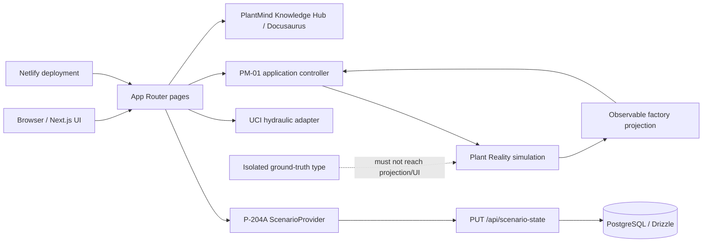
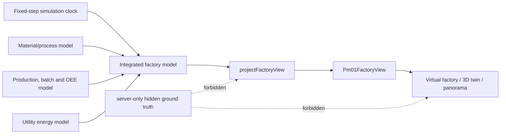

# PlantMind OS Architecture

## Current system shape

PlantMind is a modular Next.js 16 / React 19 / TypeScript application. The web experience, route handlers, simulation controllers and UI modules are in one repository. PostgreSQL 17 with Drizzle ORM supports the legacy scenario/audit foundation; the PM-01 factory simulation is currently client-local and not persisted.

## Frontend

- `src/app/` contains App Router pages, root layout, error/loading/not-found UI and one route handler.
- `src/components/app-shell.tsx` provides the shared navigation, theme controls, scenario metadata and executive-viewer presentation.
- The sidebar links to `/knowledge-hub`, where Next.js rewrites serve a Docusaurus static build packaged under `public/knowledge-hub-static`. The Hub retains its own MDX/content validation, navigation and local-search build while sharing the PlantMind origin and release artifact.
- `src/components/workspace-tabs.tsx` preserves deep routes while grouping briefing/command and investigation/approval/outcome into two coherent workspaces.
- `src/features/overview/` implements the executive introduction.
- `src/features/vision/` implements the CEO briefing, sector journeys, connector catalogue and curated AI preview pages.
- `src/features/scenario/`, `command/` and `timeline/` implement the legacy P-204A replay and decision views.
- `src/features/real-data/` adapts the normalized UCI hydraulic dataset into a separate evidence-labelled experience.
- `src/features/pm01/ui/` renders PM-01 process, statistical, 3D and panorama views.
- Styling is primarily centralized in `src/app/globals.css`, with timeline-specific CSS alongside that feature.

State management uses React context/hooks rather than a third-party store. The legacy replay uses `ScenarioProvider`. PM-01 uses `useFactorySimulation`, a client-local controller that advances immutable domain state and retains a bounded observable history.

## PM-01 architecture and truth boundary

- `contracts/` defines boundary-safe types.
- `plant-reality/` owns deterministic clocks, assets, tags, physical material state, production, energy and integrated factory advancement.
- `plant-reality/state/ground-truth.ts` is explicitly `server-only`. It defines future hidden-condition fields but is not wired into the healthy process model.
- `observable/factory-projection.ts` converts factory state into `Pm01FactoryView`.
- `application/use-factory-simulation.ts` owns browser lifecycle commands and observable replay history.
- `ui/` consumes the observable contract only.

ESLint import restrictions and architecture tests enforce these boundaries. PM-01 is also intentionally independent of the legacy P-204A scenario engine.

## Backend and APIs

The current server-side surface is small:

- `PUT /api/scenario-state` validates and persists legacy replay snapshots and audit events.
- Server components load the normalized real hydraulic dataset.
- Drizzle repositories support run/event/snapshot retrieval for the legacy foundation.

There is no PM-01 API, background worker, message broker, production historian adapter, authentication service or external industrial connector.

## Data and persistence

`src/db/schema.ts` defines tenants, sites, production areas, asset types, assets, sensors, sensor readings, operational metrics, scenarios, scenario stages, scenario states, roles, users, audit events and source records. Migration `drizzle/0000_tense_fenris.sql` creates the current PostgreSQL schema. Local Docker Compose starts a single PostgreSQL 17 container.

Persistence distinctions:

- Legacy P-204A scenario state can be written through the route handler.
- The normalized UCI artifact is committed JSON under `data/real/hydraulic-system/normalized/`; raw source files are ignored.
- PM-01 factory, batch, production, energy and history state is immutable but client-local and resets on reload.
- PM-01 panorama PNGs and industry-view images are static assets under `public/`.

## Runtime flow

1. Next.js renders the requested route inside the shared application shell.
2. Legacy routes read `ScenarioProvider`; real-data routes read the committed normalized dataset; PM-01 creates its healthy deterministic state in the browser.
3. Play/pause/reset/speed commands advance the appropriate deterministic replay.
4. For PM-01, physical process transitions occur first; production, batches, OEE and energy are derived from those transitions.
5. The observable projection removes simulator-only state and prepares display contracts.
6. Process, KPI, 3D and panorama components render only projected information.

## Configuration and secrets

- `.env.example` documents `DATABASE_URL` and public display metadata.
- `.env` is ignored and must remain local.
- Runtime environment variables are validated in `src/lib/env.ts` where consumed.
- No secrets are committed in the files reviewed for this handover.
- Local Compose credentials are development defaults, not production credentials.

## Deployment

- Git remote `origin` points to `https://github.com/milindvanam/plantmind-os.git`.
- The active production branch is `main`.
- Netlify deploys the Next.js application from GitHub; the current public URL is `https://plantmind-os.netlify.app`.
- No `netlify.toml` or repository-managed GitHub Actions workflow is present. Build settings, access controls and environment variables therefore depend on external Netlify/GitHub configuration and require account access to inspect fully.
- Documentation-only pushes may trigger Netlify automatically because deployment is connected to GitHub.

## Testing architecture

- Vitest + Testing Library: unit, component, integration and architecture-boundary tests.
- Playwright: route, executive preview, legacy replay, real-data and PM-01 browser regression tests.
- ESLint: Next.js rules plus PM-01 import-boundary restrictions.
- TypeScript: `tsc --noEmit`.
- Production validation: `next build`.
- Prettier is configured as a check, but formatting status is independent of runtime correctness.

## Authentication and authorization

The database contains user/role foundation tables, and the UI presents a fixed executive-viewer identity. The repository does not implement production login, session management, tenant authorization or route protection. Any Netlify preview password/access control is external platform configuration, not application code.
