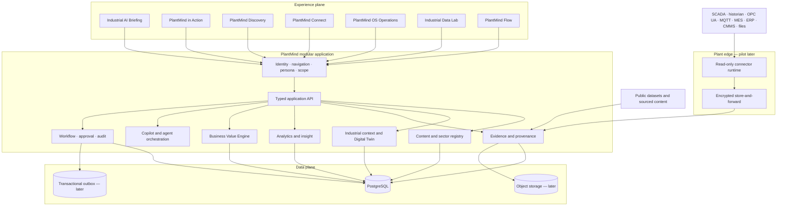

# PlantMind OS — Decision-Ready Architecture Blueprint v1.0

**Status:** Decision-ready architecture baseline  
**Date:** 12 August 2026  
**Governing reference:** PlantMind OS Founding Engineering & Product Charter v2.0  
**Horizon:** Vision Preview → real dataset demonstration → design-partner pilot → live industrial data → production MVP → multi-plant enterprise platform  
**Implementation constraint:** This document authorizes architecture and sequencing only. It does not authorize application implementation.  
**Safety boundary:** PlantMind is an intelligence and governed-action layer. It does not directly control PLC, DCS, SCADA, SIS, or safety-critical equipment.

## 1. Executive decision

PlantMind OS will evolve from the current deterministic prototype as a **PostgreSQL-first, Next.js modular monolith with explicit domain boundaries**. The near-term product is a credible, premium Vision Preview, not a prematurely distributed industrial platform.

The product promise is one traceable chain:

```text
SOURCE → CONTEXT → EVIDENCE → INSIGHT → BUSINESS IMPACT
       → RECOMMENDATION → HUMAN DECISION → ACTION → VERIFIED OUTCOME
```

PlantMind sits above systems of record. It contextualizes industrial data, explains material conditions, quantifies bounded business impact, proposes governed actions, and measures outcomes. It does not replace control systems, historians, MES, ERP, CMMS/EAM, QMS, or engineering applications.

### Decisive MVP choice

- Keep one deployable Next.js application and one PostgreSQL database.
- Keep deterministic demonstrations deterministic and visibly labelled.
- Add experiences as feature modules and typed content/data contracts.
- Use a contextual Digital Twin and graph-shaped relational model before specialist graph infrastructure.
- Use public datasets only through explicit provenance and transformation contracts.
- Introduce generative AI only behind typed, read-only tools and evidence validation.
- Require named-human approval for every material external action.
- Extract services or add specialist stores only when measured workload, isolation, deployment, or ownership needs justify them.

## 2. Architecture scope and timing

### BUILD NOW — Vision Preview

1. Preserve the six-route operational story and deterministic P-204A replay.
2. Establish top-level experience boundaries for Industrial AI Briefing, PlantMind in Action, PlantMind Discovery, PlantMind Connect, Industrial Data Lab, and PlantMind Flow.
3. Define reusable, validated models for Briefing, Discovery, sectors, pilot blueprints, and source attribution.
4. Build one executive journey connecting learning, sector context, experience, operations, and validation.
5. Architect authentic packs for all six initial industries, but implement only the strongest initial sectors and solution packs.
6. Make truth labels and provenance mandatory design-system primitives.
7. Extend the contextual Twin and Knowledge Graph as relational projections, not new infrastructure.
8. Establish deterministic business-value formulas with visible assumptions and ranges.
9. Preserve human approval and audit semantics in every action story.
10. Establish quality, accessibility, truthfulness, and visual-review gates.

### ARCHITECT NOW / BUILD LATER

1. Tenant, enterprise, plant, role, and data-scope identifiers in future domain contracts.
2. OIDC/SAML authentication and RBAC/ABAC policy enforcement.
3. Read-only edge collectors for OPC UA, MQTT, historians, SQL, files, CMMS, MES, and ERP.
4. Store-and-forward ingestion, connector certification, and data-quality workbench.
5. PostgreSQL time-series partitioning, object storage, full-text search, and `pgvector`.
6. Durable workflow orchestration for approvals, retries, timers, and compensation.
7. Vendor-neutral model gateway, retrieval pipeline, evaluation harness, and model registry.
8. Regional cells, dedicated deployments, data residency, backup/restore, and HA.
9. Specialist graph, analytical, or time-series read models after workload gates are crossed.
10. CMMS/EAM write-back adapters with idempotency and step-up approval.

### DEFER

- Kubernetes, service mesh, Kafka, microservices, and micro-frontends.
- Dedicated graph/vector databases and lakehouse ownership.
- Universal historian replacement and physics-grade/3D Digital Twins.
- Arbitrary third-party agent runtime and marketplace commerce.
- Level 4 autonomy except a separately approved reversible non-safety use case.
- Level 5 autonomy and direct PLC/DCS/SIS control.
- Six duplicated sector pages with changed labels.

## 3. Architecture principles

1. **Evidence before assertion.** Material claims link to source, timestamp, scope, transformation, and confidence semantics.
2. **Business before technology.** Findings explain risk, opportunity, cost, and recommended action in bounded language.
3. **Human in control.** AI cannot approve itself or perform a material write without policy and human authorization.
4. **Truth labels are data.** Real, transformed, simulated, model, demo, AI-generated, and sourced classifications are stored and rendered.
5. **One story per screen.** Each surface has one decision objective and progressive disclosure to evidence.
6. **Modular monolith first.** Boundaries are enforced before processes are separated.
7. **PostgreSQL first.** Specialist infrastructure requires documented evidence.
8. **LLM last.** Retrieval, calculation, policy, and workflow services remain authoritative.
9. **Read-only OT first.** Pilots start with outbound, least-privilege collection.
10. **Reproducibility.** Demos, models, recommendations, and value estimates reconstruct from versioned inputs.
11. **Tenant and plant scope everywhere.** No future entity, cache, index, audit event, or AI memory is scope-free.
12. **Incremental adoption.** One plant and one or two use cases can deliver value without platform transformation.

## 4. Overall system architecture



### Runtime by horizon

| Horizon | Runtime | Data | AI | Actions |
|---|---|---|---|---|
| Vision Preview | One Next.js app | PostgreSQL fixtures and content | Deterministic logic; curated previews | Simulated approval/write-back |
| Real Dataset Demo | App plus offline jobs | Public files, artifacts, provenance | Reproducible baseline models | Demo workflow |
| Design-Partner Pilot | HA app, workers, edge collector | Read-only sources, PostgreSQL, objects | Governed model gateway | Approved CMMS draft/create only |
| Production MVP | Scaled monolith and durable workers | HA PostgreSQL, partitions, objects | Monitored multi-model routing | Policy-controlled actions |
| Enterprise | Regional cells and selective extraction | Specialist projections when justified | Private/regional models | Bounded automation |

## 5. Product experience architecture

```text
LEARN → SEE YOUR INDUSTRY → EXPERIENCE → CONNECT → OPERATE → VALIDATE → ACT
```

| Stage | Experience | Executive question | Deep-link destination |
|---|---|---|---|
| Learn | Industrial AI Briefing | What is Industrial AI and why now? | Capability or sector journey |
| See your industry | PlantMind in Action | How does this work in my plant? | Sector scenario and pilot |
| Experience | PlantMind Discovery | What does intelligence-to-action feel like? | Operational module |
| Connect | PlantMind Connect | Can PlantMind work with systems we already own? | Connector Catalog and connection journey |
| Operate | PlantMind OS | What is happening and what should we do? | Evidence, approval, action |
| Validate | Industrial Data Lab | Is the claim credible? | Provenance, metrics, limitations |
| Act | PlantMind Flow | How does an approved insight become verified work? | Workflow, external action, outcome, value |

All five share one shell, design language, truth components, entity links, and route semantics. Personas change composition, never truth:

- CEO/board: exceptions, value, confidence, decisions.
- COO/plant head: constraints, plant health, ownership, action priority.
- Maintenance/reliability: asset evidence, failure modes, history, work orders.
- Production/energy/quality: process variables, operating modes, losses, opportunities.
- Engineer/operator: signals, timelines, quality, sources, calculations, procedures.

## 6. Frontend architecture

Continue Next.js 16 App Router, React, and strict TypeScript in one application. Use server components for content-heavy and initial composition; client components only for replay, interaction, charts, and local UI state.

```text
src/
  app/                 route composition only
  components/          shared shell and design primitives
  features/
    briefing/
    in-action/
    discovery/
    data-lab/
    sectors/
    command/
    operations/
    assets/
    investigation/
    workflow/
    value/
  domains/             future contracts and pure logic
  db/                  persistence adapters
  lib/                 cross-cutting utilities only
```

Rules:

- Route files compose features; domain calculations live elsewhere.
- Feature modules consume typed view models through pure adapters.
- Server entities do not live in a global client store.
- URL parameters carry shareable plant, asset, time, sector, dataset, and evidence context.
- Use server composition, URL state, local/context state, and the existing scenario provider now.
- Add TanStack Query for pilot server cache and SSE before WebSocket.
- Dense visualizations require textual and keyboard-accessible alternatives.

## 7. Routing strategy

Proposed families; route creation needs separate implementation approval.

```text
/briefing
/briefing/[topic]
/in-action
/in-action/[sector]
/discovery
/discovery/[experience]
/data-lab
/data-lab/datasets/[datasetId]
/data-lab/experiments/[experimentId]

/command
/operations
/assets/[assetId]
/investigations/[investigationId]
/executives/[briefId]
/interventions/[actionId]
```

Stable identifiers—not labels—belong in URLs. Authorization and scope validation occur server-side.

## 8. Backend architecture

Keep backend behavior in the Next.js modular monolith for the Vision Preview. Use route handlers for stable HTTP contracts and server-only domain services for business behavior. Do not add NestJS, FastAPI, or a second deployment merely to express architecture.

| Module | Responsibility | Authoritative records |
|---|---|---|
| Identity & tenancy | users, service principals, memberships | identity references/scopes |
| Content intelligence | Briefing sources, freshness, review | publication records |
| Sector registry | processes, assets, KPIs, use cases, pilots | sector definitions |
| Industrial context | entities, relationships, mappings | semantic model |
| Observations | signal metadata, samples/references, quality | observations |
| Dataset provenance | license, artifacts, transformations, mapping | lineage records |
| Twin | state, health, timeline, evidence | twin projections |
| Insight | finding, evidence, confidence, lifecycle | insight records |
| Value | formula, assumption, range, outcome | value ledger |
| Copilot & agents | model/tool/prompt versions and policy | AI runs |
| Workflow & action | recommendation, approval, external action | action ledger |
| Audit | security and decision history | append-only events |

Cross-module table access is prohibited even in one PostgreSQL instance.

### API strategy

- REST/JSON and OpenAPI 3.1 for resources, commands, and integrations.
- Idempotency keys for mutations and external write-back.
- Cursor pagination and explicit observation time windows.
- Problem Details for errors; ETag/version for concurrent approvals.
- SSE for progress; GraphQL deferred.
- Server actions may support UI mutations but never become the only domain API.

## 9. Industrial data architecture

```text
SOURCE → raw reference/artifact → validation/quarantine
→ unit/time normalization → operating-context enrichment
→ entity/signal mapping → quality/freshness assessment
→ contextual observation → evidence/feature/model consumer
```

Every observation carries tenant, plant, source, native and canonical signal IDs, event/ingestion time, timezone policy, value, original/canonical unit, quality, freshness, missing/estimated flags, transformation version, provenance, and operating mode/batch/shift when available.

The first live connector runtime is outbound-only, read-only by default, least-privilege, certificate-authenticated, observable, and store-and-forward capable.

Connector order is demand-led:

1. CSV/file and SQL/historian export.
2. Customer’s named historian API.
3. OPC UA read-only.
4. CMMS/EAM read and approved draft/create.
5. MQTT and streaming sources.
6. MES/ERP/QMS/documents as use cases require.

## 10. Storage strategy

### PostgreSQL

PostgreSQL remains authoritative through pilot. Drizzle remains the schema/migration layer. Future schemas use domain ownership and tenant/plant scope.

### Time series

- Preview: deterministic fixtures and derived histories.
- Dataset demo: versioned files with relational metadata/results.
- Pilot: native partitioning or Timescale-compatible hypertables after benchmark.
- Dedicated store only when retention, ingest, concurrency, or compression targets fail documented tests.

### Search and vectors

- PostgreSQL full-text search first.
- `pgvector` after an evaluation set proves semantic retrieval value.
- Dedicated search/vector service only after PostgreSQL fails scale or ranking targets.

### Graph and documents

- Canonical entities/relationships remain in PostgreSQL.
- Graph-store adoption requires failed traversal/authoring benchmarks.
- Document metadata, permissions, hashes, lineage: PostgreSQL.
- Binaries, datasets, transformed artifacts, model files, and renders: S3-compatible object storage in pilot.
- Artifacts are content-addressed, scanned, access-controlled, and retention-classified before production.

## 11. Industrial Knowledge Graph

```text
Enterprise → Plant → Area → Line/Process → Asset → Component → Sensor/Signal
                                  ↘ Failure Mode ↔ Maintenance Event ↔ Work Order
Process/Asset ↔ Document ↔ AI Finding ↔ Recommendation ↔ Action ↔ Business Impact
```

Every relationship stores subject, predicate, object, tenant/plant, temporal validity, source/provenance, assertion class, creator/reviewer, and version. Curated structure, deterministic inference, and AI-suggested links are distinct; AI links remain untrusted until reviewed or independently supported.

The graph answers “why related?” with exact paths and evidence. It supports task-oriented neighborhoods, Twin, Copilot, root-cause hypotheses, and workflow routing. Correlation is never labelled causation without an approved basis.

## 12. Digital Twin architecture

The initial Twin is a contextual operational projection, not a physics simulator:

```text
identity + hierarchy + state history + signals + maintenance + documents
+ findings + predictions + work orders + relationships + business impact
```

It references authoritative records rather than duplicating them. Each state attribute declares source, freshness, quality, and truth class. Use 2D/2.5D topology, time navigation, and evidence drawers first. Defer 3D until a spatial decision task proves value.

## 13. AI/ML architecture

| Workload | Preferred implementation |
|---|---|
| Threshold, unit, KPI, value formula | Deterministic code |
| Trend/anomaly baseline | Statistical/classical ML with versioned features |
| Failure/quality prediction | Validated model with abstention |
| Search/retrieval | Hybrid deterministic + vector retrieval |
| Explanation/synthesis | LLM over approved evidence |
| Recommendation | Rule/model/SME template; LLM may phrase |
| Workflow decision | Policy/state machine, never LLM |

```text
QUESTION/TRIGGER → identity/scope/purpose/policy → typed tools
→ evidence bundle → deterministic calculations → model gateway
→ claim/evidence and policy validation → cited answer/action options
→ immutable run/audit record
```

Every model has owner, use-case boundary, data provenance, features, metrics by regime, calibration, abstention, approval, deployment version, drift, rollback, and retirement criteria. Demo logic is never described as deployed ML.

The pilot gateway abstracts provider/model, residency, cost/rate limits, prompt version, tools, safety, structured output, traces, and fallback. Raw secrets and unrestricted OT records never enter prompts.

## 14. Industrial Data Lab and provenance

The Data Lab makes demonstration integrity inspectable.

| Truth class | Meaning |
|---|---|
| REAL SOURCE DATA | Original public or customer-authorized artifact |
| TRANSFORMED DATA | Cleaned, normalized, joined, or feature-engineered artifact |
| SIMULATED CONTEXT | Fictional enterprise, plant, asset, event, or scenario mapping |
| MODEL OUTPUT | Prediction, score, class, forecast, or named-model explanation |
| DEMO OUTPUT | Storytelling recommendation, value scenario, or deterministic behavior |
| AI-GENERATED CONTENT | Generative output with evidence and review state |
| SOURCED EXTERNAL CONTENT | News/case content with publisher, URL, date, and review metadata |

### Dataset adapter contract

```ts
interface DatasetAdapter {
  manifest(): DatasetManifest;
  validate(source: SourceArtifact): ValidationReport;
  transform(source: SourceArtifact, version: string): TransformedArtifact[];
  mapScenario(artifacts: TransformedArtifact[], scenario: ScenarioSpec): ScenarioMapping;
}
```

This is a documentation contract, not an instruction to add code now.

### Provenance model

- Dataset: publisher, URL, version/date, license, citation, domain, limitations.
- Source artifact: immutable hash, retrieval date, original name/type, storage reference.
- Transformation run: code version, parameters, inputs/outputs, operator, timestamp.
- Scenario mapping: fictional enterprise/plant/asset mapping and disclosure.
- Feature set: definitions, units, windows, leakage checks, version.
- Model run: model/version, split, metrics, output hashes, limitations.
- Demo interpretation: deterministic/AI author, evidence, assumptions, review status.

### Initial sequence

1. NASA C-MAPSS or equivalent for RUL/predictive-maintenance storytelling.
2. Tennessee Eastman Process or equivalent for process-fault investigation.
3. One credible energy dataset for energy-intensity optimization.
4. Additional datasets only when they serve an approved experience.

No dataset proceeds without license, citation, representativeness, leakage, limitations, and scenario-disclosure review.

## 15. Industrial AI Copilot

The response contract is answer-first:

1. Direct answer.
2. Scope and as-of time.
3. Evidence and source links.
4. Root-cause context and counter-evidence.
5. Confidence semantics and limitations.
6. Bounded business impact.
7. Recommended action.
8. Related assets and workflow option.

The UI shows concise decision rationale, not hidden chain-of-thought. Unsupported questions are refused or reframed. Models cannot query unrestricted databases or issue writes; all access uses typed, policy-controlled tools.

## 16. Industrial AI Agents

Agents are governed roles, not personas around a chatbot. Each manifest contains mandate/owner, scopes, triggers, model/prompt/tool versions, autonomy level, spend/time limits, approval policy, escalation, kill switch, evaluation suite, release version, and retention policy.

```text
OBSERVE → ANALYZE → REASON → RECOMMEND → REQUEST APPROVAL
→ EXECUTE PERMITTED ACTION → VERIFY OUTCOME → LEARN
```

- L0: summarize.
- L1: analyze and draft.
- L2: propose a workflow requiring approval.
- L3: execute an approved action through a bounded adapter.
- L4: future reversible, low-risk action within explicit limits.
- L5: autonomous industrial operation — deferred/exceptional.

The Vision Preview stops at L1/L2 with simulated context. Pilots may reach L3 for customer-approved CMMS drafts/creates. No agent controls an industrial process.

## 17. Workflow and action architecture

The Vision Preview uses explicit PostgreSQL-backed state machines:

```text
DRAFT → PROPOSED → PENDING_APPROVAL → APPROVED/REJECTED
→ SIMULATED_EXECUTION → VERIFIED/CLOSED
```

Adopt Temporal for real long-running approvals, timers, callbacks, retries, and compensation. Business state remains visible in PlantMind.

Every action records requester, evidence, recommendation version, policy result, approver, decision, timestamps, adapter call/idempotency key, external reference, result, verification evidence, and outcome.

Write classes are read-only query, draft record, create approved record, modify/cancel record, and industrial control. Industrial control is prohibited.

## 18. Business Value Engine

The Value Engine is deterministic and finance-reviewable. Each record contains category, baseline/window, operating regime, formula version, source inputs, assumptions, ranges, gross/net value, attribution method, state, and operations/finance sign-off.

Categories include downtime, production, energy, maintenance, quality, revenue, carbon, ROI, payback, and EBITDA impact where justified. LLMs may explain but cannot calculate or approve financial truth. Savings remain scenarios until measured and signed off.

## 19. Industrial AI Briefing

Briefing is a first-class executive product, not help documentation.

Content types include CEO Primer, Why Now, system comparison, business benefits, trends, global landscape, news, M&A/investment, real cases, transformation stories, CEO takeaways, and PlantMind capability links.

### Content/news record

Each item stores title, summary, type, industries, personas, publisher/source URL, publication/retrieval dates, author, truth class, review state/reviewer, freshness policy, business impact, CEO takeaway, related capability, and deep link.

External content is ingested as metadata and original synthesis, not copied articles. Automated ingestion remains draft-only pending human approval. Stale content is dated or withdrawn.

## 20. PlantMind Discovery

Discovery is a declarative guided narrative connected to actual modules:

```text
BUSINESS PROBLEM → DATA → AI ANALYSIS → INSIGHT → EXPLANATION
→ BUSINESS IMPACT → RECOMMENDATION → HUMAN DECISION → ACTION → VALUE
```

Each step references truth class, evidence, persona intent, interactive component, and deep-link target. Initial experiences are Predict Equipment Failure, Understand Root Cause, CEO Morning Brief, AI Executive Team, Energy Optimizer, Digital Twin, Knowledge Graph, Business Value Simulator, Factory Mission Control, and Journey to Autonomous Operations.

Only implemented operational surfaces may claim “Experience this in PlantMind.” Others are labelled future vision.

## 21. PlantMind in Action and sector templates

Every sector pack defines plant/process flow, constraints, authentic assets, sources, signals/units, KPIs, quality variables, failure modes, maintenance practices, energy drivers, production constraints, AI use cases, hero scenario, evidence chain, recommendation/approval/outcome, value formulas, pilot, glossary, and SME review.

The renderer is shared; industrial content is not. A pack fails if generic names can be substituted without changing its story.

| Sector | Process spine | Hero opportunities |
|---|---|---|
| Cement | crusher → raw mill → preheater/calciner → kiln → cooler → cement mill | kiln stability, ID fan, heat/power, clinker quality |
| Power | boiler → steam cycle → turbine/generator → condenser/feedwater | heat rate, vacuum, degradation, auxiliary power |
| Steel | blast furnace/EAF → casting/reheating → rolling → finishing | furnace efficiency, reliability, yield, quality |
| Chemicals | feed → reactor → separation/distillation → utilities/storage | fault/RCA, batch quality, rotating assets, energy |
| Water/Wastewater | intake → clarification → biological/membrane → disinfection/sludge | pumps/blowers, dosing, fouling, quality, energy |
| Dairy | reception → chilling → standardization → pasteurization → packaging → cold storage | cold chain, CIP, refrigeration, loss, OEE |

Dairy anchor stories:

1. **Pasteurization & Cold Chain Intelligence:** drift correlated with refrigeration load, compressor efficiency, CIP recovery, and maintenance; action remains an inspection/work-order proposal.
2. **CIP Optimization:** temperature, conductivity, flow, duration, chemical, water, steam, and availability are evaluated against sanitation constraints. No reduction is recommended without validated hygiene boundaries.

Each pack requires a named sector SME review covering terminology, process order, instrumentation, regimes, failure modes, safety, recommendation feasibility, and value assumptions.

## 22. Pilot Blueprint and Design Partner experience

| Week | Outcome |
|---|---|
| 1 | Discovery, value hypothesis, source inventory, safety/data boundaries |
| 2 | Read-only connection and data-quality profile |
| 3 | Asset/process context and contextual Twin |
| 4 | Baseline analytics and evaluation plan |
| 5 | Use case 1 in shadow/read-only mode |
| 6 | Use case 2 or workflow/value extension |
| 7 | Recommendation/value validation with plant teams |
| 8 | Evidence pack and scale/no-scale roadmap |

Default scope: one plant, 10–20 critical assets, selected historian/SCADA data, one maintenance use case, one energy/process/quality use case, executive view, bounded Copilot, and value report. Sector/customer reality may change it.

Design Partner controls include joint use-case/value hypothesis, data/provenance approval, named plant/safety/IT-OT/security/finance owners, pre-agreed thresholds, weekly evidence review, recommendation validation, outcome attribution, and explicit scale/revise/stop decision.

## 23. Authentication, authorization, and multi-tenancy

The Preview uses deployment-level access or a simple demo identity only if externally shared; it does not imitate enterprise RBAC.

The pilot uses enterprise OIDC/SAML through a managed broker, with Entra ID as the expected first IdP. Sessions are short-lived; MFA comes from the IdP; connectors use service principals; SCIM is demand-led.

- RBAC establishes role baseline.
- Attributes restrict tenant, plant, area, data class, action type, and financial visibility.
- Domain services enforce policy; UI hiding is not enforcement.
- PostgreSQL RLS provides defense in depth before multi-tenant production.
- Step-up/two-person approval applies to high-impact actions.
- Agent tools and external writes are deny-by-default.

All future resources use immutable `tenant_id`; plant resources use `plant_id`. Cache, objects, retrieval, memory, traces, metrics, and exports preserve scope. Higher tiers may receive separate databases, keys, networks, or cells.

## 24. Security architecture

- Outbound-only edge; no unsolicited inbound path to OT.
- TLS, encryption at rest, managed secrets, and rotation.
- Least-privilege service identities and signed connector updates.
- Dependency locking, SBOM, vulnerability/license/SAST/secret/container scans.
- WAF, quotas, rate/size/time limits, and audit correlation IDs.
- Prompt-injection controls: trust classes, content isolation, typed tools, egress policy, output validation.
- Data minimization/redaction for logs, prompts, analytics, and support.
- Incident, restore, access-review, deletion/export exercises before production.

Customer procedures take precedence. PlantMind is never a SIS or safety authority.

## 25. Event and streaming strategy

Use in-process domain events in the Preview; no broker. Introduce a PostgreSQL transactional outbox before a queue. Events carry ID, type/version, tenant/plant, subject, occurrence time, producer, correlation/causation, truth/provenance, and payload.

Use a PostgreSQL-backed worker queue initially, then a managed queue. Kafka requires sustained throughput beyond queues, several replay consumers, cross-domain event products, or contractual streaming scale. Consumers are idempotent, ordering is explicit, poison messages are quarantined, and schemas are backward-compatible.

## 26. Design system, visualization, and animation

Preserve current semantic tokens. Add primitives for truth/provenance, freshness/quality, evidence citation, confidence/uncertainty, impact range, approval state, disclosure, and persona-aware density.

Target WCAG 2.2 AA, keyboard-complete workflows, visible focus, non-color status, screen-reader summaries, and reduced motion.

- Current CSS/SVG remains sufficient until richer data exists.
- ECharts is the preferred future operational chart library.
- Cytoscape.js is preferred for task graph neighborhoods.
- SVG/Canvas is preferred for process topology.
- MapLibre requires geographic value; 3D requires a proven spatial task.

Charts expose scope, unit, source, as-of time, quality, and textual interpretation. Display scales are not operating limits unless sourced. Motion explains sequence/time/state, never implies live data or model certainty, and always supports reduced motion.

## 27. Observability and reliability

Use structured logs, metrics, and traces with a PlantMind correlation schema; adopt OpenTelemetry for pilot. Observe API/error latency, database saturation, connector lag/gaps/freshness, data-quality quarantine, model/tool cost and evidence coverage, workflow/approval SLA, external actions, content freshness, and tenant-safe journey completion.

No secrets, sensitive telemetry, document bodies, or unrestricted prompts enter observability. MVP SLOs and RTO/RPO are agreed with the design partner and validated through exercises, not marketing claims.

## 28. Deployment and local development

### Local

- Supported Node version and Docker Compose PostgreSQL.
- `.env.example` with non-secret defaults.
- migrations and deterministic seed.
- one documented startup sequence.
- dataset downloads through explicit checksum-verified scripts when artifacts cannot be committed.

### Preview

One managed web application and PostgreSQL database in one approved region; CDN for static assets; minimal background work.

### Pilot

Containerized web/API and workers, HA PostgreSQL, object storage, secret manager, edge collector, observability, backups/restore, and distinct environments.

### Enterprise

Regional cells, tenant placement, dedicated customer options, controlled releases, and selective extraction. Kubernetes is considered only when scale and team capability justify it.

## 29. Repository and ownership

Stay in one repository. Add monorepo tooling only when multiple deployables/packages need independent build graphs.

```text
docs/
  architecture/
  adr/
  product/
  data-provenance/
src/
  app/
  components/
  features/
  domains/
  db/
  lib/
tests/
  unit/
  integration/
  contract/
  e2e/
scripts/
drizzle/
```

Dependencies point inward: UI → application/domain interfaces → persistence/integration adapters. Domain logic does not import React, route modules, or concrete external clients.

## 30. Testing strategy

1. Unit tests for calculations, state machines, mappings, truth labels, and sector validation.
2. Component tests for interaction, accessibility, empty/error/stale/disabled states.
3. Database integration tests for migrations, tenant scope, lineage, and transactions.
4. Contract tests for APIs, connectors, datasets, tools, and write-back adapters.
5. E2E tests for the executive journey and engineer evidence drill-down.
6. Visual regression for desktop/mobile, dark/light, and review states.
7. Dataset tests for hashes, units, missingness, leakage, reproducibility, and license metadata.
8. AI evaluations for grounding, citations, refusal, policy, tools, prompt injection, cost, and latency.
9. Performance tests for time windows, graph neighborhoods, and concurrent views before pilot.
10. Security tests for isolation, authorization, secrets, malicious documents, and escalation.

Model/agent evaluations are versioned release artifacts. Aggregate scores cannot hide high-severity failures.

## 31. CI/CD and release governance

Pull requests require formatting, lint, typecheck, tests, production build, migration compatibility where relevant, secret/dependency/license/vulnerability scans, truth/contract validation, visual Founder Review for product changes, and architecture-boundary checks as domains grow.

```text
feature branch → pull request → preview → automated gates
→ founder/product review → main → staging → production approval
```

Production migrations are forward-compatible, backed up, and separately observable. Feature flags control incomplete capabilities; entitlements control purchased access. Rollback and kill switches are tested before pilot actions or agents.

## 32. Coding standards

- Strict TypeScript; no unexplained `any`.
- Runtime validation at trust boundaries.
- Pure functions for calculations and transformations.
- Explicit units, timezones, nullability, freshness, and truth class.
- Structured error taxonomy; no swallowed domain failures.
- Idempotent mutation and worker behavior.
- Stable identifiers separate from display labels.
- No financial calculation, authorization, or workflow decision delegated to an LLM.
- Source-specific models remain behind integration adapters.
- Accessibility/responsiveness are acceptance criteria.
- Dependencies require security/license and bundle/runtime justification.

## 33. Definition of Done

A capability is done only when:

1. Product objective, persona, and decision are explicit.
2. Truth class and safety boundary are correct.
3. Source, evidence, units, time, quality, and limitations are visible.
4. Business impact is deterministic, bounded, and assumption-backed.
5. Authorization and tenant/plant scope are enforced where applicable.
6. Loading, empty, stale, partial, error, denied, and disabled states are handled.
7. Accessibility, responsive design, themes, and reduced motion pass.
8. Risk-proportionate tests and CI gates pass.
9. Audit/provenance makes the result reproducible.
10. Documentation, ADRs, migrations, rollback, and operations are updated.
11. No secret, customer data, or unlicensed content is committed.
12. Founder Review approves visual/narrative quality before the next milestone.

## 34. Major technology decisions

### TD-01 — Modular monolith

**DECISION:** Continue one Next.js modular monolith with explicit interfaces.  
**WHY:** Fastest route to a coherent premium experience; current implementation works.  
**ALTERNATIVES CONSIDERED:** Microservices; separate NestJS API; functions per domain.  
**TRADE-OFF:** Less independent scaling; boundary discipline is mandatory.  
**MVP IMPLEMENTATION:** One app, adding a worker only for real background work.  
**PRODUCTION EVOLUTION:** Extract ingestion, AI, reporting, or workflow when scale/isolation/ownership requires it.

### TD-02 — PostgreSQL-first persistence

**DECISION:** PostgreSQL is authoritative through pilot.  
**WHY:** Transactions, context, JSON, search, vectors, partitions, RLS, and operations cover early needs.  
**ALTERNATIVES CONSIDERED:** MongoDB, graph-first, time-series-first, lakehouse-first.  
**TRADE-OFF:** Specialist workloads may later need projections.  
**MVP IMPLEMENTATION:** PostgreSQL + Drizzle; object storage for large/binary artifacts.  
**PRODUCTION EVOLUTION:** Add rebuildable graph/time-series/search projections after benchmarks.

### TD-03 — Relational Knowledge Graph

**DECISION:** Canonical entities/relationships live in PostgreSQL.  
**WHY:** Early graph size is modest; transactional provenance matters most.  
**ALTERNATIVES CONSIDERED:** Neo4j, RDF, document graph.  
**TRADE-OFF:** Deep traversals are less ergonomic.  
**MVP IMPLEMENTATION:** Typed adjacency and task-oriented queries.  
**PRODUCTION EVOLUTION:** Project into graph storage when traversal/authoring benchmarks require it.

### TD-04 — Contextual Digital Twin

**DECISION:** Twin is a contextual projection, not a separate simulator.  
**WHY:** Delivers decision value without physics-model cost or duplication.  
**ALTERNATIVES CONSIDERED:** 3D-first, vendor twin platform, physics models.  
**TRADE-OFF:** It does not simulate engineering behavior.  
**MVP IMPLEMENTATION:** 2D/2.5D state, hierarchy, timeline, evidence, findings, and actions.  
**PRODUCTION EVOLUTION:** Attach validated physics/3D modules to selected assets.

### TD-05 — REST and typed events

**DECISION:** REST/OpenAPI for APIs; versioned events/outbox for async seams.  
**WHY:** Clear contracts and broad industrial-tool support.  
**ALTERNATIVES CONSIDERED:** GraphQL-first, gRPC everywhere, broker-first.  
**TRADE-OFF:** Composed screens may make multiple queries.  
**MVP IMPLEMENTATION:** Route handlers and application services; no broker.  
**PRODUCTION EVOLUTION:** SSE, queue, outbox first; GraphQL/Kafka only after evidence.

### TD-06 — Deterministic analytics before generative AI

**DECISION:** Rules, calculations, models, and policy are authoritative; LLMs synthesize evidence.  
**WHY:** Industrial/financial trust requires reproducibility.  
**ALTERNATIVES CONSIDERED:** Autonomous general agent; direct text-to-SQL; LLM calculations.  
**TRADE-OFF:** Narrower initial questions and more explicit engineering.  
**MVP IMPLEMENTATION:** Curated tools, evidence bundles, structured output, refusal, audit.  
**PRODUCTION EVOLUTION:** Broaden agents only through evaluation and policy.

### TD-07 — Declarative sector packs

**DECISION:** One schema/renderer with authentic sector-owned content.  
**WHY:** Enables reuse without six label-swapped pages.  
**ALTERNATIVES CONSIDERED:** Hard-coded pages; free-form CMS; generic story.  
**TRADE-OFF:** Requires schema governance and SME review.  
**MVP IMPLEMENTATION:** Version-controlled typed content and validation.  
**PRODUCTION EVOLUTION:** Reviewed CMS authoring and solution-pack distribution.

### TD-08 — Provenance as a primitive

**DECISION:** Dataset/content/model/demo lineage is structured and rendered.  
**WHY:** Trust/legal clarity depend on separating source, transformation, simulation, and output.  
**ALTERNATIVES CONSIDERED:** Footnotes; README disclosure; implicit lineage.  
**TRADE-OFF:** Additional authoring/review overhead.  
**MVP IMPLEMENTATION:** Manifests, hashes, versions, scenario disclosure, truth badge.  
**PRODUCTION EVOLUTION:** Automated lineage, policy, export, and attestation.

### TD-09 — State machine then Temporal

**DECISION:** PostgreSQL state machines now; Temporal for real long-running workflows.  
**WHY:** Avoid infrastructure before retries, callbacks, timers, and compensation exist.  
**ALTERNATIVES CONSIDERED:** Temporal now; ad hoc jobs forever; BPM suite.  
**TRADE-OFF:** Orchestration evolves at pilot transition.  
**MVP IMPLEMENTATION:** Versioned states and immutable action ledger.  
**PRODUCTION EVOLUTION:** Move orchestration—not business truth—into Temporal.

### TD-10 — Managed identity for pilot

**DECISION:** Enterprise OIDC/SAML through a managed broker; Entra expected first.  
**WHY:** Federation/MFA/lifecycle complexity should not be home-grown.  
**ALTERNATIVES CONSIDERED:** Custom auth; direct IdP-only; demo credentials.  
**TRADE-OFF:** Vendor dependency and user cost.  
**MVP IMPLEMENTATION:** No fake enterprise auth in Preview; broker for partner.  
**PRODUCTION EVOLUTION:** Multiple IdPs, SCIM, delegated admin, dedicated identity.

### TD-11 — SaaS-first regional cells

**DECISION:** Managed SaaS first; cell/dedicated boundaries designed now.  
**WHY:** Lowest delivery burden with a residency/isolation path.  
**ALTERNATIVES CONSIDERED:** On-prem first; customer VPC only; one global deployment.  
**TRADE-OFF:** Some prospects require variants early.  
**MVP IMPLEMENTATION:** One approved region; no raw live OT in Preview.  
**PRODUCTION EVOLUTION:** Regional cells and dedicated/VPC deployment triggered by revenue.

### TD-12 — Durable truth and audit

**DECISION:** Evidence, AI runs, approvals, actions, and outcomes use immutable/versioned records.  
**WHY:** Traceability is the product, not an operational afterthought.  
**ALTERNATIVES CONSIDERED:** Mutable rows only; logs as audit; provider history.  
**TRADE-OFF:** More storage and lifecycle design.  
**MVP IMPLEMENTATION:** Append decision/action history with reproducible versions.  
**PRODUCTION EVOLUTION:** Signed exports, legal hold, tamper evidence, customer audit integration.

## 35. Technical risks

| Risk | Probability | Impact | Mitigation | Residual |
|---|---:|---:|---|---:|
| Vision becomes several platforms | High | High | P0 journey, timing labels, founder gates | Medium |
| Six sectors become generic copies | High | High | typed packs, authenticity tests, SME approval | Medium |
| Demo mistaken for production AI | Medium | High | truth labels and provenance everywhere | Low |
| Public dataset lineage/license weak | Medium | High | review, manifest, hashes, citation | Low-Medium |
| Business-value claims unprovable | Medium | High | formulas, ranges, assumptions, sign-off | Medium |
| AI gives unsupported answers | Medium | High | typed tools, evidence validation, evaluations | Medium |
| Agent exceeds authority | Medium | High | policy, approval, allowlists, kill switch | Low-Medium |
| OT integration delays pilot | High | High | export first, read-only edge, discovery gate | Medium |
| Data quality/context inadequate | High | High | profile first, quarantine, freshness UI | Medium |
| Multi-tenant leakage | Low-Medium | Critical | scope, RLS, isolation tests, tenant-safe AI | Low-Medium |
| Infrastructure slows delivery | High | High | adoption gates, modular monolith | Low |
| Prototype debt enters pilot | Medium | High | production-readiness exit gate | Low-Medium |
| Content stale/copied | Medium | Medium | metadata/synthesis, review, freshness | Low |
| Advice affects safety | Low-Medium | Critical | no control, procedure precedence, limits | Low-Medium |
| Customer needs on-prem early | Medium | High | paid trigger, capability matrix | Medium |

High residual risks require founder and, for pilots, customer acceptance.

## 36. Required Architecture Decision Records

Before corresponding implementation, create ADRs for:

1. Product boundary and no-direct-control policy.
2. Modular monolith and extraction gates.
3. Experience architecture and route families.
4. Truth taxonomy and provenance contract.
5. Sector schema and authenticity governance.
6. Dataset adapter/artifact/transformation/scenario mapping.
7. Canonical industrial entity/relationship model.
8. Contextual Twin projection.
9. PostgreSQL-first and specialist-store gates.
10. Tenant/plant identity, RLS, isolation tiers.
11. API versioning, idempotency, error contract.
12. Event envelope, outbox, broker gate.
13. AI taxonomy and LLM-last policy.
14. Model gateway, residency, provider, cost policy.
15. Evidence, confidence, abstention, explanation.
16. Agent identity, tools, autonomy, approval, kill switch.
17. Workflow versioning and Temporal trigger.
18. Value formula and sign-off governance.
19. Content sourcing, copyright, freshness, editorial review.
20. Authentication, RBAC/ABAC, step-up approval.
21. Edge trust boundary and connector certification.
22. Audit retention, export, deletion, legal hold.
23. Observability and sensitive telemetry.
24. SaaS region, cell, dedicated, and on-prem triggers.
25. Accessibility, visualization truth, motion policy.
26. AI/model evaluation, promotion, incident, rollback.

Every ADR names owner, status, date, alternatives, consequences, reversal evidence, and review trigger.

## 37. Recommended sprint sequence

Implementation starts only after founder approval of this blueprint and the P0 decisions.

### Sprint A — Architecture lock and content contracts

Approve boundaries, journey, routes, truth taxonomy, schemas, ADRs, one CEO journey, and one sector hero.

### Sprint B — Integrated executive navigation

Establish information architecture/trust primitives and connect Briefing → In Action → Discovery → Connect → operations → Data Lab → Flow. Add no model claims.

### Sprint C — Industrial AI Briefing

Deliver CEO Primer, Why Now, system comparison, benefits, sourced-content model, freshness/review, and deep links.

In parallel, establish the manifest-driven PlantMind Connect Catalog and demonstrate the SCADA-to-Industrial-Intelligence path with explicit Demo status.

### Sprint D — PlantMind in Action foundation

Deliver sector template/authenticity validator and one flagship journey at full depth. Choose Dairy if founder access is strongest; otherwise Cement.

### Sprint E — Discovery golden experiences

Deliver CEO Morning Brief, Predict Equipment Failure linked to P-204A, and explainable AI Executive Team assistance.

### Sprint F — Industrial Data Lab foundation

Deliver provenance UI and one checksum/license-controlled dataset adapter with reproducible transformation and simulated mapping.

### Sprint G — Six-sector completion

Add remaining authentic packs with SME review and sector-specific pilot variations.

### Sprint H — Preview hardening

Complete CEO/engineer journeys, accessibility, performance, regression, truth, security, and rehearsal. Produce production-readiness gap report.

Design-partner transition requires a named partner, source access, owners, and measurable hypothesis before identity, edge, quality, objects, durable workflow, AI gateway/evaluation, RLS, backup, and observability work begins.

## 38. Founder decisions before implementation

### P0

1. Which sector and Industrial Solution Pack anchor the first In Action journey?
2. Which CEO journey is the external opener?
3. Is P-204A retained as the operational golden thread?
4. Which public dataset is legally/narratively suitable first?
5. Which two AI Executive roles? Recommendation: Maintenance Director AI and CEO Strategy AI.
6. Which currency, assumptions, and ranges may be displayed?
7. Who reviews each sector/editorial pack?
8. Is the Preview private, partner-gated, or public?
9. Confirm all write-back remains simulated until partner approval.
10. Which Connector Catalog entries may be shown as Demo, and which must remain Planned or Custom?

### Before pilot

Confirm named plant/use cases/systems/owners; region/model constraints; IdP/roles/approval; retention/export/deletion/model terms; and success thresholds/baseline/value owner.

## 39. Architecture acceptance

This blueprint is decision-ready when the founder approves or amends the modular-monolith/PostgreSQL direction, timing boundaries, five-stage journey, truth/provenance taxonomy, sector authenticity model, Data Lab lineage, Copilot/agent/workflow safety, Value governance, pilot gates, sprint sequence, and P0 choices.

Approval authorizes the next bounded sprint only—not the long-term platform.

## 40. Architecture recommendation

Build PlantMind as one integrated evidence-to-action product—not a collection of dashboards, content pages, demos, and chatbots.

The Vision Preview should let an industrial executive understand what Industrial AI means, how it applies to their plant, what PlantMind sees, why it matters, what action is recommended, what value may be created, what evidence supports it, and how a low-risk pilot begins.

The engineer must inspect the same conclusion down to signal, source, timestamp, unit, transformation, relationship, model/rule version, calculation, and approval history.

That shared executive-to-engineering truth is PlantMind’s defensible nucleus. The architecture grows only when real datasets, design partners, live industrial data, and measured demand require it.

## 41. External benchmark and market adjacency

### Cognite benchmark — what it validates

Cognite’s current product architecture validates the category progression from contextualized industrial data to a Knowledge Graph, specialized agents, and frontline workflow execution:

- Cognite Data Fusion positions contextualized OT, IT, and engineering data as the trustworthy foundation.
- Cognite Atlas AI provides a low-code workbench for agents using prompts, industrial tools, and data from the Knowledge Graph.
- Cognite Flows is positioned as an AI-native action layer for persona-based frontline workflows.

Sources: [Cognite industrial AI overview](https://www.cognite.com/en/industrial-ai), [Atlas AI documentation](https://docs.cognite.com/cdf/atlas_ai), [Atlas AI agent concepts](https://docs.cognite.com/cdf/atlas_ai/concepts), and [Cognite Flows introduction](https://resources.cognite.com/en/resources/blog/cognite-flows-the-new-standard-for-industrial-workers).

Cognite states that Flows can support custom applications up to 100x faster and cites a pharmaceutical workflow delivered in four days with 30x faster time-to-value. These are **vendor-published claims**, not independent PlantMind evidence, and must be described as such if used in Briefing content.

### PlantMind response — do not imitate the platform breadth

Knowledge Graph, industrial agents, and workflows are category requirements rather than sufficient differentiation. PlantMind should not attempt to reproduce Cognite Data Fusion, Flows, or Atlas AI during the Vision Preview.

PlantMind’s differentiated wedge is:

1. **Executive-first intelligence:** decisions, risk, value, and consequence before platform configuration.
2. **Authentic sector journeys:** credible process, asset, failure-mode, and KPI language for each industry.
3. **Evidence-to-action traceability:** every insight connects evidence, impact, approval, action, and outcome.
4. **Business Value Engine:** deterministic value ranges, assumptions, attribution, and finance sign-off.
5. **Demo and data integrity:** real source, transformation, simulation, model, and demo layers remain inspectable.
6. **Low-risk adoption:** one-plant pilots with selected sources and one or two measurable use cases.
7. **India and growth-market practicality:** support for heterogeneous plants, export/file-first onboarding, and services-assisted deployment without sacrificing product boundaries.

### Capability implications

| Benchmark capability | PlantMind BUILD NOW | PlantMind later |
|---|---|---|
| Contextual industrial data | Narrow contextual model for approved scenarios | Mapping/data-quality workbench and live connectors |
| Industrial Knowledge Graph | PostgreSQL entity/relationship projection and explainable paths | Specialist graph projection after benchmarks |
| Frontline action layer | Governed recommendation, approval, and simulated action story | Configurable daily action workspace and CMMS integration |
| Industrial agent workbench | Two bounded, explainable role assistants | Reviewed agent templates and low-code configuration after pilot demand |
| Cross-application context | Deep links and shared plant/asset/time context | Persistent, tenant-scoped Copilot/agent context |
| Rapid application composition | Typed Discovery/sector/content schemas | Governed builder only after internal templates prove reusable |

PlantMind should measure its own deployment speed and outcomes before publishing comparative multipliers.

### Ducon adjacency — industries and industrial systems

Ducon’s public materials show a practical industrial customer landscape around power generation, alumina/non-ferrous industries, cement/building materials, oil and gas/refineries, steel, mining, petrochemicals, and general process industries. Its infrastructure portfolio groups work around flue-gas desulphurization and air-pollution control, bulk-material handling, electrification/infrastructure, and industrial engineering/maintenance. Sources: [Ducon Infrastructure Systems](https://duconinfra.co.in/infrastructure-system/), [Ducon company overview](https://duconinfra.co.in/), and [Ducon engineering services](https://duconinfra.co.in/engineering-services/).

These are market categories and public references—not PlantMind customers, partnerships, endorsements, or proof of data access.

### Two-dimensional solution-pack architecture

PlantMind should classify opportunities on two axes:

1. **Industry pack:** Cement, Power, Steel, Chemicals, Water/Wastewater, Dairy, and later Mining/Minerals, Alumina/Non-ferrous, Oil & Gas/Refining, Petrochemicals, Pulp & Paper, and Ports/Terminals.
2. **Industrial-system pack:** Rotating Equipment, Bulk Material Handling, Air Pollution Control/FGD, Utilities & Energy, Process Reliability, Maintenance Execution, Quality, and Sustainability/Emissions.

An experience is composed from both axes. For example:

```text
Power Industry Pack + FGD/Air Pollution Control Pack
  → absorber/reagent/gypsum process context
  → ID fan, pump, slurry, pressure, pH, flow, emissions evidence
  → reliability, efficiency, compliance, and maintenance use cases

Cement Industry Pack + Bulk Material Handling Pack
  → limestone/clinker/fly-ash conveying context
  → conveyor, silo, air-slide, pneumatic-line evidence
  → blockage, wear, energy, dust, throughput, and maintenance use cases
```

This composition prevents duplication, reflects how EPC/industrial customers organize real systems, and creates a reusable route from Ducon-like categories to PlantMind demonstrations without making unsupported commercial claims.

### Updated founder decisions

Before sector implementation, decide:

1. Is PlantMind’s beachhead selected primarily by **industry** or by a repeatable **industrial system/use case** across industries?
2. Which relationship, if any, exists with Ducon or similar EPC/domain partners: research source, SME access, design partner, connector/channel partner, or none?
3. Should the first adjacency beyond the six charter sectors be Mining/Minerals, Alumina/Non-ferrous, or Oil & Gas/Refining?
4. Is the first frontline workflow maintenance execution, shift operations, emissions/compliance, or bulk-material handling?

Until these are answered, Ducon-derived categories remain architecture research only.

## 42. PlantMind Connect and Connector Catalog

### Product promise

**Keep the systems you already have. Add intelligence on top.**

PlantMind Connect is a top-level commercial and technical capability. It shows how PlantMind interoperates with SAP, ERP, SCADA, historians, MES, CMMS/EAM, databases, APIs, files, and engineering knowledge without implying rip-and-replace.

### Catalog architecture

The Connector Catalog is driven by versioned connector manifests rather than hard-coded cards. Each manifest defines:

- connector family, vendor/product, supported versions, and protocol;
- capabilities: discover, read, subscribe, backfill, draft, create, update;
- status, deployment mode, authentication, and required network path;
- canonical objects/signals/documents emitted;
- data classifications, rate limits, checkpoint semantics, and health model;
- setup prerequisites, certification evidence, owner, and support tier;
- demo fixture/reference, limitations, and last validation date.

Permitted customer-facing statuses are:

| Status | Meaning |
|---|---|
| **Available** | Implemented, tested end-to-end for named versions, documented, supported, and production-approved |
| **Demo** | Demonstrated against fixtures/sandbox/replay; not certified for a customer production system |
| **Planned** | Roadmap intent only; no usable connector claim |
| **Custom** | Requires discovery, version validation, mapping, security review, and commercial scope |

No connector is marked Available solely because a protocol library or generic API client exists.

### Vision Preview catalog

The Preview should render the complete catalog but use honest statuses. A file/CSV replay adapter may become the first **Demo** connector. SAP, OPC UA, MQTT, historian, SCADA, MES, Maximo, SharePoint, and vendor ERP entries remain Demo/Planned/Custom until their exact behavior is implemented and verified.

Suggested catalog groups:

- **Enterprise:** SAP, Oracle, Microsoft Dynamics, other ERP.
- **Industrial:** OPC UA, MQTT, Modbus through approved gateways, SCADA, DCS, historian, MES, IoT.
- **Maintenance:** SAP PM, IBM Maximo, other CMMS/EAM.
- **Data:** PostgreSQL, SQL Server, Oracle Database, SQL, REST, CSV, Excel, object storage.
- **Knowledge:** SharePoint, repositories, PDFs, drawings, manuals, SOPs.

### Connector runtime contract

```text
CATALOG MANIFEST
  → installation/configuration
  → credential reference
  → discovery and mapping
  → read/backfill/subscribe
  → checkpoint and store-and-forward
  → canonical envelope
  → data-quality/context mapping
  → health, audit, and certification evidence
```

Adapters run outside core domain logic. They emit canonical contracts so adding a connector does not change the Context Engine, Twin, Knowledge Graph, AI, or Flow.

## 43. Enterprise, historian, SCADA, and document integration

### SAP/ERP approach

PlantMind does not become an ERP replica. The first SAP path is read-only and use-case scoped:

- equipment/functional locations;
- maintenance notifications and work orders;
- materials/spare references;
- selected cost/status fields;
- approved PlantMind-to-SAP identifier mappings.

Use supported SAP APIs/events appropriate to the customer’s deployed product/version. Avoid direct writes to SAP database tables. A later action adapter may draft or create a maintenance notification/work order using idempotency, named approval, service identity, and returned SAP reference. Oracle and Dynamics follow the same anti-corruption pattern.

### Historian/SCADA approach

SCADA/DCS remains the operational/control interface and historian remains the source of record for raw operational time series. PlantMind retrieves selected tags/windows through supported historian APIs, OPC UA, exports, or customer gateways. It preserves source tag, timestamp, quality, unit, interpolation, aggregation, and retrieval provenance.

The Preview demonstrates `SCADA → contextual signal → asset/process → evidence → insight → decision`, but labels all replayed inputs as simulated/demo. A live pilot begins read-only and outbound from OT. PlantMind never writes setpoints or control commands.

### Document intelligence

Document ingestion performs malware scanning, optical/text extraction, layout-aware chunking, metadata/entity linking, access inheritance, version/hash tracking, and source citation. Retrieval is hybrid and tenant-scoped. P&IDs, drawings, manuals, SOPs, inspection reports, and OEM documents retain page/region references where extraction allows.

AI extraction is a proposed assertion, not canonical truth, until rule validation or human review. Document permissions are enforced at retrieval time, not only indexing time.

## 44. Industrial Context Engine

The Context Engine turns connector outputs into the canonical operating model:

```text
Enterprise → Site → Plant → Area → Process → Production Line
→ Asset → Component → Sensor/Signal
```

It relates these objects to work orders, maintenance, documents, operators, suppliers, spares, failure modes, process conditions, quality, energy, production, safety, cost, revenue, findings, recommendations, and outcomes.

### Contextualization pipeline

```text
SOURCE OBJECT/TAG/DOCUMENT
→ source identity resolution
→ canonical entity candidate
→ unit/time normalization
→ hierarchy and relationship mapping
→ rule/reference-data matching
→ confidence and conflict detection
→ human review where required
→ versioned canonical assertion
→ Twin/Graph/search/AI projection
```

The Engine stores mapping provenance, assertion type, confidence, review state, temporal validity, and conflicts. It never silently merges ambiguous equipment or tags. Mapping quality and unresolved context become visible product metrics.

## 45. PlantMind Agent Studio and PlantMind Flow

### Agent Studio

Agent Studio is ARCHITECT NOW / BUILD LATER. It is a governed configuration workbench for domain experts—not an unrestricted prompt editor.

An agent template includes mandate, industrial domain, inputs, allowed Context/Graph scopes, prompts, models, deterministic tools, workflow triggers, autonomy level, budgets, approval policy, evaluation suite, runtime version, release state, owner, and kill switch.

The Vision Preview presents curated Maintenance AI and CEO Strategy AI experiences. It does not expose a customer agent builder. A pilot may allow reviewed configuration from approved templates; arbitrary tool/code installation is deferred.

### PlantMind Flow

PlantMind Flow is the unified action workspace that turns an insight into controlled work:

```text
FINDING → EVIDENCE → RECOMMENDATION → ENGINEER REVIEW
→ MANAGER APPROVAL → SAP/CMMS ACTION → EXECUTION
→ TWIN UPDATE → OUTCOME VERIFICATION → VALUE LEDGER
```

The Preview implements the narrative/state experience with simulated external action. The pilot adds one real, bounded workflow only after connector certification and customer approval. Flow must show ownership, SLA, evidence, approval, external-system status, exceptions, and verification on one coherent screen while preserving the external system as authoritative.

## 46. Industrial Solution Pack architecture

Solution Packs combine an industry context with a reusable industrial-system model, analytics/evidence templates, workflows, value formulas, and pilot plan.

### Pack contract

- supported industries and operating regimes;
- system/process topology and canonical equipment classes;
- signals, units, calculated KPIs, and source expectations;
- failure/degradation modes and counter-evidence;
- deterministic rules and candidate models;
- documents, maintenance, and supplier/spare relationships;
- findings, recommendations, approvals, and action adapters;
- value categories, assumptions, and validation method;
- demo dataset/scenario mapping and truth disclosure;
- deployment prerequisites, exclusions, SME owner, and version.

### FGD / Emissions Intelligence Pack

Context includes absorber tower, reagent/limestone preparation, slurry circulation, oxidation air, gypsum dewatering, pumps, fans, SO₂, particulate/emission monitoring, pH, flow, pressure/differential pressure, reagent quality, and emissions limits.

Use cases include performance and reagent optimization, pump/fan health, scaling/fouling, excursion prediction, energy, gypsum quality, and maintenance prioritization. Compliance outputs remain advisory and source-linked; PlantMind does not replace certified emissions monitoring or regulatory reporting.

### Air Pollution Control Pack

Context includes wet scrubbers, bag filters, cyclones, wet precipitators, SCR/NOx, solvent/CO₂ removal where applicable, fans, hoppers, differential pressure, temperature, flow, reagent, and emissions instruments.

Use cases include differential-pressure anomaly, filter degradation, fan optimization, emission-risk prediction, cleaning/maintenance scheduling, and energy optimization.

### Bulk Material Handling Pack

Context includes belt/pipe conveyors, pneumatic conveying, silos, air slides/lifts, feeders, chutes, loading/unloading, motors, gearboxes, idlers, pulleys, belt alignment, vibration, current, speed, throughput, pressure, air flow, and inventory.

Use cases include conveyor health, misalignment, motor/gearbox risk, blockage, throughput, conveying energy, silo inventory, wear, and maintenance planning.

The pack framework supports future OEM/EPC packs without embedding a partner’s proprietary IP or implying partnership. Public Ducon references inform taxonomy only unless a formal relationship and authorized technical content exist.

## 47. Demo enterprise and Pilot Engine

### Demo enterprise

Use a clearly fictional enterprise only to create coherent cross-industry demonstrations. The model contains enterprise, sites/plants, areas, processes, assets, source systems, operators/roles, work orders, documents, findings, actions, and value records.

Every mapped dataset displays:

```text
REAL PUBLIC DATASET + TRANSFORMED DATA + FICTIONAL DEMO CONTEXT
```

The fictional enterprise is never described as a customer. Generated work orders, savings, and incidents remain demo outputs.

### Pilot Engine

Every In Action journey ends with **Put PlantMind to Work**. The Pilot Engine composes an illustrative 6–8 week plan from industry pack, solution pack, source availability, use-case value, data quality, asset count, roles, safety boundary, and success criteria.

```text
SELECT PLANT → SELECT USE CASES → CONNECT DATA → BUILD CONTEXT
→ CREATE TWIN → DEPLOY AI IN SHADOW MODE → VALIDATE
→ MEASURE VALUE → SCALE / REVISE / STOP
```

Pilot output includes scope, timeline, required systems/data, customer and PlantMind roles, risks/dependencies, deliverables, success thresholds, expected value method, and scale decision. It is illustrative until jointly agreed; it is not an automatic commercial proposal.

## 48. Charter v2.0 decision additions

### TD-13 — Manifest-driven Connector Catalog

**DECISION:** PlantMind Connect uses versioned manifests and Available/Demo/Planned/Custom status.  
**WHY:** Interoperability is commercially essential, while truthful readiness prevents false claims.  
**ALTERNATIVES:** Hard-coded marketing cards; implement every connector first; generic integration claim.  
**TRADE-OFF:** Catalog breadth may exceed implemented breadth and needs careful governance.  
**MVP IMPLEMENTATION:** Catalog UI architecture plus one fixture/file-based Demo adapter; all other statuses evidence-based.  
**PRODUCTION EVOLUTION:** Certified connector SDK, conformance suite, deployment health, support lifecycle, and partner review.

### TD-14 — Anti-corruption adapters for SAP/ERP and OT

**DECISION:** Vendor-specific adapters translate to canonical PlantMind contracts; source systems remain authoritative.  
**WHY:** Core intelligence must not change for each SAP, historian, SCADA, MES, or CMMS product/version.  
**ALTERNATIVES:** Direct vendor models throughout the app; data replication platform; rip-and-replace.  
**TRADE-OFF:** Mapping/version certification is real implementation work.  
**MVP IMPLEMENTATION:** Demonstrate contracts and simulated interoperability without production-ready claims.  
**PRODUCTION EVOLUTION:** Version-certified read adapters, then approved idempotent action adapters.

### TD-15 — Context Engine as the canonicalization boundary

**DECISION:** Identity resolution, normalization, mapping, conflict, and assertion review form a dedicated domain boundary.  
**WHY:** Graph, Twin, AI, workflow, and value are only as trustworthy as context.  
**ALTERNATIVES:** UI joins; model-time joins; connector-specific semantics.  
**TRADE-OFF:** Requires mapping governance and visible unresolved context.  
**MVP IMPLEMENTATION:** Typed deterministic mappings for selected demo entities with explicit provenance.  
**PRODUCTION EVOLUTION:** Mapping workbench, assisted matching, temporal assertions, quality KPIs, and stewardship queues.

### TD-16 — Agent Studio is template-governed

**DECISION:** Agent Studio exposes approved templates and typed tools, not unrestricted prompts/code.  
**WHY:** Domain experts need configurability without bypassing safety, scope, evidence, or evaluation.  
**ALTERNATIVES:** No configuration; arbitrary low-code agent builder; generic Copilot only.  
**TRADE-OFF:** Less flexibility than open builders and higher template-governance effort.  
**MVP IMPLEMENTATION:** Curated agent experiences only; no builder.  
**PRODUCTION EVOLUTION:** Reviewed template configuration, promotion workflow, runtime pinning, evaluations, and agent library.

### TD-17 — PlantMind Flow preserves systems of record

**DECISION:** Flow orchestrates PlantMind decisions and external actions while SAP/CMMS remains authoritative for work records.  
**WHY:** Users need one action workspace without creating a second ERP/CMMS.  
**ALTERNATIVES:** Insight-only dashboard; duplicate work management; direct uncontrolled automation.  
**TRADE-OFF:** Cross-system consistency, retries, and exception UX are complex.  
**MVP IMPLEMENTATION:** Persisted approval narrative with simulated write-back and verification.  
**PRODUCTION EVOLUTION:** Temporal orchestration and one certified CMMS/SAP workflow with reconciliation.

### TD-18 — Industry × Industrial-System composition

**DECISION:** Experiences compose an Industry Pack with an Industrial Solution Pack.  
**WHY:** It reflects real plants/EPC ecosystems and enables reuse without generic sector pages.  
**ALTERNATIVES:** Industry-only pages; OEM-specific forks; generic use-case catalog.  
**TRADE-OFF:** Requires careful compatibility rules and two forms of SME governance.  
**MVP IMPLEMENTATION:** One flagship industry plus one FGD/APC/Bulk Handling or rotating-equipment pack; architect all six sectors.  
**PRODUCTION EVOLUTION:** Versioned pack registry, compatibility matrix, customer overlays, and authorized partner packs.

## 49. Charter v2.0 P0 implementation boundary

### BUILD NOW

- Industrial AI Briefing with sourced, freshness-aware executive content.
- PlantMind in Action with one or two strongest authentic sector/solution journeys.
- PlantMind Connect Catalog with honest readiness status and interoperability story.
- SCADA-to-Industrial-Intelligence deterministic journey.
- CEO Morning Brief, Predict Equipment Failure, and two bounded AI Executive roles.
- Pilot Engine experience ending in a practical 6–8 week starting plan.
- Existing Twin, Graph, Copilot, operational routes, evidence, approval, and value concepts connected into one platform journey.

### ARCHITECT NOW / BUILD LATER

- Production connectors, Context mapping workbench, Agent Studio, PlantMind Flow external actions, live historian/SCADA ingestion, enterprise identity, tenant isolation, document intelligence, durable workflows, model gateway/evaluations, object storage, and production observability.

### DEFER

- Broad connector implementation, open connector marketplace, arbitrary agent builder, multi-vendor write-back, automated compliance decisions, all six fully implemented sectors, autonomous process control, and distributed platform infrastructure.

## 50. Final success criterion

The Vision Preview succeeds when a CEO progresses naturally through these conclusions:

1. **I understand Industrial AI.**
2. **I can see how it applies to my industry and industrial systems.**
3. **PlantMind can work with the systems we already own.**
4. **I can see what it would do in my plant.**
5. **The evidence, assumptions, and limitations are credible.**
6. **I can see how an insight becomes a governed action and measured result.**
7. **We can start small with one plant and a bounded pilot.**
8. **Let us select a plant and validate value.**

The corresponding engineering success criterion is that the same journey has a credible path from deterministic preview to real dataset, live read-only data, validated models, certified connectors, governed workflow, tenant isolation, and production operations without rebuilding the product foundation.
