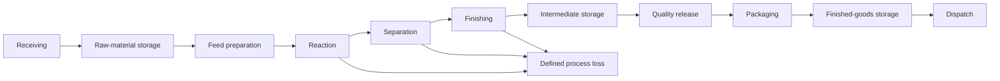

# PM-01 Plant Model

## Model identity

PM-01 is a deterministic simulation of a fictional 100 T/day ASC-100 specialty-chemical plant. It is a process and product prototype, not a calibrated plant design, safety model or certified digital twin.

## Physical flow

The quality-release transfer is currently immediate physical routing. Batch quality is a provisional placeholder, not a laboratory decision.

## Assets and hierarchy

`asset-registry.ts` defines one site, eight areas and equipment for raw-material handling, feed preparation, reaction, separation, finishing, packaging, utilities and warehouse/dispatch. Significant modeled/visualized assets include material tanks, feed mixer, reactor, HX-301, cooling valve CV-301, circulation pumps P-301A/B, separator, filter, dryer, packaging line, cooling tower, boiler, compressor and warehouse/dispatch equipment.

The registry validates duplicate IDs, parent relationships and equipment-area assignment. `tag-registry.ts` defines 82 metadata records across the modeled assets, including engineering units, sampling intervals and operating bands.

## Materials and recipe

Material vectors contain RM-A, RM-B, RM-C, catalyst, process water and ASC-100. The recipe basis per nominal tonne before recoveries is:

| Material | Tonnes per basis tonne |
|---|---:|
| RM-A | 0.620 |
| RM-B | 0.280 |
| RM-C | 0.120 |
| Catalyst | 0.015 |
| Process water | 0.080 |

The chemistry is a bulk-mass abstraction; it is not molecular stoichiometry. Initial receiving, storage and WIP inventories represent an already operating plant.

## Capacities and recovery

- Design production basis: 100 T/day.
- Packaging nameplate: 5 T/hour.
- Reaction recovery: 89%.
- Separation recovery: 99.5%.
- Finishing recovery: 99.8%.
- Explicit stage capacities constrain receiving, storage, WIP and finished-goods buffers.
- Healthy constraint factors are 1.0 for feed availability, reactor, separation, finishing, packaging and dispatch demand.

Throughput is limited by upstream material, downstream capacity, stage/equipment capacity and constraint factors. Dispatch can only draw material actually present in finished-goods storage.

## Material balance

The ledger tracks opening inventory, explicit external receipts, dispatch and defined process loss:

`opening inventory + receipts = current inventory + dispatch + process loss`

`receiveMaterial` is the only post-initialization entry point for new mass. Tests validate the balance within numerical tolerance and reconcile batch consumption and yield/losses.

## Production and batches

- Daily target: 100 T.
- Shift target: 33.333 T for each eight-hour shift.
- Default batch target: 25 T.
- Default expected batch cycle: six hours.
- Actual production is newly finished ASC-100, not an independent counter.
- Packaging and dispatch are tracked separately from production.
- Batch IDs and lot IDs are deterministic and scoped to the run.
- Batch material consumption uses the exact feed-preparation material vector.
- Completed batches currently receive provisional `PASS`; real LIMS state is not modeled.

Key production formulas:

- Current rate = `last-tick finished tonnes / tick seconds × 86,400`.
- Expected target now = `daily target × elapsed production-day seconds / 86,400`.
- Target achievement = `day actual / expected target now`.
- Production variance = `day actual − expected target now`.
- Capacity utilization = `cumulative actual / design output expected over elapsed time`.
- Projected end of day = `day actual + current physical rate × remaining day fraction`; null when no defensible rate exists.
- Batch yield = `finished ASC-100 / total recipe material consumed`.

## OEE

`OEE = Availability × Performance × Quality`

- Availability = reactor-active seconds / planned simulation seconds.
- Performance = gross finishing input / ideal output during reactor-active seconds, capped at 1.0.
- Quality = accepted finished output / gross finishing input.
- Gross finishing input = finished output + finishing loss.

All running simulation time is currently planned time. Shutdown calendars and equipment-specific ideal cycles are not modeled.

## Energy and utilities

The healthy configuration targets approximately 410 kWh-equivalent/T at design load:

- Electricity = 600 kWh/day fixed demand + 175.5 kWh per tonne of reactor output.
- Steam = 0.25 T per tonne of reactor output.
- Steam conversion = 650 kWh-equivalent/T steam.
- Cooling = 55 kWh-equivalent per finished tonne.
- Compressed air = 100 Nm³ per packaged tonne.
- Compressed-air conversion = 0.11 kWh/Nm³.

Variable electricity and steam respond to reactor output; cooling responds to finished output; compressed air responds to packaged output; fixed electricity responds to elapsed operating time. Energy per tonne therefore worsens at low load. Values are deterministic engineering assumptions, not a validated heat-and-power balance.

## Time, determinism and replay

- Baseline: `PM01-HEALTHY-BASELINE`, seed `PM01-BASELINE-001`.
- Fixed step: ten simulated seconds per tick.
- Speeds: 1×, 10×, 100× and 1000×.
- Shifts A/B/C are derived in `Asia/Kolkata`.
- State transitions use prior state, explicit elapsed time and explicit constraints.
- Plant Reality excludes `Math.random`, wall-clock reads and unparameterized dates.
- Namespaced seeded RNG exists for future simulation variability, though the healthy process model itself is currently pure and non-random.
- Pause stops advancement; reset reconstructs opening state; identical commands reproduce identical results.

Production and energy history snapshots are retained every five simulated minutes by default. They are in-memory and suitable as future historian contracts, not durable historian data.

## Observable versus simulated values

All PM-01 values currently originate in simulation. The UI receives an observable projection containing timestamps, statuses, tags, inventories, throughput, production, OEE, energy and batch summaries. Hidden future failure-condition fields—such as fouling, bearing health, valve stiction, filter loading, reactivity and sensor bias—are isolated in a `server-only` type and are not exposed or actively simulated.

In a real deployment, observable tag values, alarms, batch/quality records and business transactions are intended to come from governed plant systems. Model parameters, inferred condition and counterfactual state must remain explicitly distinguished from those observations.

