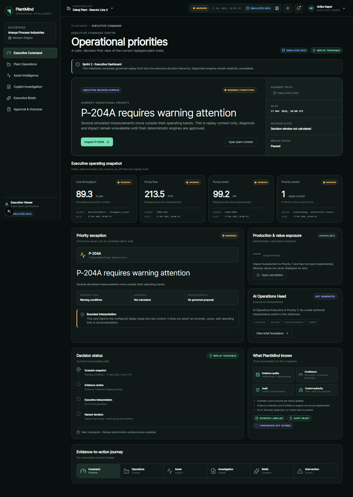
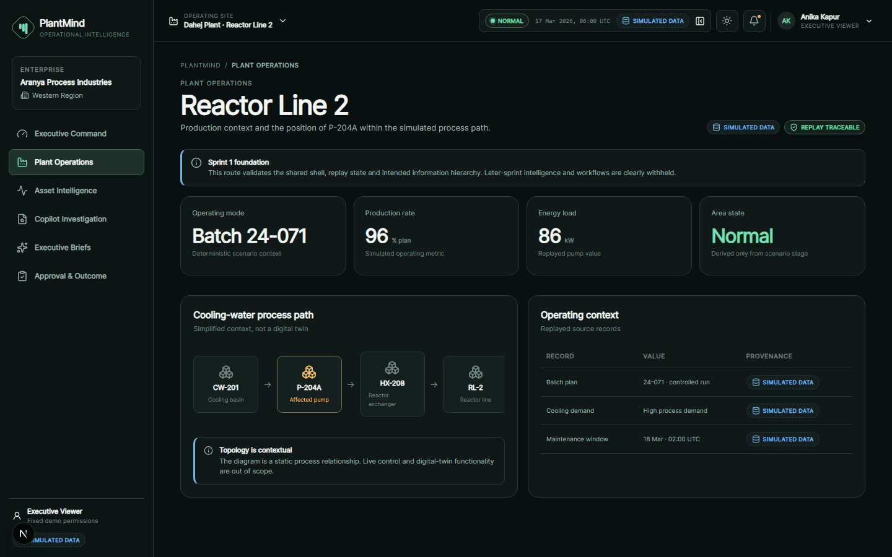
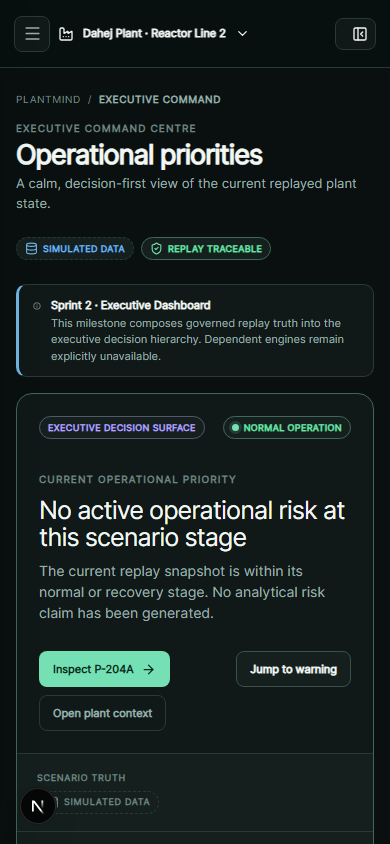
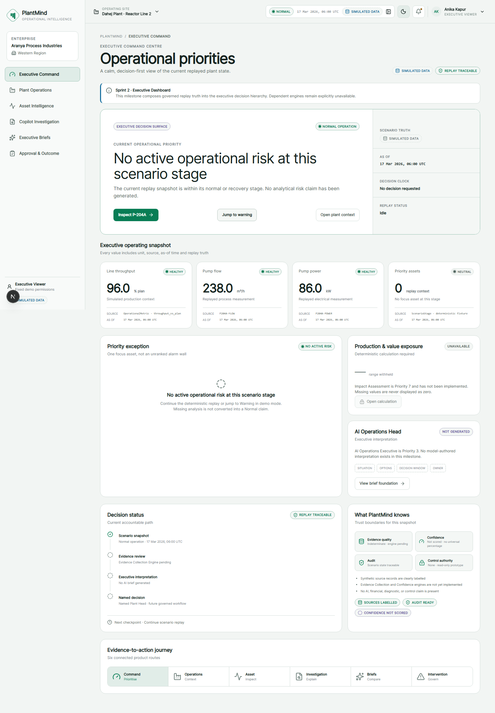
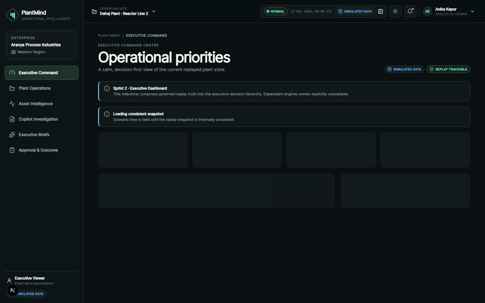
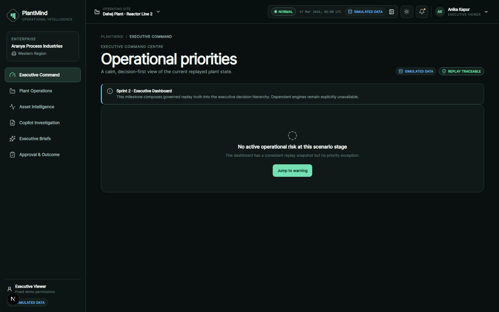
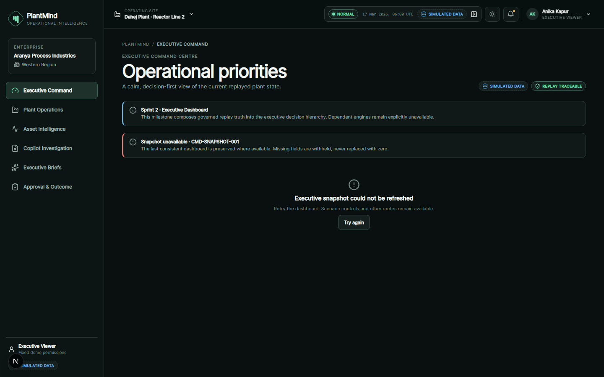
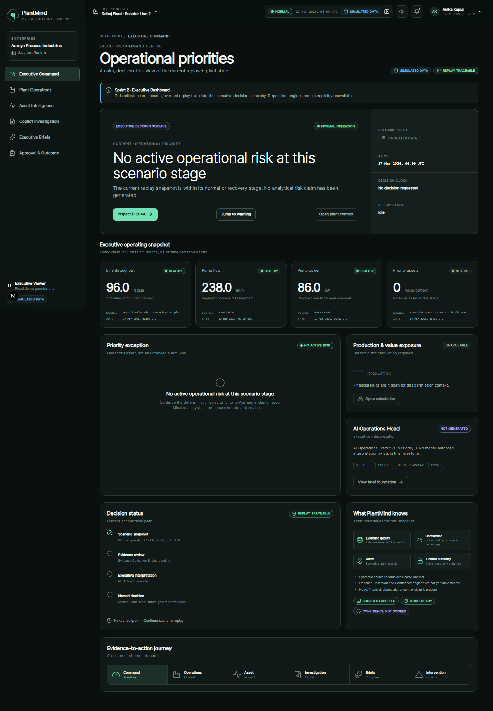

# Founder Review Report — Permanent Visual Gate

Status: complete; application running for founder review.

Local URL: `http://127.0.0.1:3000`

## Scope reviewed

- Sprint 1 application shell, navigation, replay controls, themes, responsive behavior, and all six routes.
- Sprint 2 Milestone 1 Executive Dashboard hierarchy, provenance, trust boundaries, unavailable states, and navigation.
- Development-only loading, empty, error, and disabled review compositions.
- Priority 2 remains preserved at its approved commit; no further product milestone implementation was performed.

## Browser verification

- Chromium navigation and interaction suite: 18 passed.
- All six primary routes loaded in the shared shell.
- Replay start, pause, resume, reset, stage jump, and speed controls passed.
- Desktop and 390×844 mobile layouts passed.
- Dark and light theme selection passed.
- Loading, empty, error, and disabled review URLs passed.
- No browser page errors were recorded during screenshot capture.

## Screenshots

### Landing page

### Executive Dashboard

### Desktop layout

### Mobile responsive layout

### Dark mode

### Light mode

### Loading state

### Empty state

### Error state

### Disabled state

## Visual-defect assessment

No visual defect was found in the reviewed approved functionality. No design, route, schema, replay, persistence, or product behavior was changed.

The only implementation added is the permanent development-time review harness. Review parameters are ignored outside development and unsupported values resolve to the normal ready Dashboard.

## Verification results

- Production build: pass.
- Formatting: pass.
- ESLint: pass with zero warnings.
- TypeScript: pass.
- Unit/component tests: 28 pass.
- PostgreSQL integration: 1 pass.
- Chromium end-to-end tests: 18 pass.
- Production dependency audit: zero vulnerabilities.
- Full development audit: four moderate transitive advisories remain in the locked Drizzle Kit toolchain; the proposed npm remediation is a breaking downgrade.

## Permanent milestone checklist

- ✅ Application running locally
- ✅ Local URL reported
- ✅ Browser verification complete
- ✅ Desktop screenshots captured
- ✅ Mobile screenshots captured
- ✅ Responsive verification complete
- ✅ Test results recorded
- ✅ Founder Review Report generated

## Risks and open questions

- The host embedded-browser connection remains unavailable because of a Windows sandbox fault. The installed Chromium harness provides equivalent route, interaction, viewport, console-error, and screenshot verification.
- No product decision is required. Explicit founder approval is required before any further milestone implementation.
