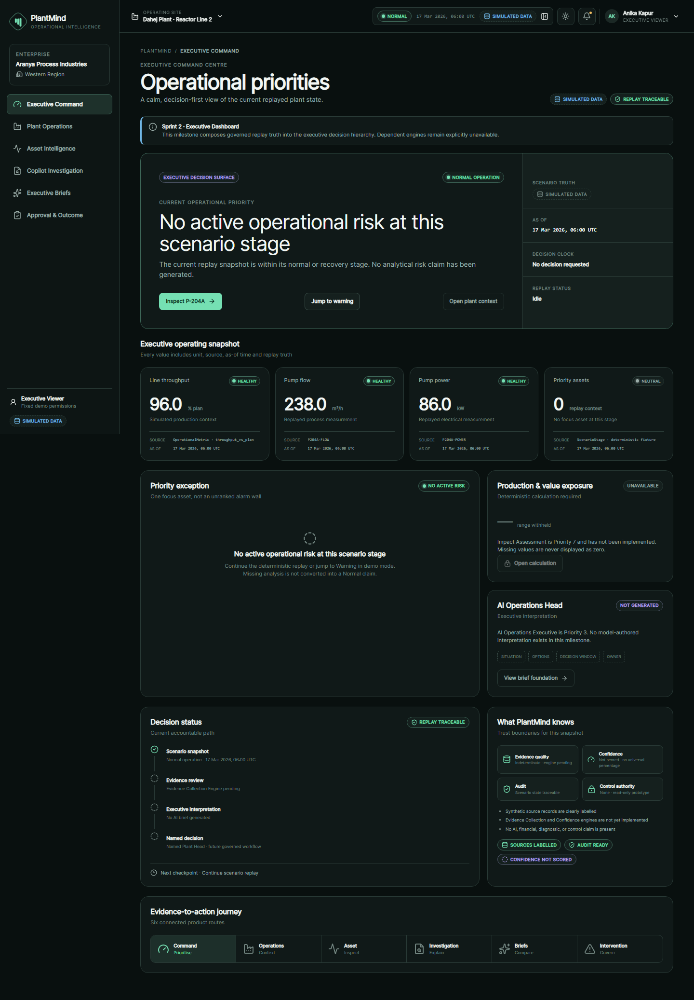
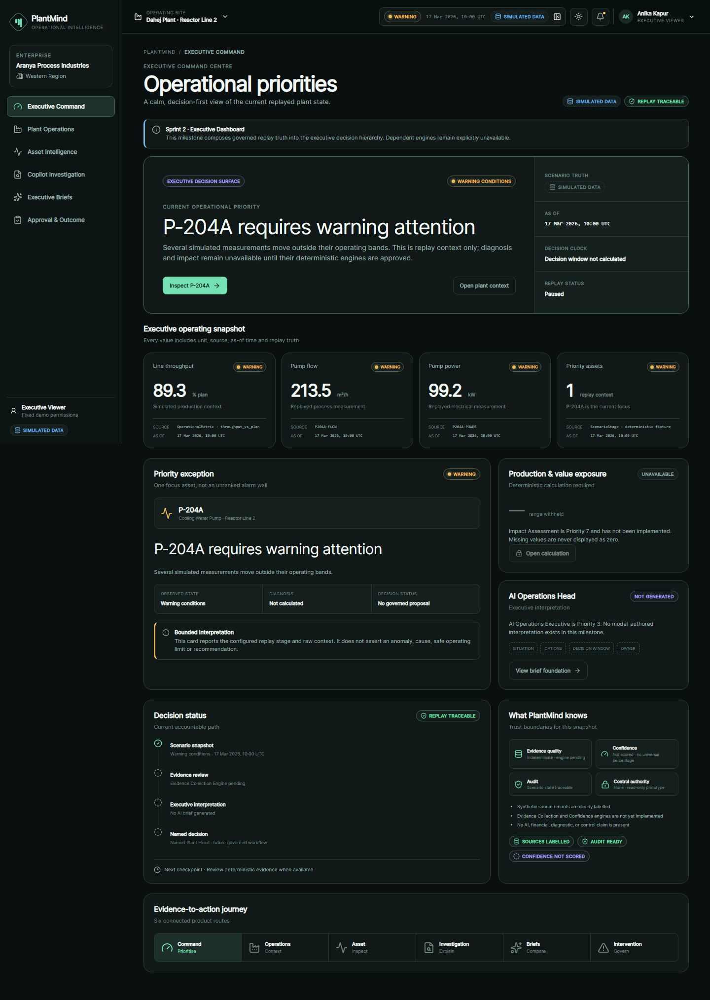
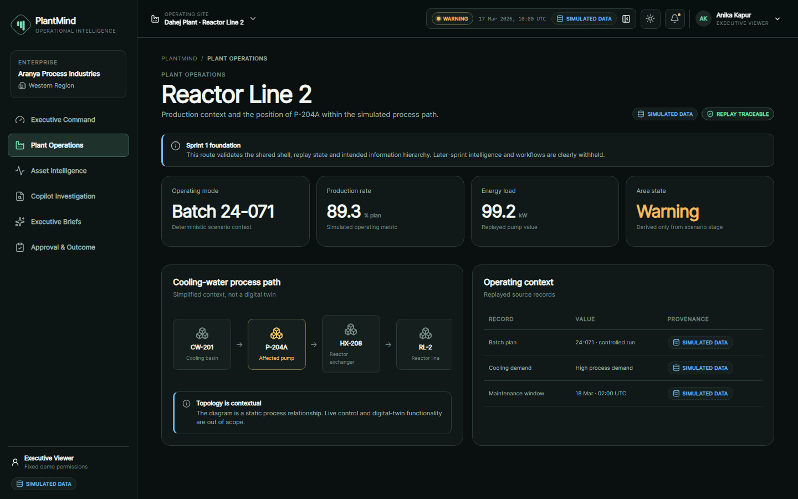
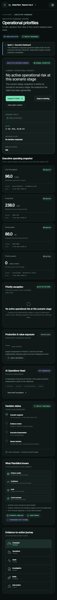
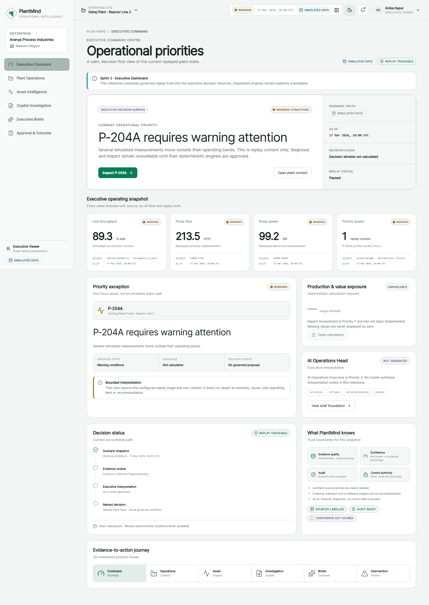
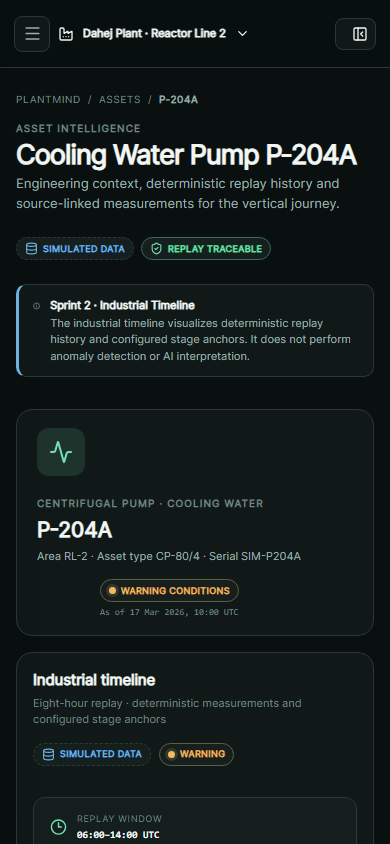
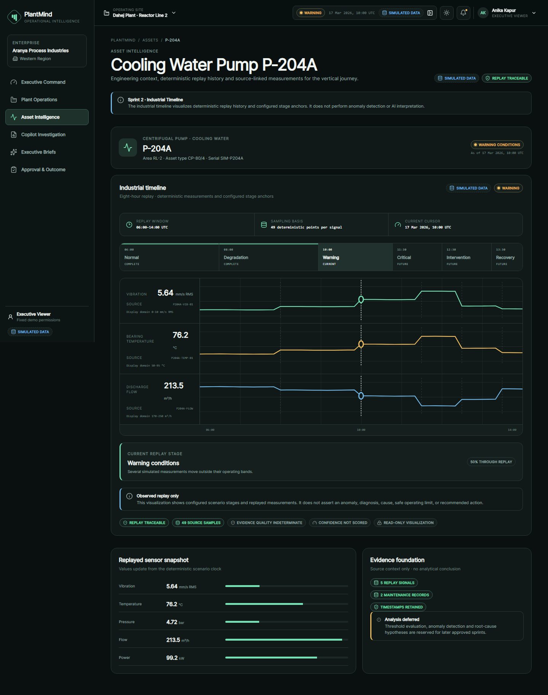
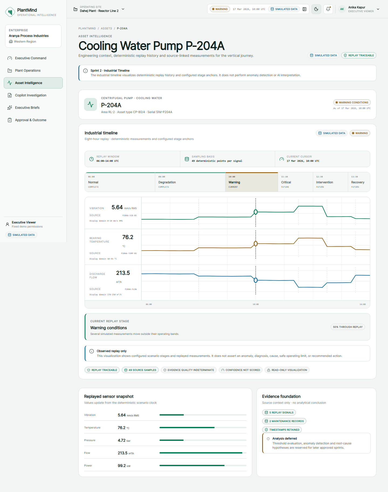

# Sprint 2 — Milestone 2 Founder Review: Industrial Timeline

Status: implementation and verification complete; awaiting founder review.

## Features completed

- Eight-hour Industrial Timeline on the existing `/assets/P-204A` route.
- Three synchronized signal lanes for vibration, bearing temperature, and discharge flow.
- Forty-nine deterministic samples per signal at ten-minute replay intervals.
- Six configured stage anchors with current, completed, and future states.
- Stage navigation through the existing replay provider and persistence path.
- Current replay cursor, source identifiers, units, display domains, and as-of context.
- Honest evidence-quality, confidence, audit, and read-only status.
- Loading, empty, error, disabled, desktop, and mobile states.

## Architecture decisions

- Reuse `ScenarioProvider`; do not create another clock, store, timer, or persistence path.
- Generate timeline samples through pure deterministic functions over `sampleAt`.
- Treat stage anchors as configured replay truth, not anomaly or root-cause conclusions.
- Keep the feature on the approved Asset Intelligence route.
- Add no dependency, endpoint, route, schema, or migration.
- Keep AI, anomaly detection, diagnosis, evidence scoring, and confidence scoring unavailable.

## Baseline screenshots reviewed before implementation

### Home page

### Executive Dashboard and dark desktop view

### Desktop route view

### Mobile responsive view

### Dark mode

### Light mode

## Updated Priority 2 screenshots

### Home page

### Executive Dashboard

### Industrial Timeline desktop view

### Industrial Timeline mobile responsive view

### Industrial Timeline dark mode

### Industrial Timeline light mode

## Files added

- `src/features/timeline/timeline-model.ts`
- `src/features/timeline/industrial-timeline.tsx`
- `src/features/timeline/industrial-timeline.css`
- `tests/unit/industrial-timeline.test.tsx`
- `tests/e2e/industrial-timeline.spec.ts`
- `scripts/capture-founder-review.ts`
- Baseline and Priority 2 review screenshots.

## Files modified

- `src/components/prototype-page.tsx`
- Architecture, API, database, replay, component, developer, decision, known-issues, release, and sprint-status documentation.

## Verification results

- Formatting: pass.
- ESLint: pass with zero warnings.
- TypeScript: pass.
- Unit/component tests: 21 pass.
- PostgreSQL integration: 1 pass after starting the approved local fixture.
- Playwright against the final production build: 14 pass.
- Production build: pass.
- Production dependency audit: zero vulnerabilities.
- Full development dependency audit: four moderate transitive advisories remain in the locked Drizzle Kit toolchain; npm's proposed repair is a breaking downgrade.
- Desktop dark-theme visual QA: pass.
- Mobile 390×844 visual QA: pass.
- Light-theme visual QA: pass.
- Sprint 1 and Milestone 1 browser regressions: pass.

## Risks

- Signal lanes use explicit presentation domains, not approved safety or alarm thresholds.
- Evidence quality and confidence remain intentionally indeterminate.
- The visualization is based on the prototype replay adapter, not a historian query.
- The full development audit retains the locked Drizzle Kit transitive advisories documented in Known Issues.

## Open questions

None blocking. Founder approval is required before Priority 3.

## Remaining work

- Obtain explicit founder approval.
- Begin Priority 3 only after approval.
